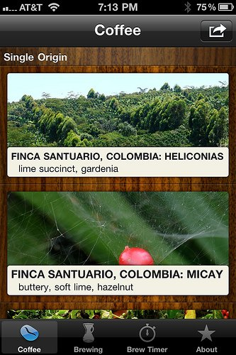
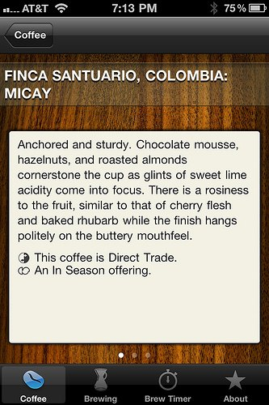
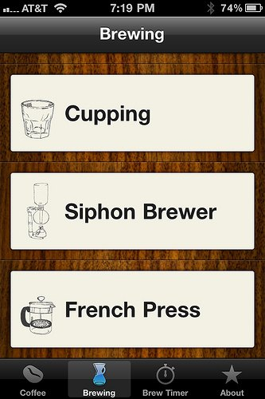
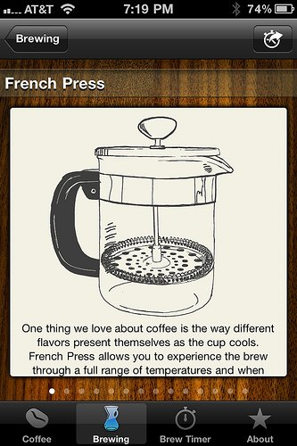
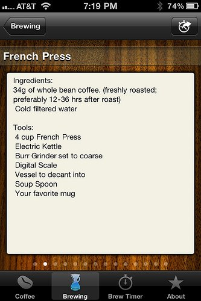
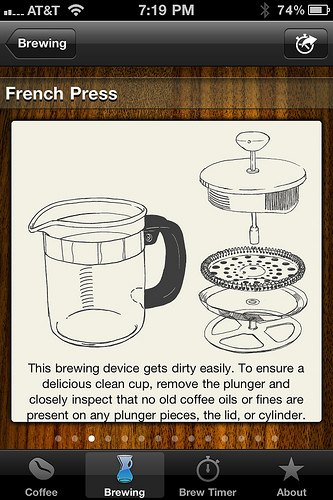
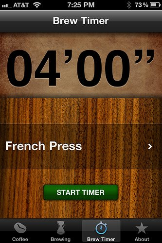
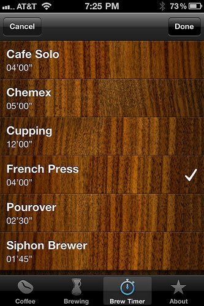
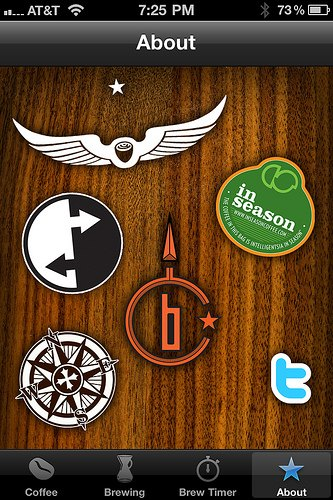
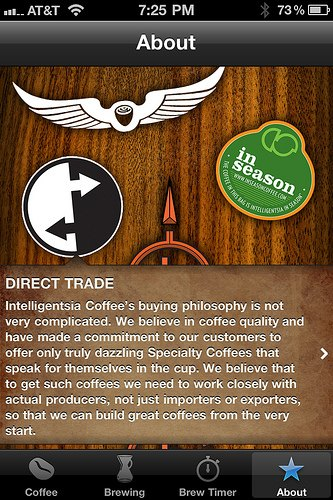

If you haven’t heard of Intelligentsia Coffee Roasters out of Chicago, you probably aren’t a Coffee Geek. Many Coffee Geeks may have even broken in their first real espresso machine on the famous Intelligentsia Black Cat Espresso blend. Starting in 1997, they offer a very compelling look at espresso, roasting, coffee, and the people who grow them.

And now they have thrown their hat into the iPhone app ring. But it is more than just an app about their company, a way to order their coffee or a glorified advertisement. It actually provides useful instruction. You know, on the stuff that actually matters, like making coffee. There are detailed, step-by-step directions with nice illustrations on a variety of coffee methods. Of course, they also provide information on their coffee offerings and a brew timer, as well as more detailed information about the company, its products, and its philosophies.

There are four main pages accessed from icons along the bottom:

- Coffee – Their Current Offerings
- Brewing – Detailed, Illustrated, Step-by-Step Brewing
- Brew Timer – A Brew Timer
- About – About the Company, Projects, and Philosophy

### Quirks

The Intelligentsia iPhone app has a few oddities, so let’s get those out of the way first. On the Coffee Page, there is a little “Forward” or “Share” icon in the upper right-hand corner. Only that’s not what it’s for. Instead, it is a way to filter the coffees you are looking for by all sorts of criteria. I like the feature, but I think they should just use a different icon. That’s just me.

On the Brewing instruction pages, some of them cut off the text at the bottom, but just a little. It just looks weird. I think they could either shrink the text, shrink the illustration, or both, and it would look less beta and more pro.

They provide no tips for espresso preparation. Granted, there isn’t a lot they can tell you about how to prepare espresso with your particular machine, but a temp recommendation would be nice. They could put this on the specific Coffee page itself or make a new category on the Brewing Page and only list their espresso blends there, along with the temps. After all, some people can adjust their espresso machine temps to a very precise window and would love to know how Intelligentsia rolls when it comes to the temps on a specific blend or single-origin bean (SO espresso).

Lastly, there doesn’t seem to be any way to purchase coffee within the app. Look, folks, impulse buys on devices like the iPhone are massive. I buy way too much stuff from Amazon or even the Apple App Store just because it is easy. I order Chipotle over Rubios because there is an app that makes it easy. Give us a way to click a couple of buttons and buy your coffee!!!

### Different Philosophy

On the bright side, the app is beautiful, with wood-grain backgrounds, nice fonts, an intuitive UI, and a wealth of actual information that matters to us Coffee Lovers. You can find out if a coffee is “In Season”, “Direct Trade”, or part of a “Black Cat Project”. You probably won’t see terms like Fair Trade, Organic, Shade Grown, or Bird Friendly. Here is why: They actually try to follow something they call “Direct Trade”. What does that mean? Here is how they explain it:

> _“Coffee quality must be exceptional.”_

> _“The grower must be committed to healthy environmental practices.”_

> _“The verifiable price to the grower or the local coop, not simply the exporter, must be at least 25% above the Fair Trade price.”_

> _“The grower must be committed to sustainable social practices.”_

> _“All the trade participants must be open to transparent disclosure of financial deliveries back to the individual farmers.”_

> _“Intelligentsia representatives must visit the farm or cooperative village at least once per harvest season, understanding that we will most often visit three times per year: pre-harvest to craft strategy, during the harvest to monitor quality, and post-harvest to review and celebrate the successes.”_

So it’s actually better than Fair Trade coffee. Pretty high standards. The more I read, the more I love these guys’ attitudes.

### Details

Now, let’s look at each page one by one:

### Coffee

After selecting a specific Coffee Offering, there are 3 pages that are accessed by swiping left and right:

1.  Description of the coffee, and any tags for “In Season”, “Direct Trade”, or a “Black Cat Project”.
2.  Detailed specs about the coffee, including the farmer’s name (very cool!), Farm, Region, Varietal, Harvest, and Country
3.  A way to share, or view the Story, Images, Videos, Comments, or even Comment yourself

 

 

### Brewing

After selecting a brew method, you select one of 6 Brewing Methods which are accessed by tapping. They are:

1.  Cafe Solo
2.  Pourover
3.  Chemex
4.  Cupping
5.  Siphon Brewer
6.  French Press

Once a brewing method is selected, you are presented with the first page, which shows a nice illustration of the representative brewing vessel, along with a very general description of how the coffee should taste once brewed with this method. However, I find their descriptions more fluff than reality. As an example, for the French Press, it says in part, “…it gives a sweet, lush and satisfying brew.” Ummmm. OK. Not exactly how I would describe the French Press, but it’s not my app. And I am no genius marketeer either, so maybe they should leave it.

Swiping to the left presents page two, which tells you what you are going to need to make said coffee. For example, this is what it lists for French Press:

- 34g of whole bean coffee
- Cold Filtered Water
- 4 Cup French Press
- Electric Kettle
- Burr Grinder set to coarse
- Digital Scale
- Vessel to decant into
- Soup Spoon
- Your favorite mug

Swiping to all the additional pages, which can exceed a dozen depending on the method, show individual detailed steps with illustrations, and even illustrated cleanup instructions. Very nice touch.

 

 

### Timer

Not much to be said here. Choose one of the 6 main brewing methods, and hit start. It would be nice to include a timer for espresso, as well as to customize the times for the advanced users. For instance, they set the French Press timer to 4 minutes, but what if I like 3:30 or 3 minutes flat? Just an idea for improvement.

 

### About

There are six cute little graphics, that when touched slide down a quick blurb. You can tap again to be taken to a full-page view to read more. Here are the items you can select from:

1.  About Intelligentsia – Tells you about, guess who?
2.  Direct Trade – Explains what “Direct Trade” means. A good read.
3.  In Season – Explains what “In Season” means. Another good read.
4.  Black Cat Project – Explains what the “Black Cat Project” is all about. Yet again, a good read. How do they keep doing that?
5.  Locations – Links to the Intelligentsia locations, with address, phone number, hours, and a nice simple map view, with a link to Google Maps.
6.  Twitter – Direct view of their Twitter Feed.

 

### Conclusion

The app is very polished, has a few quirks, extremely useful, but best of all is FREE!!!

I can see myself referring to this for the more exotic preparations (like Siphon), but really more as a recommendation to friends who want to get into coffee, and happen to have an iPhone. It will really save a lot of explaining.

Put that Cappuccino down, and grab your copy today.
