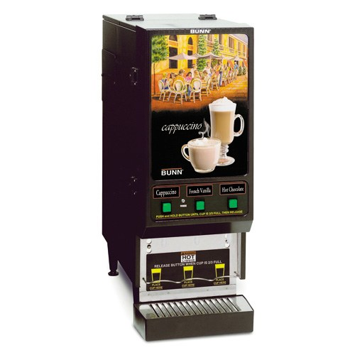
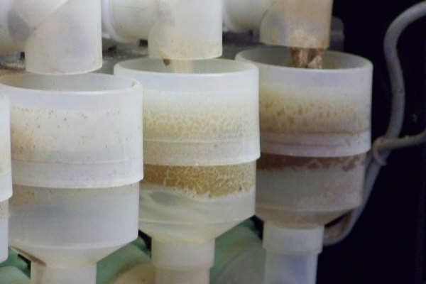
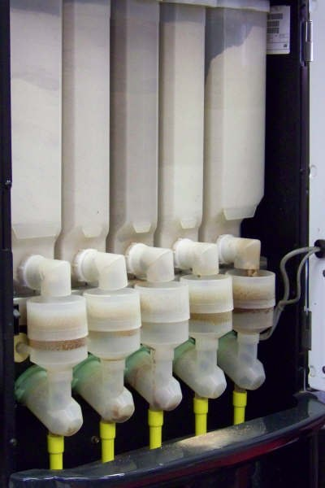

We see them everywhere now. Instant cappuccino machines, there’s at least one (if not five) in every gas station. I’ve seen them in car dealerships and even in a hardware store, some of them daring to sport names like Barista. With just the touch of a button, we can have our choice of vanilla cappuccino, orange mocha, or even caramel apple latte. A terrific bargain at just $2 for 24 ounces. It sounds too good to be true. But is it really coffee?

Technically it is coffee but you can judge for yourself. When one of these machines is opened up for its nightly cleaning (yes they are well maintained) one can observe that there are no coffee grounds to be seen. Instead, there is a dry container, called a hopper, which dispenses instant coffee powder into a funnel where it is mixed with hot water.

The coffee mix is frothed on its way out of the funnel and into your cup. Ingenious really. It’s sanitary and cost-effective, but I remain skeptical of the instant coffee powder. It reminds me of a certain store brand of instant cappuccino powder. I’m not talking about Folgers crystals here; I’m talking about the frou-frou all-in-one mixes. For some reason, these products conjure up images of bubble baths, romance novels, and the Delilah radio show. Don’t ask me why.

  
*Coffee Vending Machine*

Here are the ingredients of one of the commercial mixes:

**Ingredients:** Sugar, Nondairy Creamer (Corn Syrup Solids, Partially Hydrogenated Soybean Oil, Sodium Caseinate, Dipotassium Phosphate, Mono and Diglycerides, Artificial Color, Silicon Dioxide, Lecithin, Artificial Flavor), Whey Powder, Nonfat Dry Milk, Instant Coffee, Cocoa (Processed with Alkali), Salt, Guar Gum, Natural and Artificial Flavors, Calcium Silicate (to prevent caking)

Coffee is #5 on the list if you don’t count the ingredient sub-list for nondairy creamer. Most of the spurious ingredients are found in non-dairy creamer. Have you ever wondered what guar gum is for? I have.

-   **Corn Syrup Solids:** Dried corn syrup, used in imitation dairy as a whitener.
-   **Partially Hydrogenated Soybean Oil:** Hydrogenated=trans-fats, need I say more?
-   **Sodium Caseinate:** Emulsifier and stabilizer derived from milk proteins. So much for non-dairy.
-   **Dipotassium Phosphate:** Flavor enhancer. Also an ingredient in certain pesticides, but then again many pesticides contain water.
-   **Mono and Diglycerides:** Emulsifiers. Help with that creamy consistency.
-   **Silicon Dioxide:** Anti-caking agent, also known as sand. That’s right, sand.
-   **Lecithin:** Emulsifier and preservative naturally found in eggs and found to reduce cholesterol.
-   **Guar Gum Thickener:** Guar gum is far more potent than cornstarch. Sometimes used as a laxative.
-   **Calcium Silicate:** Anti-caking agent. More fancy sand.

  
*Inside Coffee Vending Machine*

If you regularly eat Twinkies or other such “foods”, you are already accustomed to these ingredients because their ingredients are shockingly similar. Twinkies have over thirty ingredients. Instant cappuccinos have eighteen. Fifteen of the ingredients in these instant coffees are also in Twinkies. Many of them are slight variations but are essentially the same. The remaining three not found in Twinkies are coffee, cocoa, and the sand. (Who would put an anti-caking agent in a snack cake anyway?)

  
*Coffee Vending Machine Inside*

With all this being said, some of these beverages are tasty. I might even enjoy one of these liquid snack cakes on occasion. I Just hope none of my friends see me. Is it coffee? Judge for yourself.

The next time you are in your local coffee shop, try saying this to the barista-

> *I’ll take a large cafe mocha with one pump guar gum, two pumps Diglycerides, extra salt and a pinch of that fancy sand.*