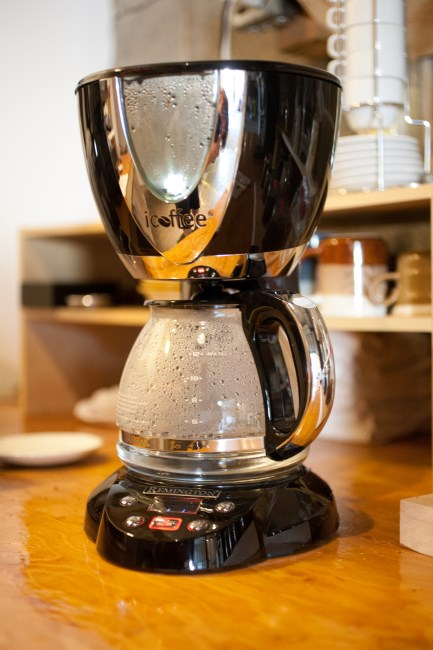
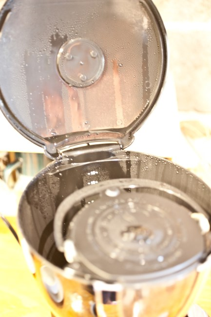
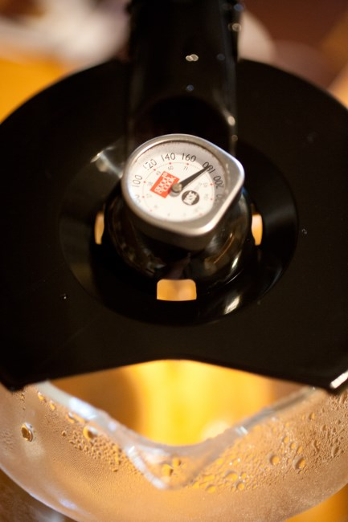
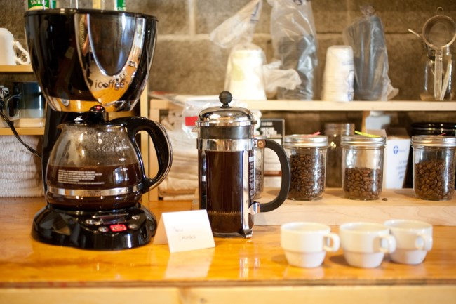
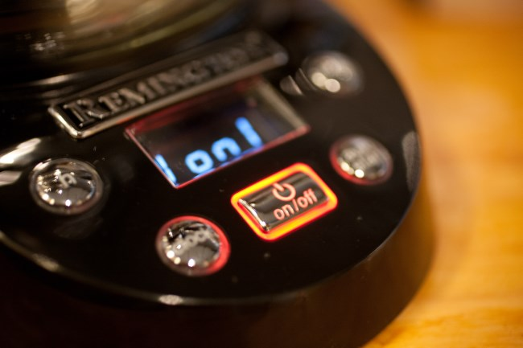

For many years, I started every morning with French press coffee. I loved the ritual of getting up early, heating the water, grinding the coffee, pouring in the hot water, waiting 3-4 minutes, plunging, and then serving. But I’m also a morning person. Some coffee drinkers don’t have the energy or patience to make a French Press in the morning, so they often opt for an automatic drip coffee maker.

The problem is that as great as a drip coffee maker is for ease, it lacks the richness of the French Press. In recent years, a few companies have tried to develop ways to improve the automated drip machine. One of those companies is Remington. They developed a new drip machine called the *iCoffee*. Their design uses what they call “rotational steam brewing”. Instead of the water coming at the beans from the top, they use a gold filter, circulating the water towards the ground coffee from the side.

I don’t have much experience with drip coffee makers, but I found that iCoffee makes a cup of coffee close to the French Press. I still prefer the slightly smoother taste of the French press, but if I were a person who wanted the convenience of drip, it would do a fine job.

*Running water through the machine before the first brew.*

  
*This is the inside top of the iCoffee.*

### iCoffee Tips

The documentation does not specify a recommended grind size. We found that using a regular drip grind was too fine and tasted bitter. Go a little coarser—not quite French Press coarse, though. Look at the [Coffee Grind Chart](http://ineedcoffee.com/coffee-grind-chart/) and try to get your grind between Medium and Coarse.

The *iCoffee* website states that you can save money by using 15% less coffee. The claim was skeptical, but our tests showed that a 19 to 1 ratio (grams of water to grams of coffee) tasted just as good as the standard 17 to 1 ratio. This might change with different coffees, different roast levels, and, of course, personal tastes.

  
*The iCoffee has a window to observe the brewing.*

  
*The iCoffee coffee temperature at the end of a full pot was 180 F.*

### Messy Cleanup

The *iCoffee* isn’t the easiest brewing method for cleaning up. Because of the steam, the inside can get messy. Cleaning in there is not as easy and straightforward as rinsing the French press. One risk you could potentially have with the *iCoffee* is mold could form and grow if you don’t do a good enough job cleaning it. Meanwhile, most French Press brewers are dishwasher safe.

### Other Options

For a more detailed write-up of the *iCoffee*, check the favorable review by *KitchenBoy* in the resources below. *KitchenBoy* prefers iCoffee over French Press, whereas I give the edge to the French Press. *KitchenBoy* uses a 4-6 minute French press steep, which he states produces bitterness. I advise using a 3-4 minute steep with a slow 30-second plunge. I found this results in less bitterness.

When we first reviewed the *iCoffee* brewer in 2014, the price was $120 USD. Too much, in my opinion. Since then, the price has been cut in half to $60 USD. That is a fair price. I recommended this brewer as a good alternative to those who love French Press but want the convenience of a drip machine

The downside of the iCoffee is the effort required to clean the brewer properly. I still prefer the classic French Press even with the new lower price. But it is a close call.

  
*Comparing the iCoffee head to head with a French Press.*

  
*The user interface for the iCoffee brewer.*

### Resources 

[Buying a French Press – Picking the Right One](http://ineedcoffee.com/buying-a-french-press-picking-the-right-one/) – Our French Press purchasing guide.

[iCoffee Machine Review](https://web.archive.org/web/20171029072853/http://kitchenboy.net:80/blog/icoffee-machine-review/) – Detailed iCoffee review from KitchenBoy.

*Disclaimer: INeedCoffee received an iCoffee brewer to test for this article.*

*Brewing photos by Joseph Robertson of Extracted Magazine, a digital coffee magazine published for iOS and Android.  
*