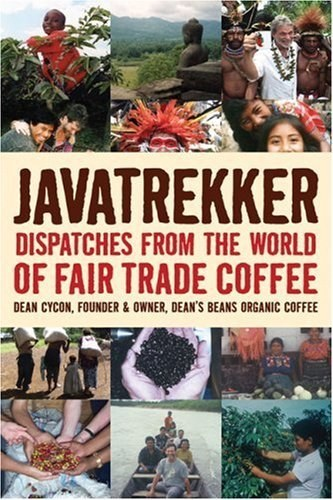

> *When you sit back with a good cup of coffee you are engulfed in the aroma, the taste, the acidity, and body of the brew. You take in all the dimensions of the cup – yet this is only the surface. Swirling beneath are worlds within worlds of culture, custom, ecology, and politics. All of the major issues of the twenty-first century – globalization, immigration, women’s rights, pollution, indigenous rights, and self-determination – are being played out through this cup of coffee in villages and remote areas around the world.*  
> – Dean Cycon

Dean Cycon takes pride in the fact that he is an exception to the disconnected world of coffee. Many coffee growers have never tasted a sip of their own coffee, and few coffee retailers or drinkers have been anywhere near where their beans are grown.

“The truth is, 99 percent of the people involved in coffee commerce, from roasters to baristas, have never been to a coffee village,” says Cycon in his book *Javatrekker: Dispatches From the World of Fair Trade Coffee* (Chelsea Green Publishing Co., 2007). If the book’s title evokes a “Star Trek” association, it’s probably not coincidental – Cycon aims to go where no coffee roaster has gone before.

  
*Javatrekker: Dispatches From the World of Fair Trade Coffee*

Twentysomethings and thirtysomethings who feel lost about their direction in life may find Cycon inspiring. He didn’t discover his life’s mission until he was 40 years old when he founded *Dean’s Beans*, a coffee roaster based in Orange, Mass. When Cycon delivered the Hampshire College commencement speech in Amherst, Mass. earlier this year, he described his ambition to start a coffee company that took responsibility for the chronic underdevelopment in coffee-growing communities.

Cycon told Hampshire’s graduates that the Dean’s Beans business model “is not fancy and does not require a Ph.D.” The company’s bottom line is secondary to a process that provides development assistance to the indigenous people who grow the coffee. Cycon travels around the world to meet the growers and discuss their goals and needs. Dean’s Beans then helps the farmers finance their projects by paying “a meaningful price” for the beans, at or above Fair Trade value; and profit-sharing. Essentially, it’s a for-profit business with a mission similar to many nonprofits.

Cycon’s business brings him face-to-face with coffee growers worldwide, and *Javatrekker* is a narrative of his travels to the coffee farms in developing countries where Dean’s Beans are grown. The countries he visits – among them Ethiopia, Nicaragua, Peru, Indonesia, Colombia, El Salvador, and Guatemala – read like a list of crisis nations from the past three decades or so. While overall conditions have improved in some of these countries, their coffee farmers often face massive obstacles to earning a living. The beans, in turn, face myriad obstacles to reaching your cup.

Cycon has seen thousands of human faces behind the world’s coffee industry. None of them is Juan Valdez.

### Bear Market Backdrop

Most of Cycon’s “Javatrekker” travels take place in the 21st century, with the backdrop of a global crash in coffee prices. As profitable as the new millennium has been for coffee retailers, it has been brutal to the farmers. When coffee trades at less than 60 cents per pound – as it did from 2000 until 2004 – it costs more to grow and harvest the beans than it pays to sell them. Growers slide into debt.

“At the same time, coffee companies throughout the United States were making the grossest of gross profits,” Cycon says. “They could buy the beans for so little, without dropping their prices to customers who were so unaware of the economics and true human cost of the trade.”

There’s nothing unusual about a pound of roasted premium coffee retailing for $12 or more in the United States. Farmers who receive [Fair Trade](http://ineedcoffee.com/fair-trade-coffee-klatching/) prices for organic Arabica beans will get $1.34 to $1.36. Most receive far less than the Fair Trade amount, even if they’re eligible. The difference goes to a chain of “coyote” transporters, money lenders, exporters, importers, roasters, and retailers – sometimes cooperatives or governments take a cut too. Cutting out the middleman? It’s far easier said than done in most coffee-growing countries.

As Cycon meets the world’s coffee farmers, he sees what they’re up against. In Tapachula, Mexico, Cycon visits a shelter for people who lost arms or legs trying to ride the “Death Train,” a freight train that runs north through Mexico and into the United States. The stench of the tiny shelter and the apparent hopelessness of its 26 residents haunt Cycon after he leaves. His despair in Tapachula could apply to many of the other places he visits.

> *“This whole thing seemed a horrifying dead end. What was at all possible to do here besides make a donation and run screaming home? The despair was really sinking in. … I sat stoically, but my Great White Hope veneer was cracking.”*

But donating once and fleeing the scene runs counter to Cycon’s ideals. He’s disgusted by corporate, single-shot, photo-op donations that do nothing to change the coffee farmer’s longer-term plight. He wants to see the world’s coffee growers make a sustained living through their trade.

Cycon returns to the Tapachula shelter and asks its residents to dream about what they’d do if they could leave and get a new start. They brainstorm on ways to make these dreams a reality. One man wants to return to growing coffee in Honduras; a woman wants to run a store in her Salvadoran hometown. “I’d make love to some Chinese girls,” says another man in the shelter.

It’s this fusion of hope and humor that keeps *Javatrekker* very readable, even amidst scenes of poverty, war, and injustice. There are more jokes than sermons in this book. Side stories are refreshing and relevant, like when Cycon delves into the rivaling claims between Yemen and Ethiopia as the birthplace of coffee.

Cycon remains flexible in his approaches to each coffee-growing community. Their needs vary. As the head of a business, Cycon doesn’t need to adhere to the whims of donors, as he might if he ran a nonprofit. In Colombia, Cycon wonders why coffee grown by indigenous Arhuaco farmers is producing samples of such uneven quality.

> *“That’s it!” I shouted. “That’s why the samples were so different. The coffee we got last year probably came from different farmers than the ones who grew the samples this year.” I explained that it was really important for them to segregate coffee by altitude and region if they wanted to have a distinct coffee in the marketplace. That way a buyer could be guaranteed a similar taste and quality profile each year, instead of the luck of the draw that happened when everything was mixed together. That is what differentiates specialty coffee from whatever comes out of a supermarket can.”*

It is the breakthrough moment that many people hope for when they’re working in the developing world. The Arhuaco farmers are already skilled at growing quality coffee; it’s the game of the global marketplace they now need to master. Despite the way the international coffee market has treated them, Cycon remains hopeful that a new business paradigm can help coffee farmers in Colombia and elsewhere can improve their lives.

### Java Don’t Preach

Cycon’s tone in *Javatrekker* is rarely preachy or shaming. There’s no need for it – his travels speak for themselves. That doesn’t mean that he fails to get his shots at the corporate coffee industry, which he views as exploitative and detached from its impact on coffee growers. His disgust at progressive poses by corporations comes through loud and clear.

The same goes for Cycon’s opinions on many of this century’s most pressing global issues. They are personified by coffee growers throughout the world:

-   **Global Warming** – Javier Mestres, an indigenous Arhuaco coffee farmer in Colombia’s Sierra Nevada mountains knows about global warming without the benefit of Al Gore movies. His family’s coffee plants are flowering prematurely, and the berries are weakening.
-   **Illegal Immigration** – Wilmer, a coffee farmer from Honduras, has lost both of his legs, each amputated just above the knee. He lives within Dona Olga’s Tapachula, Mexico shelter for 26 economic refugees who were maimed while trying to hop the “Death Train” to the U.S. Wilmer tells Cycon he dreams of returning to Honduras to resume coffee farming.
-   **War on Drugs** – Javier Mestres in Colombia says aerial coca eradication programs are ruining coffee crops and polluting water supplies. Some Colombian organic farms lose their certification because aerial sprays drift onto coffee plants, Cycon says.
-   **Women’s Rights** – Esperanza is the first female agronomist in Peru’s coffee region, and she works with a coffee co-op through times of revolution and terrorism in Peru. An all-male board of directors asks her to manage the co-op in 1993. She travels to the 2003 Specialty Coffee Association of America convention in Boston, clinging to the faint hope that her co-op can make a major sale.

### Conclusion

Roaming through a Sumatran coffee forest, Cycon ponders his Javatrekking life of the last 15 years. “I think about the blessings in my life that have flowed from this venture,” he says. “I have been able to travel, meet interesting people, and experience different cultures. I get to help people work toward their goals. And to top it all off, it actually pays the bills.”

It’s this attitude that makes *Javatrekker* such a good read. The book could be a 239-page guilt trip, but it’s not. It’s interesting, often funny, consistently eye-opening, and persuasive advocacy of Fair Trade coffee. Cycon keeps the focus on the people who grow coffee, so the narrative never bogs down to dry economics or despair. The coffee growers, for all they’ve endured, are determined to make it, and Cycon shares their determination.