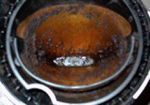
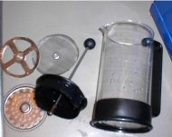
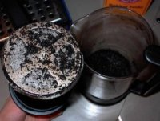
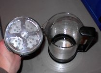

Drinking coffee at home is a wonderful experience. It is nice to brew a great cup of coffee for yourself in the morning or to serve your guests after dinner. However, in order to continue making great coffee, you need to make sure that your equipment is clean.

Here you see some examples of equipment that aren’t as clean as they need to be. Okay, you caught me. The glassware on the left is downright filthy. The glassware on the right demonstrates how clean the glassware could and should be. Since not all equipment can be cleaned in the same way, I will discuss each type separately.

### The Toolkit

To keep coffee equipment clean, you will need to have some basic equipment, which is listed below:

1.  Baking Soda: This is great for cleaning plastic or glass. It is especially useful on plastic because regular soap is very hard to rinse from plastic.
2.  Dishwashing Detergent: This should be used to clean glass or ceramic only. It will leave a film on some plastics that will be hard to get rid of.
3.  Vinegar: This is used to remove mineral deposits from your Automatic Drip coffee pot.
4.  Puro Caff: This is like baking soda on steroids and is useful for cleaning your espresso machine.

### Drip Coffee Maker

To maintain your Auto Drip coffee maker, you will want to do a basic cleaning weekly and a thorough cleaning at least monthly. The purpose of the thorough cleaning is to remove mineral deposits that may build up in your coffee maker. These deposits will eventually clog up the piping inside the machine and will give off flavors to your brew. Some modern drip makers have built-in filters that actually will trap a great deal of these minerals in the filter before brewing. To avoid doing all this, you can use distilled water only for your coffee. Most people won’t go to such extremes, though.

**Do the following weekly:**

1.  Clean the Carafe: Remove the plastic lid if possible and soak in dish detergent. Soak this while cleaning the lid and the filter basket.
2.  Filter Basket: Fill your sink about halfway with warm water and at least four tablespoons of baking soda. Using a rag, wipe the residue coffee oils from the plastic components. Rinse thoroughly with water.
3.  Finish cleaning the carafe by swirling the soapy water around a bit with a cleaning rag. Rinse thoroughly with water. You may even want to rinse this with a baking soda solution to fully rinse.
4.  Using the rag that was in the baking soda, wipe around the coffee maker itself. Pay close attention to the showerhead as many old coffee oils will be there.

**Do the following monthly:**

1.  Perform your weekly cleaning routine.
2.  If you have a filter built into your coffee maker, remove it. Fill your carafe with water and add two tablespoons of vinegar to it.
3.  Pour into the coffee maker and begin brewing.
4.  Halfway through the brewing cycle, stop the machine and wait 10-15 minutes. Resume the brewing process until it is completed.
5.  Rinse your carafe out and brew another one to two cycles of plain water through the system. Rinse out the coffee maker and you are done!

   
*The drip filter before and after cleaning.*

### French Press

Fully cleaning a French Press may seem like a bit more work, but after you do it once or twice, it becomes second nature.

  
*French Press disassembled*

1.  Disassemble the French press completely, as shown in the photo above.
2.  Soak all components in a bath of soapy water if you have the glass kind. If it is a plastic press, you will want to soak it in a baking soda bath.
3.  After about ten minutes, grab your cleaning rag and use it to clean the equipment thoroughly.
4.  If you had the glass press, rinse it in a baking soda solution to help make sure all the soap comes away from the parts.
5.  Allow all parts to air dry.
6.  Reassemble.
7.  Anticipate your next brew!

   
*The Press Pot before and after cleaning.*

### Espresso Machine

As I mentioned earlier, to fully clean an espresso machine, you will need a special cleaner like Puro Caff. I need to mention that you do need to heed the warnings on the package about using very small quantities of this cleaner. It is incredibly strong, and a little will go a long way. If you use your machine regularly, you should perform this cleaning task at least once a week to keep it brewing quality shots.

I will not even mention descaling your espresso machine, because I am a firm believer that you should use only distilled water in your espresso machine. By using only distilled water, you will keep your machine running longer.

1.  Remove the handle from the espresso machine if you haven’t already. If there is still an espresso cake left in it, dump it and give the handle a good rinse with warm water.
2.  Pour 1 tsp. of Puro Caff into the filter basket. With your espresso machine ready to brew, put the handle in the espresso machine just like you were going to brew some shots.
3.  Put a bowl under the brewing group. Begin pulling the ‘shots’. You will want to brew for about five seconds, stop brewing for fifteen seconds, and then back on again for five seconds. Repeat this on/off process at least five times.
4.  Next, remove the handle from the machine and rinse it with water. Turn your machine on without the handle in it and turn it on to fully rinse the group.
5.  Next, using the brush for your espresso machine, work your way around the groove in the brewing group. Once you have successfully cleaned this, turn it on to give the showerhead another rinse. You are now finished!

Hopefully, you will be on your way to cleaner and more enjoyable coffee. Remember, no one likes to clean, but doing it properly will keep the quality of your favorite beverage consistent and high.
