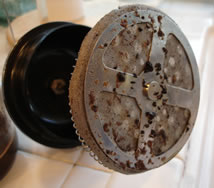

We can’t stress this one enough: a clean French Press is vital to good-tasting coffee. Fortunately, cleaning a French Press isn’t difficult and only takes a few minutes. There are only a few pieces to worry about — just make sure you pay attention the first time you take it apart so you’ll know how the parts go back together once they’re clean.

In the beginning, we were a little concerned about using soap to clean the pot. After all, we didn’t want any nasty lemony detergent getting caught in the plunger screen and affecting the taste of our coffee. So the usual daily procedure involved dumping out the old grounds in the trash, giving a quick spin of the plunger screen in hot water to get rid of the grounds, rinsing the whole thing again, and wiping it dry with paper towels. It seemed clean enough, but as the weeks went by, we noticed our coffee beginning to taste bitter. No matter what we did, we couldn’t get a decent pot brewed.

  
*French Press filter prior to cleaning*

Turns out, that coffee leaves behind quite a bit of oily residue on the plunger screen and inside the pot. Hot water alone will not get rid of it, and after time those oils can turn rancid and affect the taste of your coffee.

The good news is that most press pots are dishwasher safe. Simply unscrew the plunger screen and put all the pieces into your dishwasher. We put the plunger pieces in the silverware basket to keep them from flying all around the dishwasher. Everything comes out sparkling and all the soap residue is gone. Since it’s not practical or convenient for most people to take their pots home daily, we recommend taking them home for a good dishwashing on Fridays at least 2-3 times per month.

A daily hot water rinse and making sure to take apart the screen and plunger assembly seems to be enough during the week. Put a drop or two of mild dish soap in (or a teaspoon of baking soda instead), fill the carafe with hot water, and let everything soak for a few minutes. Just be sure to rinse all the parts very thoroughly in very hot water to remove all the soap residue. Take a close look at all the parts and see if you notice any coffee residue coming off onto your paper towels.

NOTE: if you use an “unbreakable” polycarbonate (plastic) carafe like the Bodum Brazil, baking soda will do a better job of cleaning it than dish soap without leaving residue.

One last important point — we strongly recommend dumping the old, spent coffee grounds in the trash instead of tossing them down the drain. Even with a good garbage disposal, you may risk clogging the sink, and we’re sure you don’t want to have to explain that to the facilities and maintenance folks. A few grounds are fine, just not the entire pot full.