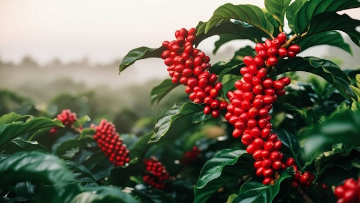

I forgot the exact dollar amount, but a friend told me during college that they got a full pound of Hawaiian Kona coffee at a price that seemed too good to be true. I looked at the bag; sure enough, it had a picture of Hawaii and a Kona label, and then I saw the word Style. I learned from one of my early coffee mentors that the word Style usually means there is no Kona coffee in the blend.

> Kona Style indicates a blend of coffee beans roasted in the *Style* a Kona would be roasted.

Pretty sneaky? Or one might think it was fraudulent. The more common way a lower-priced Kona Coffee is sold to the public is by putting the term *Blend* beside Kona. How much Kona is in a *Kona Blend*? INeedCoffee contributor and Kona Coffee farmer Gary Strawn answered this question in his article Kona Blends.

> If you purchase Kona coffee from a store anywhere other than Kona, you are very likely purchasing a Kona Blend. Here in Hawaii there is a state law that requires a minimum of 10% Kona coffee and the percentage has to be written on the label. On the mainland there is no such law so a “Kona Blend” might be 0% Kona coffee. Even at 10%, that means a Kona blend is 90% cheaper filler beans.

Even 10% seems fraudulent to me. It did to others as well. A bill (HB931) that would have increased the state law minimum of 10% to 51% was introduced. That bill failed to make it to a committee, and in the same post, Gary Strawn details how what started as a decent idea turned into a bill that he couldn’t even support.

What do you need to know when it comes to Kona Coffee?

-   AVOID: Kona Roast – Most likely has 0% Kona coffee.
-   AVOID: Kona Style – Most likely has 0% Kona coffee.
-   AVOID: Kona Blend—It contains just 10% Kona coffee if purchased in Hawaii and as little as 0% if purchased elsewhere.
-   BUY: 100% Kona Coffee – Island coffee is exceptional and will cost more. Make sure you get 100% Kona.

### Better Than 100% Kona Coffee?

INeedCoffee contributor Andrew Hetzel thinks Hawaii can do better than labeling the coffee 100% Kona. In his article *“Kona Coffee Needs a Quality Grading System,” he makes a case for Hawaiian Kona coffee to participate in a coffee cupping and grading system already used* in other parts of the world.

> Whereas in many regions of the world, coffees are cupped regularly and systematically evaluated by the producer 1) for their own internal quality improvements, 2) to communicate flavor profile with buyers, and 3) to objectively promote cup quality, in Kona, the process is largely left to chance. **Hawaii’s coffee grading system currently monitors only the number of faults in each green sample and screen size of the bean; no consideration whatsoever is given to the resulting flavor.**

The article explains that 100% Kona coffees will have different quality and flavor profiles. Some should be priced higher than others. His proposal is an open grading system.

> The argument posed by the small farming community is that by diluting a pure Kona coffee product, you are damaging the reputation of the brand — but that argument is only half correct and makes the false assumption that 100% Kona is always 100% good quality. This is, unfortunately, not always the case.

### Sources

[Kona Blends](https://web.archive.org/web/20161005210039/http://www.konaearth.com/Life/2009/090216/) – By Gary Strawn of Kona Earth Coffee.

[Gary Strawn](/by/gary-strawn/) – INeedCoffee contributor page.

[Kona Coffee Needs a Quality Grading System](https://web.archive.org/web/20230606231944/https://www.coffeestrategies.com/2009/01/31/kona-coffee-needs-a-quality-grading-system/) – Article by Andrew Hetzel.

[Hawaiian Coffee](/hawaiian-coffee/) – Island by island Hawaiian coffee overview by Chris Arnold.

[Kona coffee](https://en.wikipedia.org/wiki/Kona_coffee#Kona_blends) – Blending information on the Kona coffee Wikipedia page.

HB931 – Bill proposal to change the Kona Blend labeling law.
