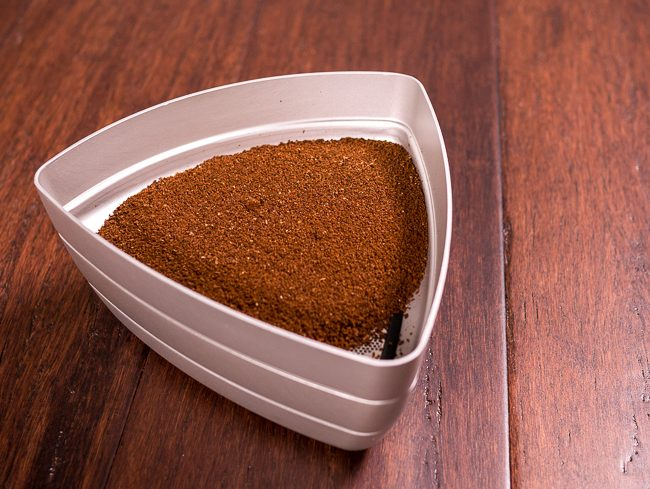

So you have upgraded your beans, your grinder, and maybe a dozen other things in search of the perfect cup of coffee. But if you quest for more, the Kruve Coffee Sifter may be for you, as it promises to take your grind to the next level by giving you only the particle size you desire. Kruve’s motto is *“Many Have Tried To Perfect The Grinder. We Perfected The Grind.”* Let’s take a closer look at how it works.

The Kruve system works by taking the coffee you have ground and sifting it through two sizes of sieves. The oversized and undersized particles are trapped, giving you a specific, narrow range of coffee particle sizes suitable for the type of coffee you are brewing. Otherwise, you may end up with over-extraction or under-extraction, often causing a bitter or weak cup of coffee.

Kruve believes sifting to a narrow range of coffee particle size is an important step in getting the best cup of coffee and is finally available to the consumer using sieves with precision photo-etched holes, which are much more precise than the older mesh style used mostly by professionals. Kruve also contends that even very expensive coffee grinders are incapable of providing a narrow enough range of coffee ground size, so there are benefits to the professional and consumer alike:

-   Higher TDS (Total Dissolved Solids) while still having a clean cup (think of less mud in French Press)
-   Consistent preparation, cup after cup
-   The ability to speak a common language when it comes to particle size, making recipe sharing easier
-   The ability to calibrate a grinder after cleaning or burr replacement

### Sifter Overview

The Kruve Coffee Sifter “Twelve” model comes with 3 trays, a lid, and 12 different-sized sieves that allow you to dial in the grind, getting only the range of grind size you desire, regardless of whether you prefer French Press, Espresso, AeroPress, or Pourover. No electricity is required.

Sieve sizes included in microns (μm) are 200, 250, 300, 350, 400, 500, 600, 700, 800, 900, 1000, and 1100.

*Kruve Sifter*

### Using the Kruve

The Kruve comes with three trays and a lid. The larger-sized sieve of your range is placed on the top tray, and the smaller-sized sieve is placed in the middle tray.

For instance, if you want to do AeroPress, Kruve recommends 500-900μm (microns). So the 900μm sieve would go in the top, and the 500μm would go in the middle. The idea is that everything between 500-900μm ends up in the middle tray, and all the coarser and finer coffee grounds end up in the top and bottom, respectively.

After inserting the appropriate sieves, you load your coffee into the top tray and shake like crazy for about 60 seconds. I found that a paint-mixer motion seemed to be very effective, but adopt your own style.

Now, you have perfectly sized coffee grounds in the middle tray. Kruve says you may even be able to regrind the coarser stuff from the top tray to eliminate waste even further. Consult your coffee grinder manufacturer to see if your grinder is designed to handle anything other than whole beans.

### Grinder Calibration

Kruve recommends you “calibrate” your grinder to minimize waste. What this really means is for a given range of particle size, try to set your grinder so as many particles as possible fall into that range, and try to get about 50-50 between the oversize and undersize.

You start at a fairly coarse setting with 10 grams of coffee, and after sifting, check the ratio between oversize and undersize until you get about 50-50, going finer each time. You will need to repeat the process for each range of coffee and make note of the grinder setting so you can repeat it.

### Hands-On Taste Test & Observations

We tried both French Press and AeroPress. Something surprising to us was how inconsistent our $1000+ Ditting bulk grinder was. We were also surprised by the French Press on how fine 600-1000μm actually looked, and the recommended brew time of 10 minutes was more than double what we would normally do.

The reality is the French Press done exactly as Kruve recommended was quite flavorful, had plenty of good oils, and silt (mud) was almost non-existent.

The AeroPress was also quite good, but AeroPress isn’t usually finicky for us, so the differences were not as stark. Still, a darn great result.

We want to try this on espresso and drip and may have an update on these in the future. However, we don’t see ourselves using this as much for a single shot of espresso, mainly because of the extra prep time. We would, however, use the Kruve when making coffee in larger amounts.

### Improvements

As good as the Kruve is, there are a few things we would like to see improved.

-   The sieves are a little tricky to get in, but we found that inserting them with the trays upside down made things easier. Perhaps they will break over time.
-   Would like a way for the trays to stay together (other than gravity). We thought a magnet system could work, but once they are together, they are fine as long as you keep a firm grip on the assembled unit.
-   Would like the option to buy extra trays at a discount, so we could have more than one range (2 sieve sizes) ready to go. For instance, we would probably keep a French Press, Drip, and Espresso locked and loaded.

### Conclusion

The Kruve certainly shows how technology is attempting to improve coffee, and we think they have really hit on something special. Let’s face it, even very high-end grinders are ultimately crushing your coffee beans, and there is no way they can have 100% consistent coffee ground particle size. The Kruve not only allows you to calibrate your grinder to minimize waste but ensures you have exactly what you desire. It’s science!

It’s not cheap at $129, but we can recommend this as a way to not only increase your coffee nerd cred but truly improve your coffee brewing experience.

*[KRUVE Coffee Sifter Review: Hands On with French Press & AeroPress](https://www.youtube.com/watch?v=18kTfkdxkbk) – by Two Bit da Vinci LIFE*

### Resources

*Kruve Sifter  
*

[Coffee Grind Chart](/coffee-grind-chart/) – INeedCoffee photo tutorial of different coffee grind sizes.

*Disclosure: INeedCoffee was sent this product at no cost, which did not affect its review.*
