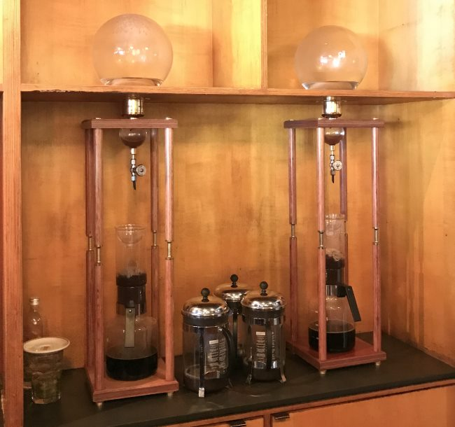
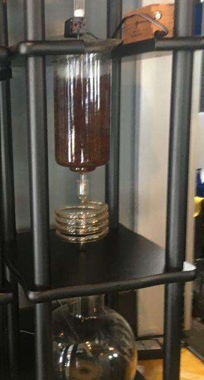
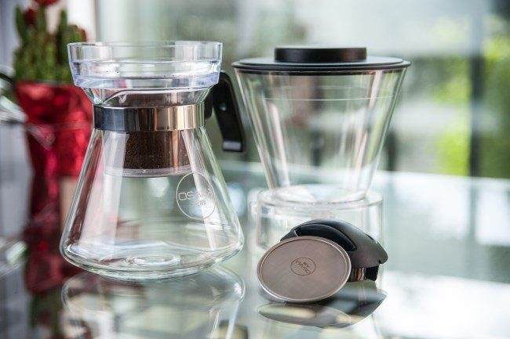

Kyoto-style slow-drip coffee, also known as slow drip or Kyoto-style coffee, is a coffee brewing style that became popular in Kyoto, Japan.

Kyoto-style slow drip coffee is made by letting water slowly, drop by drop, drip over coffee grounds. As this process has evolved, Kyoto-style brewers have become increasingly elegant. They now resemble tall, gilded hourglasses.

### Why the rise in popularity?

In recent years, Kyoto-style coffee has become more popular. Many high-end coffee shops have purchased Kyoto-style coffee towers to make iced coffee for their customers. These towers make delicious coffee, and the brewers themselves are a thing of beauty and a coffee conversation starter.

*Caffe Vita Roastery, Seattle, WA* 

### How does the taste differ?

Kyoto-style iced coffee differs from traditional cold brew coffee. Cold brew coffee, often made using a [Toddy](http://ineedcoffee.com/cold-brew-coffee-with-the-toddy-coffee-maker/), involves allowing the entire collection of coffee grounds to soak in water for some time (12-24 hours). This is a full immersion brewing method because the water and beans are in full contact with each other throughout the entire brew.

The Japanese iced coffee method is not full immersion because the water is slowly dripped into the coffee grounds and then exits. The differences in the two brewing methods result in two different taste profiles. Cold brew has less acidity than Kyoto-style, which captures more of the high notes that one would taste if the coffee were brewed at a normal temperature.

Cold brew also tends to be made as a concentrate and can be very high in caffeine. Iced coffee is brewed at a similar ratio to normal hot brewed coffee. As this style of cold brew becomes more popular, you may be wondering how you can make it at home.

*QED Coffee – Seattle, WA*

### Make your own Kyoto-Style brew at home

Because Kyoto-Style coffee is so delicious, it’s no surprise you will want to make it at home, and it is possible.

Cold-drip coffee is made in a three-section brewer. Water is poured into the top section and drips down into the middle section. Coffee grounds are in the middle section, and as each drop works through the coffee, it drips into a collector at the bottom of the brewer.

There are two ways to get Kyoto-style cold drip brewers at home. You can either buy one or create one.

Kyoto-style brewers are available online. Yama makes one model that makes 6-8 cups and another that makes 25 cups. At the time of this article, the smaller one costs $241 USD, and the larger one is $441 USD. The larger one is more suited for a cafe or for a household that drinks a lot of iced coffee. Besides Yama, other companies such as Nispira and Dutch Q have attractive models of Kyoto-style coffee drippers.

If these are too expensive and you are comfortable with tools, you can build one. A DIY guide can help you build your own brewer and cut the price down to about $80 USD.

*[DIY COLD BREW COFFEE TOWER](https://www.youtube.com/watch?v=uFH-m0H-By8) by Mr. Fix It*

### A Budget Alternative

Osaka makes a cold coffee dripper that makes 4 cups. The Osaka Cold Brew Dripper costs less than the Yama towers or even the DIY approach. It would be a good introduction to Kyoto-style drip coffee at a lower price point. It also takes up less space in your kitchen.

### Try it!

You’re missing out if you’re a coffee aficionado and haven’t tried Kyoto-Style cold brew. Seek out a local coffee shop where you can try cold-drip coffee or start making your own at home. Then you can taste the difference.

### Resources

[The Osaka Cold Brew Dripper Tutorial](http://ineedcoffee.com/cold-brew-dripper-tutorial/) – INeedCoffee brewing tutorial.

[Cold Brew Coffee is Not Rocket Science](http://ineedcoffee.com/cold-brew-coffee-is-not-rocket-science/) – An overview of the cold brew coffee method.

[Coffee Brewing Guide](http://ineedcoffee.com/coffee-brewing-guide/) – Our collection of coffee brewing tutorials.

*Title photo by Photo by [Sidney Chiang](https://unsplash.com/photos/selective-focus-photography-of-pink-cherry-blossom-vycxgXgRuHI).*