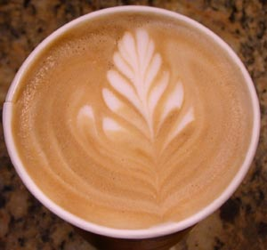
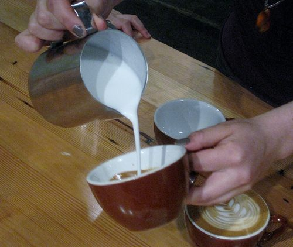
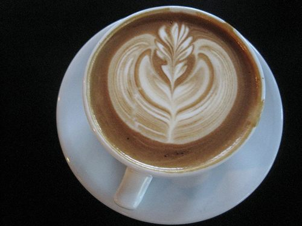

To a home roaster or coffee connoisseur, ordering a latte at a mall-based coffee shop can be a depressing experience. But my head was pounding, and I needed caffeine, so I ordered a latte at Cafe Bravo (formerly known as Shivers and Jitters). I was amazed and thrilled to find that my latte at the bar was adorned with latte art. This is a great sign. No one bothers to learn how to do latte art unless they have a deep and abiding appreciation for espresso. So it was that the latte made by the barista, Mark Christman, was one of the best lattes I’d ever tasted. Later, Mark and I had an opportunity to discuss his introduction to latte art. Below is the interview.

An Interview with Mark Christman of *Cafe Bravo* in Temecula, California

**What was your first introduction to latte art?**

Mark: I saw a video made by *David Schomer of Espresso Vivace* in Seattle, called “Caffe Latte Art”.

**When did you learn?**

I learned how to make Latte Art about 2 years ago.

**How many attempts did it take you before you mastered latte art?**

I can’t even count that…I’d say 300 drinks.

  
*Mark’s Latte Art*

**What designs have you seen in latte art?**

I do the leaf, but I’ve seen also seen hearts and some places do letters. The leaf is the most popular design.

**Please describe the process of making latte art.**

Start with cold milk and a cold pitcher always. Stretch the milk, only when it’s cold and never warm. Once you feel the milk is at body temperature, tuck the wand and get a whirlpool going spinning clockwise. Once your milk is at 155 degrees, shut it off.

Tap your pitcher on the counter a few times, bringing the microbubbles to the top, presenting a nice layer of foam. Pull your shot, and espresso with thick crema helps! Cut your shot before it turns white. Tap your pitcher once again giving it a swirl, to mix the steamed milk, and the foam together. Pour your shots right down the middle of your espresso, slowly, not breaking the crema. 3 quarters the way up the cup, rock your pitcher back and forth while bringing it back slowly. Cut back across the top of your drink, creating the stem. Serve fresh and enjoy.

  
*Pouring Down the Middle*

**Do you have any tips for beginners?**

Don’t over-stretch, don’t stretch warm milk, have a nice fresh roasted espresso that offers excellent crema, have patience, never let your shots sit, and practice makes perfect.

**What kind of equipment do you recommend?**

For industrial machines, La Marzocco. For household, La Pavoni.

**Can you make latte art at home?**

I do.

  
*Latte Art Design*

**Anything else that you’d like to add?**

You can only master latte art with the right beans and the right milk. If you’re using old coffee, forget about it.

### Resources

[Latte Art Gallery](http://ineedcoffee.com/latte-art-gallery/) – Photos of killer latte art designs.