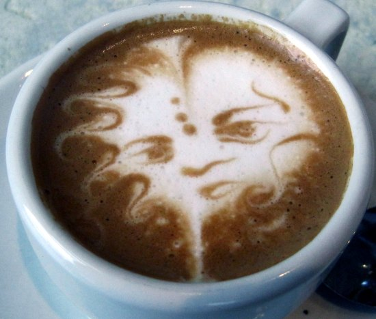
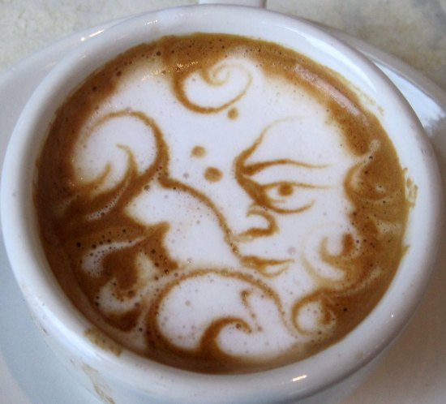
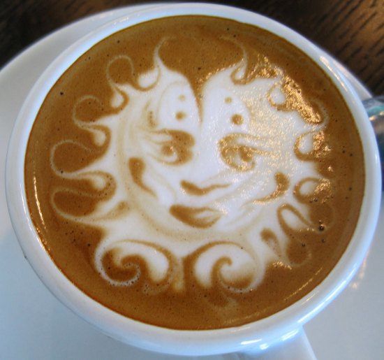
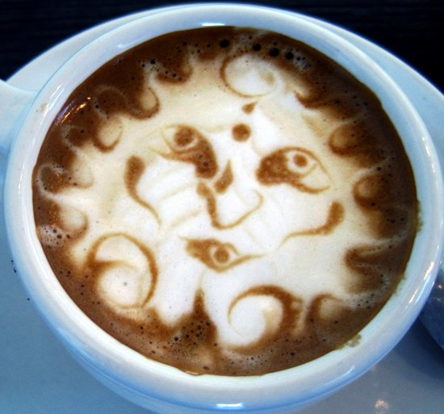
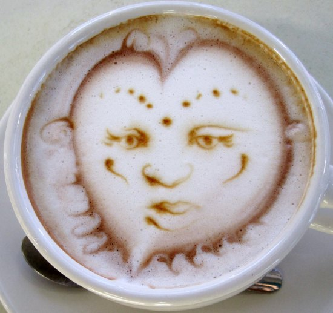
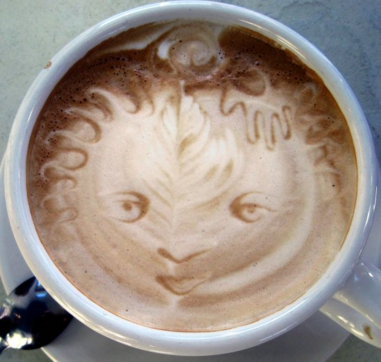
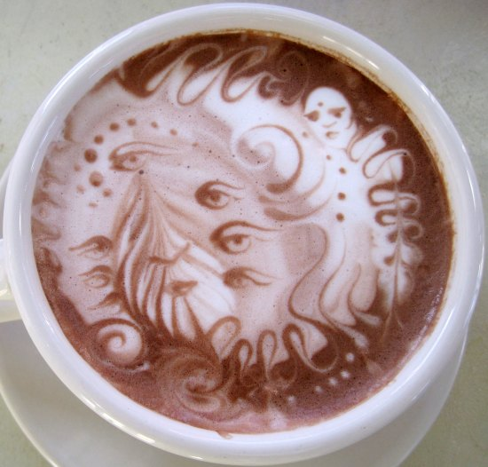
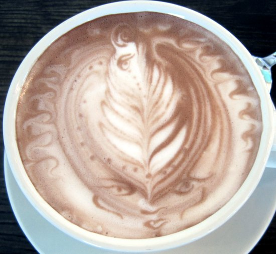
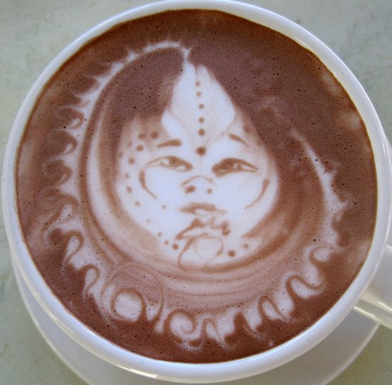
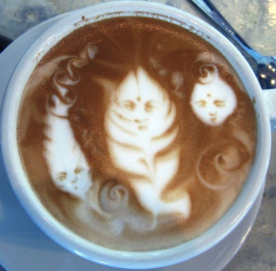

The following photographs of Latte Art Etching were taken over the course of three visits to Dubsea Coffee in White Center, Washington, just south of Seattle. The etching was done by barista and artist Joerael Julian Elliott. He no longer works there. I’m glad I brought my camera during my visits.

Feel free to use any image on this page for any purpose. Even commercial. I only ask that you link to [INeedCoffee](https://ineedcoffee.com). Full Creative Commons license information is at the bottom of this article.

This work is licensed under a [Creative Commons Attribution-ShareAlike 3.0 Unported License](https://creativecommons.org/licenses/by-sa/3.0/).

### Resources

[The Feet Under Our Ground…](http://joerael.blogspot.com/) – Blog by Joerael Julian Elliott.

[Dubsea Coffee](https://www.dubseacoffee.com/) – 9910 8th Avenue Southwest Seattle, WA 98106

[Latte Art Gallery](http://ineedcoffee.com/latte-art-gallery/) – INeedCoffee Photo gallery of traditional latte art.