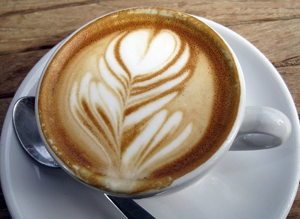

Here is a mini collection of latte art photos I have taken in the past three years. Feel free to use whatever image you want for any purpose, even commercial. I only ask that you link to [INeedCoffee](https://ineedcoffee.com/). Full Creative Commons license information is at the bottom of this article.

  
*Caffe Artigiano – 763 Hornby St, Vancouver, BC*

  
*Aster Coffee – 5615 24th Ave NW, Seattle, WA*

  
*Caffe D’Arte – 125 Stewart St, Seattle, WA*

  
*Urban Coffee Lounge – 9744 NE 119th Way, Kirkland, WA*

  
*Heart Coffee Roasters – 2211 E Burnside, Portland, OR*

  
*Makeda Coffee – 153 N 78th St, Seattle, WA*

  
*Stumptown Coffee – 1115 12th Ave, Seattle, WA*

This work is licensed under a [Creative Commons Attribution-ShareAlike 3.0 Unported License](https://creativecommons.org/licenses/by-sa/3.0/).