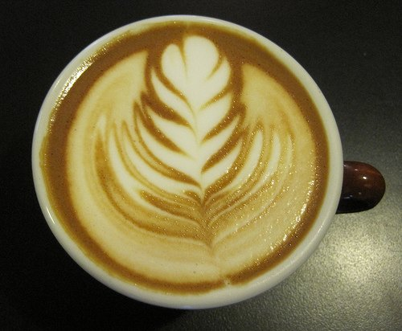
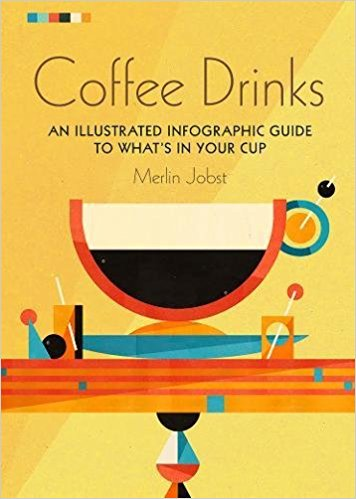

Have you ever gone into a coffee shop and stared at the gigantic menu of fine print, wishing they would just write it in plain English? Well, I hope I can help! How about a crash course in Italian & French? If that sounds like too much work, we’ll just stick to the *latte lingo* for now. You’ll be ordering that *tall mocha breve con panna* in no time.

First, the basics: most espresso beverages have a base of milk. Whole milk is *latte.* Half and half is *breve.* Heavy cream is *creme.* With whipped cream is *con panna.* Having something *dry* means only foamed milk, no liquid. You can also have a *rice latte* or a *soy latte* instead of regular milk.

Then you add the espresso or *caffe.* One shot is equal to one ounce. If you order an espresso, you will get a one-ounce shot of espresso in a *demitasse,* which is French for *half-cup* and usually holds about three ounces. An espresso macchiato is a shot of espresso with foam on top, and an espresso creme is an espresso with an ounce of heavy cream. Whether it be a shot of espresso or a shot of flavored syrup, one shot is one ounce. In a short (small) or a tall (medium) drink, there will usually be two shots of espresso, which is called a double or *doppio.* The larger sizes (grande or venti) would contain a triple or three shots. And for the daring, a quad would be four shots.

  
*Espresso macchiato made with half and half.*

-   A *caffe latte* is steamed with whole milk and espresso.
-   A *caffe breve* would be steamed half and half with espresso, very rich; it is my favorite drink. It is okay to leave off the *caffe* part (i.e. I’ll have a latte) because they assume you are not asking for just a cup of steamed milk, but need some caffeine to get you going!
-   The same goes for a *mocha,* which just means chocolate, but if you ask for a *mocha* they will assume you are asking for a *mocha caffe latte,* not just chocolate.
-   A *cappuccino* is usually 1/3 espresso, 1/3 milk, and 1/3 foam.
-   A *dry cappuccino* is made with espresso and foam only.
-   *Caffe au lait* is drip-brewed coffee with steamed milk.
-   An *Americano* is an espresso with hot water; similar to drip coffee, but with a little different flavor.
-   Most coffee shops also have a [Toddy](http://ineedcoffee.com/cold-brew-coffee-with-the-toddy-coffee-maker/) or the cold-brewed coffee I spoke of last month. These drinks are all assumed to be hot unless you ask for iced. Although in Arizona on a hot afternoon you will have to watch them closely because they might assume that you want iced.

Some common additions and subtractions are *con panna,* with whip cream. *No foam* is just as it sounds because a normal latte will have a 1/4 to 1/2 inch of foam at the top, which some people do not enjoy. *Half-caf,* one-shot regular, and one-shot decaf. *Decaf,* all shots are decaf. *With room* is to leave room at the top for cream. *Add a shot of \_\_\_\_\_* can be for any flavored syrup such as vanilla, caramel, or hazelnut.

Now, let’s put it all together. Start with the size, then you can specify iced (if you don’t, they will assume hot), then the drink, and finally any additions/subtractions. Okay, so we could order a *tall latte con panna* – translation – a medium cup of steamed whole milk, two shots of espresso, with whipped cream. A *short dry cappuccino* is a small cappuccino with only foam. And now, my current favorite drink is a large (or venti) decaf iced breve with one shot of caramel.

This is Stefanie reminding you to enjoy life, one cup at a time.

*Coffee Drinks: An illustrated infographic guide to what’s in your cup by Merlin Jobst  
*

*Title Photo by [Matt Hoffman](https://unsplash.com/@__matthoffman__).*