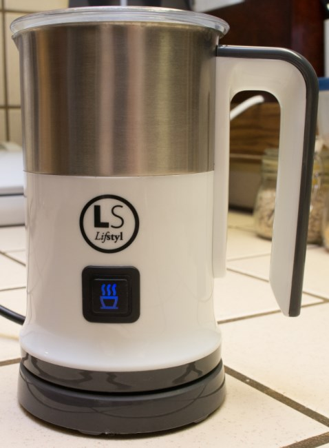
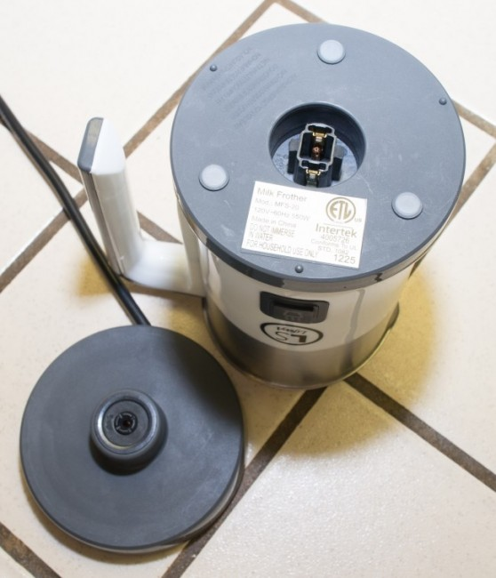
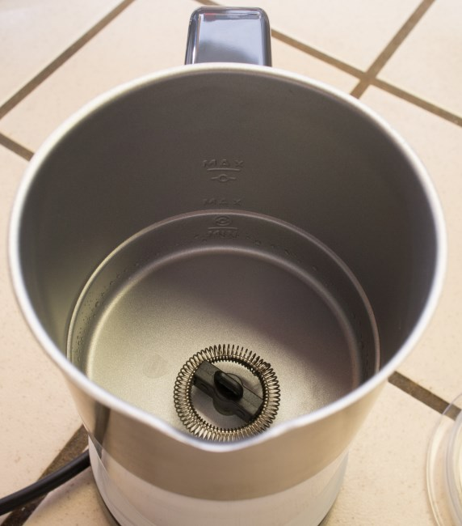
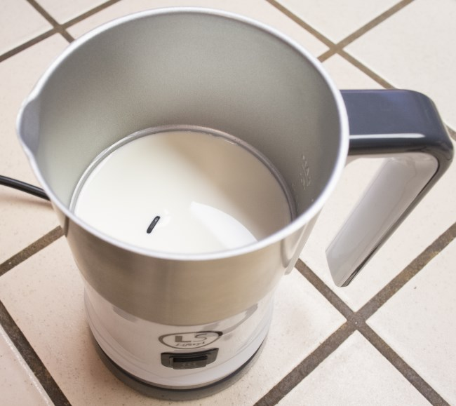
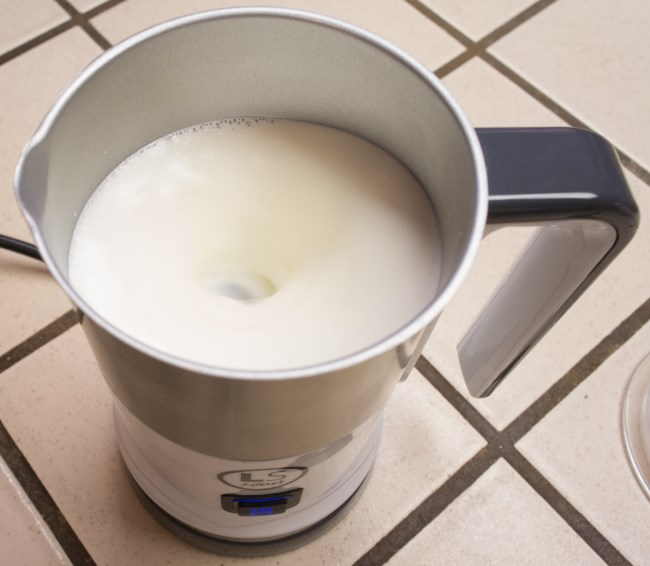
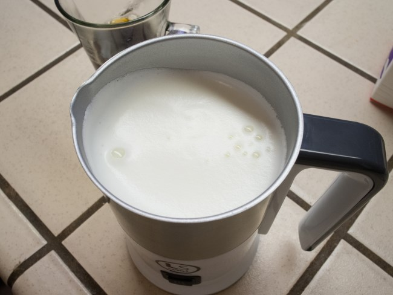
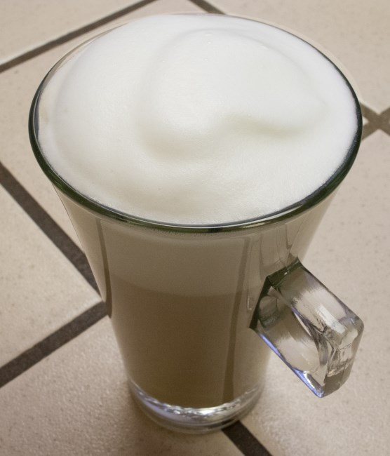

***2016 UPDATE:** The LifStyl Milk Frother is no longer available for sale.*

I was disinterested when I was first offered a chance to try out another milk frother. After all, there are many milk frothers out there; hand-powered milk frothers, battery-powered wand-type milk frothers, those attached to lower-end espresso machines, as well as those milk frothers that are the size of espresso machines. All these have one thing in common: they suck in one way or another, whether it is function, form, or price.

I will tell you that the LifStyl Milk Frother is not like the others I have tried in any of those ways. If you don’t want to read any further, just hit the product link and buy it now. That is how much I love it. Otherwise, read on to find out why it has become a daily part of my routine.

Most of us that use cream or milk in our drip coffee or espresso, use it cold (at least in the US). Of course that reduces the temp of the coffee, and we don’t all have (or want) an espresso machine to steam a whole pitcher of milk just for a cup of coffee, especially when in a hurry. Even if you have a high-end espresso machine, sometimes you just don’t feel like going through the process of steaming milk and the resulting cleanup (it usually takes me about 5 minutes from start to finish this way).

This is where the LifeStyl milk frother swoops in and saves the day.

The LifStyl milk frother consists of 4 parts:

1.  Main pitcher (with markings inside to help you not underfill or overfill).
2.  Base
3.  Lid
4.  Metal whisk called a Spring Head (leave it on and it froths; take it off and it doesn’t)

The LifStyle milk frother is very simple to use & clean (about 90 seconds from start to finish)

1.  Decide if you want froth or not, and add/remove the Spring Head accordingly
2.  Add milk, half & half, soy milk, rice milk, or even skim milk!
3.  Put pitcher on base
4.  Put the lid on the pitcher
5.  Press button
6.  60 seconds later, you have a perfect 145-158F product
7.  Pour into your coffee
8.  Rinse and wipe inside

I only ran into one thing I would like to see changed on future models: the ability to adjust how “foamy” or “frothy” the milk gets as it reaches temp. In my case, using half & half, although the full 60 seconds brought it to temp, it was a little too foamy. One option recommended by the manufacturer is to simply hit the button early, which does work. The only downside is that the temp is a little lower than optimum, but it’s a very nice compromise. And they were very receptive to my suggestions for future products.

I really love this product in so many ways, and it’s affordable to boot. I can highly recommend the LifStyl Electric Frother to anyone who wants an easy, affordable way to heat or froth their milk or nondairy products. And that includes you high-end espresso snobs; you would be surprised how easy the LifStyl is and how nice the results are.

### Pros

-   Froths & warms in just 60 seconds
-   Warms only (no foam)
-   Foam quality and consistency are great
-   Operation is dead simple
-   The pitcher is cordless and has a cool base
-   Very Quiet
-   Cleanup is easy, thanks to a non-stick interior
-   Small Footprint
-   Relatively low energy use (550 Watts)
-   Relatively low cost: about $40 for frother

### Cons

-   Could use a way to adjust the foam level

### Resources

*The LifStyl Milk Frother (no longer available)*

[Sherwood SMF-1000 Automatic Electric Milk Frother and Warmer Review](/sherwood-smf-1000-automatic-electric-milk-frother-warmer-review/) – INeedCoffee article.

*Disclosure: INeedCoffee was sent this product at no cost, which did not affect its review.*
