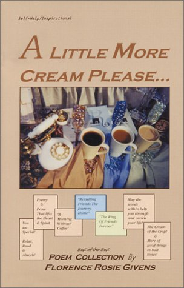

### Coffee Money

The greenery that's
used for a pleasant
upbringing of the
coffee to your mouth!

Give it to the Coffee
Cafe' and be happy
about it, after all they
drink coffee there too!

Bouncing fellows full
of joy frequent the
Cafe' and above all
came back to see
where they left off!

Sitting for hours now
drinking coffee and
budgeting the next
cup of coffee for
centuries to come!

How could they so
heartily accomplish
it? They had money to
spare...not only that...
but money to share!

Coffee Money makes
you very rich, or you
wouldn't sit in a Cafe'
feeling that good about
yourself and the cup of
coffee in your hand! 

It doesn't take a lot to
make you feel on top
of the world, but it's
best to keep coffee
money to spare!

For the morning is
coming and you're
going to need the
coffee to tell you a
few things!

Huh? "Wake Up!"
and...pay the cashier
the world is waiting for
you to open your eyes!

(C) 2004 FloBound Poems Publications

### Coffee Makers

When we first started we were just workers
Then we became over timers and in need
For what reason we deserved a cup in hand
So we pressed for a way to get awake early
 
We found a way to do that by getting started
On Monday we found an idea that's great
Tuesday we finished the integrity part of it
Wednesday we fought to get it on the shelves
 
Then on Thursday we got everyone hooked
Friday we knew that we had a special product
On Saturday things started to go smoothly for us
Sunday we knew what made the world go around
 
So we decided to be a friend to all of them
We set sail for the important places abroad
It spread as far as the South Seas and beyond
Then it spread to me...hmmmm to its aroma...
I think that I, myself, will make some coffee!

(C) 2006 By Florence Rosie Givens

### Coffee Blog

We really do not care what you all think
If you do not think of us and coffee...
We want to hear about coffee 24/7
If you have a word or two to say, say it...
 
We'll be right here to see your interest
Hope it's up on the top ten list of things
If so let it be on this blog...coffee I mean
Okay, after you wake up then let us know

The Espresso said what? A strong one?
Espresso's are always strong and rich...
You find them at the best Cafe' around
Well,  you've got to find the best one!

Ask, MAS? Why, does he travel too?
He said that he did, he'd taste the best...
Did you see his pics? On ineedcoffee.com?
Yes, they are awesome...Espresso lands!

I look forward to this Website...it's great!
Well, let get blogged over there on today...
Get the hot Espresso, bring the cups...
Hello MAS, we're here!... Us stay a while?

Thanks for being there for us we think that
we will! We need coffee too...MAS!

(C) 2006 By Florence Rosie Givens

Inspired by INeedCoffee.com Website and [MAS](/by/michael-allen-smith/)

### Coffee Rhymes

It rhymes with whatever you say...
Coffee in your hand....in the land 
Coffee to wake you up...in the cup
Coffee for a day...or on the way...

It rhymes with what you do not say...
Do not ask me to quit ...or not use wit
Do not ask me to stop...or not be at the top
Do not ask me to go without...or to not pout

"Coffee Rhymes" if you'd like it to rhyme
Or you can let it flow freely in your cup...
It's all up to you, what you feel what you do!

What you don't like poetry? Oh, really?
Well, just drink your coffee, sip slow...
What happened to the poet? Look here!
You can drink coffee without rhyming friend!

Another poem? Oh no, another cup of coffee!
Why didn't you said that then?...We can do that!
If you rhyme one more line I will ask for coffee!
Well, get the coffee pouring...The poet's back!

(C) 2006 By Florence Rosie Givens

### Winter On the Run!

 
We run around in laughter
Cups in hands, coffee hot!
Cars revving up, job awaiting!
Bosses fully satisfied, goals up!
 
Paychecks ends up in stores
Bill collectors quietly sip coffee!
Antique dealers with Espresso!
New York, California lands deal!
 
Let's drink coffee from now on!
So they hike over to the cafe ineedcoffee.com suffices them!
MAS supplies pics of Espresso!
 
Others chip in with Articles!
Now and then coffee drinkers
Look over the outnumbered
Tea drinkers constantly now!
 
For the coffee drinker's home
Is so full of coffee cups and
Coffee machines worldwide!
They smile every morning!
 
Now all we need is to say,
ineedcoffee.com ... check!
Coffee beans, cups... check!
Hot water, and friends...check!
For Winter on the Run...check!
 
Thanks MAS, you inspire us!
What's that we say? Coffee!
Coffee gets us going, MAS!
You're one of the greatest!
Online Coffee Lovers we know!
 
MAS, introduce yourself in the
Next few lines before the lines
Run out, for the coffee never will!
As long as ineedcoffee.com
Stands by us, Thanks MAS!

(C) 2007 By Florence Rosie Givens

Inspired By ineedcoffee.com and [MAS](/by/michael-allen-smith/)

### Press For Coffee

Pushing happily along  today
We are awake very early
We need this job you know
Why? To buy more coffee!

Yes, food, rent, car, etc, all
But serve it hot in the mornings
Then we look up, work done!
Meetings wide eyed noted

Freedom to drink hot coffee
Followed us much on today!
Went walking was offered a cup!
I believe that I will have one! Two!

No, I do not want tea... Coffee!
Yes, Coffee! When? Every day!
If you've got to have Coffee then
Why didn't you say so! Coffee!

You do what? I Press for Coffee!
Coffee gets me through the day!
Nights are grand! Coffee dreams?
Never dreamed coffee was this good!

(C) 2007 By Florence Rosie Givens

### Snow Drifts Softly, Coffee Pours Freely

I sit at the window of the coffee cafe,
hmmm good coffee as its sips of slow
aroma frequently passes my nose...
The snow drifts drastically on the street!

I feel warmed and freshly inspired by this
hot cup of coffee, the waiter pours more!
Patrons frequently pass by, snow melts...
from their frosted lapels, they now smile!

Out from the Winter's cold, refreshed
with steaming hot aromatized coffee...
Poetry is read upon faces, smoothly!
Coffee blends with life all the same!

A cup in hand as I leave the coffee cafe
Get me to the car on time, though brisk!
I remember only now the hot coffee...
As another day at the Coffee Cafe ends!

I am warmed from the thought of Coffee
I am encouraged by the sounds of friends!
I am a coffee drinker and a happy one!
And I'm inspired as the snowfall drifts on!

(C) 2007 By Florence Rosie Givens

### Smooth Coffee

Days are really meant to be used
for our enjoyment and for work,
Coffee beans are really used for
the coffee cups and for the perk!

Espresso raises then our level
of thinking to be so very bright,
Wakes us up every early morn
Gets us to start thinking right!

We don't always remember
that we don't really need cream,
If we want to stay awake today
We'd use strong coffee it seem!

As long as the coffee is smooth
it is alright in our neighborhood,
We are an elite group of folks that
stands up for what we know is good! 

(C) 2007 By Florence Rosie Givens

  
*Living For The Mornings! Collective Best of Coffee Poems* by Florence Rosie Givens
