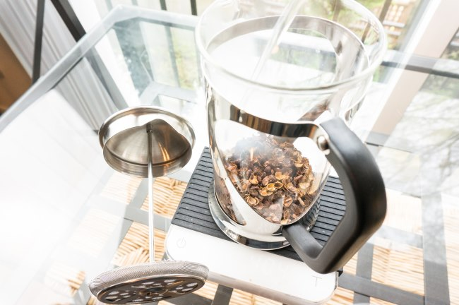

Cascara has been gaining popularity in coffee circles in the past few years. With Starbucks releasing its own Cascara Latte, the term will soon become commonly known to many who frequent cafes or read coffee websites.

Cascara is the dried outer skin of a coffee cherry. In Spanish, cascara means peel or fruit skin. It is collected during the pulping process. Usually, the coffee producer uses the wet production method, but some cascara is now being collected from producers using natural production. These cascara skins are sometimes dried to be used as tea.

Cascara is not technically tea, as tea comes from the camellia sinensis plant. This is explained in our article [A Coffee Lover’s Guide to Tea](http://ineedcoffee.com/a-coffee-lovers-guide-to-tea/). However, it is being used increasingly to make a tea-like beverage. When brewed as tea, cascara is delicious. It tastes fruity with notes of cranberries and honey. And cascara tastes great both hot and iced.

In this tutorial, we will make a pot of cascara tea using a 34-ounce French Press. You can use a mason jar if you don’t have a French Press. Using the French Press just makes the filtering process easier.

### The Ratios

There are wildly different recipes for making cascara tea. I’ve seen brewing ratios as strong as 10:1 (10 parts water to 1 part tea) and as weak as 20:1, but many use ratios between those two outliers.

Different cascaras at different levels of freshness will taste good at different ratios. Unlike coffee, which requires more precision, cascara is more forgiving of the dose. For this tutorial, we are going to use a 15:1 ratio. This is a good middle ground. If you find it too sweet, you can reduce the amount of cascara you use the next time or add more water. If it isn’t sweet enough, you can add more cascara or extend the brew time.

### #1 Add Cascara To French Press

Add 10 Tablespoons or 60 grams of cascara tea to a large French Press.

### #2 Add Hot Water and Fill French Press

Heat water to boiling and fill French Press. Normally when brewing actual tea leaves you would not use water this hot – but this is not tea (camellia sinensis) – so it is brewed in the same manner as other herbal teas, which is just off the boil.

### #3 Steep Cascara For 4 Minutes and Stir

Begin the 4-minute steep. Gently stir a few times during the brew with a chopstick. Our goal is to ensure that all the cascara is making contact with the hot water.

### #4 Push Down and Serve

There is no need to slam the filter down. Move it slowly, as the cascara will put up less resistance than you would experience when brewing coffee.

Enjoy your cascara hot or over ice. Jar whatever you don’t use and refrigerate for later use.

### 2nd Steep

Like many tea varietals, you can steep your cascara tea a second time. It won’t be as sweet as the first steep, but it should still taste rich. Some people who find the first steep too sweet may prefer the second steep more. Follow the same instructions as above, but extend the brew time to 6 minutes.

*The Cosori French Press / Tea Press*

### Cascara Concentrates

Until now, we have just made regular cascara tea. We can also make cascara concentrates in the same manner as above with a few changes. Cascara concentrates will be used in drinks that require a much stronger cascara flavor, such as cascara lattes, homemade sodas, and even cocktails.

For cascara concentrates, we are going to increase our ratio to 10:1, which means using 90 grams of cascara for our 34-ounce French Press. We will also extend our brew time to 15 minutes.

Another concentrated brewing option is to brew the cascara like you would a [cold brew coffee in a French press](http://ineedcoffee.com/making-cold-brew-coffee-french-press/). Place the cascara in the French press, add cold water, and allow it to sit on the counter for 12-24 hours. This is one way to make a stronger extract, but it is not necessary to wait that long. My preference is to increase the amount of cascara by 50% and brew for 15 minutes. Adjust according to taste.

### How Much Caffeine is in Cascara?

Although there is some debate on how much caffeine is in cascara, a growing consensus is that caffeine levels are around 25% of brewed coffee on an ounce-by-ounce basis. I feel a jolt from cascara, but that is likely because I tend to drink more of it due to its sweet nature.

If this topic is of interest, see the article [The Great Caffeine Debate](https://unionroasted.com/blogs/latest/the-great-caffeine-debate) by Union Hand Roasted Coffee. They measured the levels of two different varietals of cascara. Square Mile Coffee Roasters also performed caffeine tests, as shown in [Cascara and Caffeine](https://web.archive.org/web/20230603183929/https://squaremileblog.com/2013/08/30/cascara-and-caffeine/).

### Start Brewing!

Cascara makes a delicious beverage and is super easy to make. More and more specialty coffee roasters have begun selling loose cascara.

One last tip. If you are brewing coffee and cascara tea in the same French Press, be sure to do an excellent job cleaning the filter. This might mean running it in the dishwasher. You don’t want your cascara to taste like the last pot of coffee you brewed.

*Brewing photos by Joseph Robertson of Extracted Magazine, a digital coffee magazine published for iOS and Android.  
*