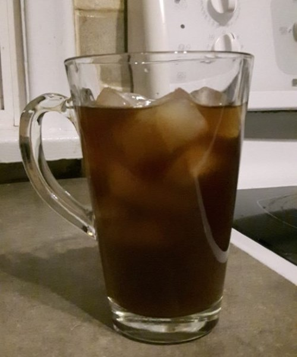
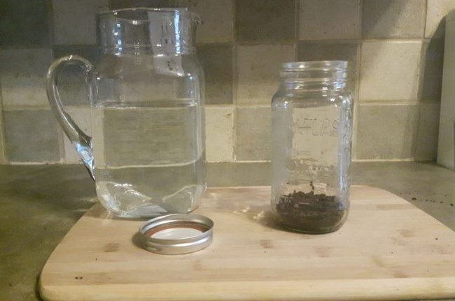
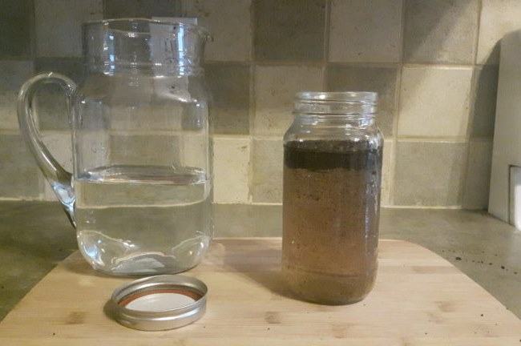
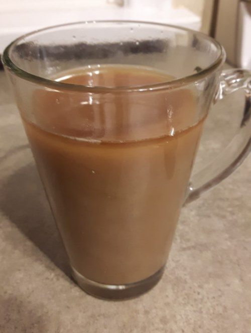

Nothing creates demand for cold drinks like hot weather. Every spring and summer, coffee lovers are drawn to iced coffees and frappes to beat the heat. However, many frappes are vaguely coffee-flavored milkshakes and can contain a lot of sugar and calories. Many iced coffees are bitter and end up tasting watered down by all of the ice. However, over the past few years, cold brew coffee has been changing the coffee scene. If you’re the sort of person who wants a cold coffee drink that tastes like coffee, cold brew may be exactly what you’re looking for.

A bit more like wine than coffee, cold brew is made by steeping fresh-ground coffee in cold water for hours. Unlike most other coffee brewing methods, which emphasize how fast they can make your cup, cold brewing takes between eight and twenty-four hours to steep all the goodness out of those beans.

However, cold brewing is also unique in that it holds onto so much of the coffee’s flavor. Hot coffee warms up the bean’s aromatic compounds and oils and releases them into the air, which is the reason why fresh coffee smells so great. Cold brewing doesn’t release any of those compounds. So, cold brew tends to have intense flavors that hot coffee doesn’t. Aficionados consider cold brew to be sweet and mellow, with less bitterness and acid characteristics than conventionally made coffee.

Cold brew coffee has a long and illustrious history. The Dutch started making something like cold brew coffee in the 1600s. Dutch sailors may have wanted a coffee concentrate that could be stored for long periods of time, but also easily heated and served. The cold brew fever spread to the Japanese, who elevated Kyoto-style cold brew coffee to something of an art form. Today, cold brew coffee is available at many coffee shops in the summer. Even Starbucks makes cold brew coffee now.

My adventure with cold brewing started at a coffee shop just down the street from my house. This coffee shop began offering what it called “Dutch-style” coffee last summer. They even have an elaborate cold brewing coffee maker on display. On a whim, I ordered some. This coffee served over ice in the summer, was flavorful and refreshing. While most iced coffees come with loads of sugar and flavorings, that glass of cold brew was great completely solo.

So, as soon as the first hints of spring started to appear, I wanted to try my hand at it. Neither do I have a fancy setup like that coffee shop, nor do I have the space for it in my kitchen. Fortunately, cold brew is actually pretty simple to make. I made it at home with almost no special equipment beyond a coffee grinder and a Mason jar.

### Making Cold Brew

#### The setup

I started by coarsely grinding about a quarter cup of light roast coffee in a blade grinder. In order to really get a sense of how cold brewing affects coffee flavor, I used the same beans I usually use to make my morning cup. The coffee should be ground to about the consistency of breadcrumbs. If the coffee is too finely ground, the resulting coffee can be cloudy, so it’s not a bad thing if the coffee is very coarse.

A 1:8 ratio of beans to water is ideal for cold brew, and I was planning to use a two-cup mason jar to hold the mixture while it steeps. I put the mixture in the mason jar, poured cold water over it, and closed it up for the day.

After letting the coffee steep for about ten hours, it was time to strain the cold brew and taste it. Any method for getting the grounds out of the coffee should work. Some instructions I found on the internet suggested skimming the grounds out of the coffee. Others suggested straining the coffee repeatedly. Instead, I used my handy French Press. I poured the still steeping mixture into the press and let it settle for about an hour before pressing down the plunger.

The French Press method worked fairly well for me. However, if the coffee remains cloudy after pressing or filtering, it just means that the beans were ground too finely. Using a burr grinder can result in more evenly ground coffee. That means that there will be fewer fine particles floating in the coffee.

### The result

So, how did it work out? I made delicious cold-brew coffee right at home. I tried it a couple of different ways: plain with ice, and with cream and a little brown sugar. The black coffee was incredible. Even though it was pretty light in color, it was not weak at all. It was rich and extremely flavourful. Because I was using my usual coffee, I could easily compare the hot and cold brews from the same beans. I was really happy to conclude that the cold brew version had a much deeper flavor and less bitterness than what I usually drink in the morning. With added cream and sugar, the coffee was dessert-like.

Compared to other cold coffees, like an iced Americano you can get at Starbucks or your local coffee shop, cold brew has all of the flavors with none of the bitterness. Making cold brew coffee at home is really easy and doesn’t require too much in the way of special equipment. I’ll definitely be making this throughout the summer.

### Resources

[Buying a French Press – Picking the Right One](http://ineedcoffee.com/buying-a-french-press-picking-the-right-one/) – If you don’t own a French Press, here is a guide to help you make a purchase.

[The Perfect Solution For Cold Brew Coffee on the Road](http://ineedcoffee.com/the-perfect-solution-for-cold-brew-coffee-on-the-go/) – How to brew cold brew coffee in the Primula travel bottle.

[Cold Brew Coffee is Not Rocket Science](http://ineedcoffee.com/cold-brew-coffee-is-not-rocket-science/) – A primer on cold brew coffee.

[A Clever Way to Make Iced Coffee](http://ineedcoffee.com/clever-way-make-iced-coffee/) – How to make iced coffee that isn’t bitter or watered down.