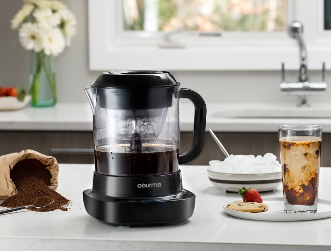
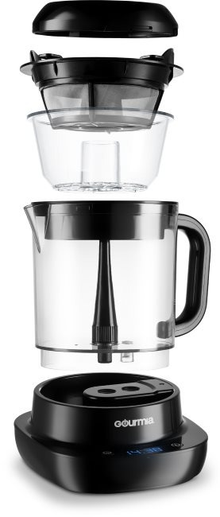
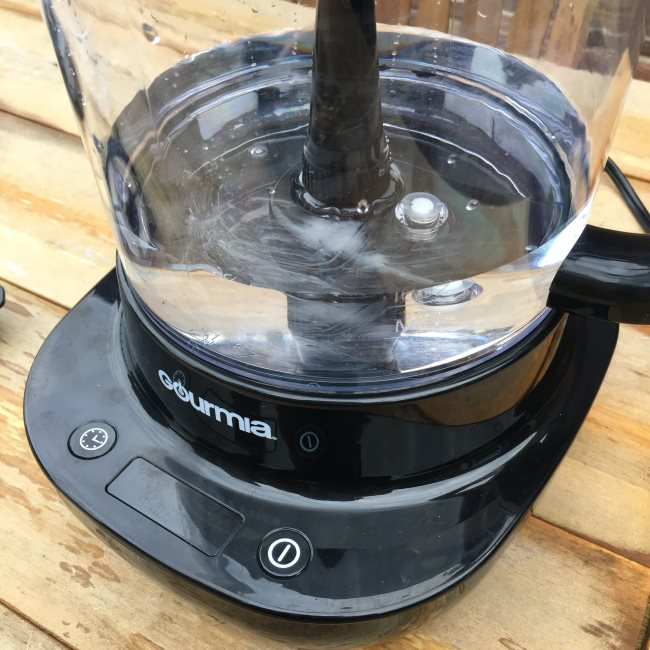
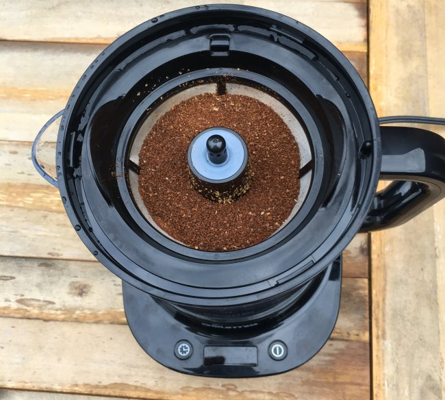
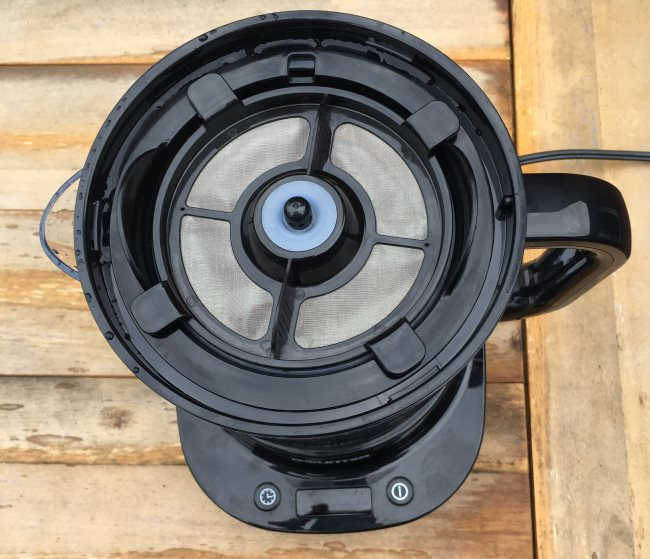
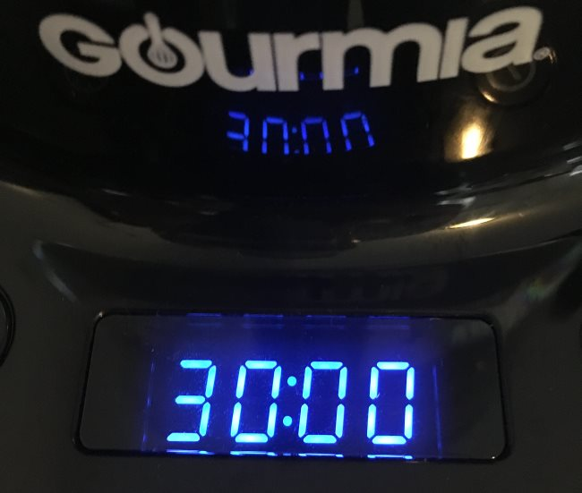
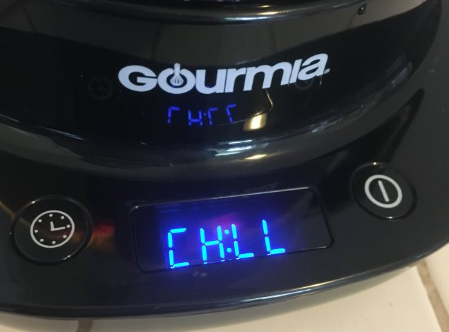

In several tutorials here on INeedCoffee, we show you how easy it is to make cold brew coffee at home. Soak coffee grounds in water for 12-36 hours, filter, and you’re done. The only step left is to chill the finished brew. So what makes one cold brewer better than the next? Volume, the quality of the filter, how easy it is to clean up, and how good it looks on your counter. That was it. Until now.

Gourmia solved the one variable everyone else took for granted: The Wait. Why must we wait 12-36 hours for cold brew coffee? Does it have to take so long? Can we speed up the process?

We wait so many hours for cold-brewed coffee because the coffee grounds are sitting in motionless water, slowly releasing their flavor—very slowly. What if, throughout the brew cycle, the water gently agitated the coffee grounds to accelerate the release of flavor? You could reduce the brew time.

This is what the Automatic Cold Brewer by Gourmia does.

Depending on how rich you want your cold brew, the Gourmia will softly push the water evenly over the coffee grounds for 10 to 40 minutes. This is followed by an optional cooling cycle of around 6 minutes. This means that you can have filtered cold brew coffee from set up to finish in minutes.

*Gourmia Automatic Cold Brewer*

### The Equipment

When you unbox the Gourmia Cold Brewer, you will see several parts. Don’t be overwhelmed. It is easy to get started, and the documentation is well-written. First, you’ll want to remove all the plastic wraps covering the different sections. Then wash and dry everything.

*This photo shows the different parts of the Gourmia Automatic Cold Brewer.*

*From top to bottom: Lid, Top Filter on the Coffee Basket, Ice Basket, Pitcher, Removable Fountain (inside Pitcher), and the Main Unit. Note that the coffee basket is used only during the brew cycle, and the ice basket is used only during the chilling cycle.* 

### Cold Brew or Cold Brew Concentrate?

Before you start brewing, you will decide how strong you want your cold brew. There are four settings, each corresponding to a brew strength.

-   Light – 10 minutes
-   Medium – 20 minutes
-   Bold – 30 minutes
-   Concentrate – 40 minutes

Gourmia recommends using a Medium-Coarse grind for all the settings. However, if you want to make a strong coffee in 10 minutes, tighten up the grind to Medium. If you’ve used a grind too fine and your coffee is too strong, you can always add water to bring the coffee to the strength level you prefer most.

### Brew Quantities

Three markings on the pitcher’s side indicate different brew quantities. Each level has a different coffee requirement. This information is in the instructions, but I’ll reprint it here if you’ve misplaced yours.

-   10 ounces water – 25 grams or five teaspoons of ground coffee
-   16 ounces water – 40 grams or eight teaspoons of ground coffee
-   24 ounces water – 60 grams or twelve teaspoons of ground coffee

The brew chamber can hold a lot more water but don’t be tempted to make more than 24 ounces because the basket that holds the ground coffee is limited to around 60 grams. Adding more water will only result in a weaker brew. You can add water post-brew if it tastes too strong for you.

### Step By Step Brewing Instructions

The Gourmia Automatic Cold Brewer has two phases.

1.  Brewing Cycle
2.  Chilling Cycle

Phase two is optional. You do not need to use the brewer to perform the cooling, but if you are having the coffee right away, use it. Otherwise, bottle the coffee and place it in the frig.

#### #1 Add the Removable Fountain

Twist the Removable Fountain clockwise into the bottom of the pitcher before adding water.

#### #2 Add Water

Fill the pitcher with cold water to the marking level you wish to make. 10, 16, or 24 ounces.

*On this brew, I was making 16 ounces of coffee.*

#### #3 Add Ground Coffee to Basket

Add coffee grounds inside the Coffee Basket and place it on the pitcher.

*Add coffee grounds inside the Coffee Basket and place them inside the Pitcher.* 

#### #4 Put on the Top Filter and Lid

Put the Top Filter over the Coffee Basket and press it into place. Then, add the Lid and turn it in place.

*The Top Filter will fit snugly over the Coffee Basket.* 

*Secure the Lid on top.* 

#### #5 Plug in the Cold Brewer

Confirm that the cold brewer is plugged into a working outlet. If you have power, you’ll see the LED Display.

#### #6 Set Brew Time and Begin

Pressing the left button will cycle through the brewing times in 10-minute increments. Set the time based on the brew strength you desire, and then hit the right button to begin. If you decide you want to make the coffee lighter or stronger in the middle of a brew, you can adjust the timer.

*Here, I have set the brew to 30 minutes (Bold) with the button on the left. Then, I pressed the right button to initiate the cold brew.* 

At this point, the coffee has finished brewing. You can bottle it and place it in the refrigerator or if you’ve made a concentrate, you can add ice/cold water. Or heat it and drink it hot.

### (Optional) Perform Chilling Cycle

The Gourmia has a chilling cycle that moves your cold brew near the basket of ice, cooling the coffee without melting the ice. The cold brew retains its brew strength and gets chilled.

#### #1 Swap Coffee Filter Basket with Ice Basket

Remove the Coffee Filter Basket and place it inside the Ice Basket filled with ice cubes.

#### #2 Add the Top Filter Lid and Start the Chill Cycle

To start the chill, hold the left button down for 3 seconds. Once you see **CH:LL**, press the right power button. This will take about 6 minutes. During this time it may appear the machine is doing nothing, but the coffee is being circulated through the Removable Fountain by the ice.

At the end of the chilling cycle, the coffee will not be super cold, but it will be cool enough that if you add ice, the ice will not melt right away.

### Troubleshooting

Add water, ice, or both if the coffee tastes too strong.

If the coffee is too weak, tighten your coffee grind and/or extend the brew cycle time.

### Review

The Automatic Cold Brewer by Gourmia is pretty neat. The cold brews I made at both the 20-minute and 30-minute settings were just as delicious as the cold brew I had in my frig, which took 24 hours.

Besides the extreme time savings you get with the Automatic Cold Brewer, another benefit is that with the 4 settings, all the guesswork on how long to leave your cold brew is handled for you. Repeating your brewing results will be easy with the Gourmia.

As much as I like other cold brewing methods, even the newer ones with better filters, I found that the Automatic Cold Brewer brews a cleaner, brighter-tasting cold brew. When it was finished brewing, there wasn’t the sandy residue at the bottom of the pot.

For those who love cold brew coffee but don’t like to wait a day, this might be the coffee brewer you need.

### Resources

*Gourmia GCM6800 Automatic Cold Brew Coffee Maker*

[Cold Brew Coffee is Not Rocket Science](/cold-brew-coffee-is-not-rocket-science/) – An overview of the basics of cold brew coffee.

*Disclosure: This post was sponsored. INeedCoffee received equipment and compensation for this article.  
*
