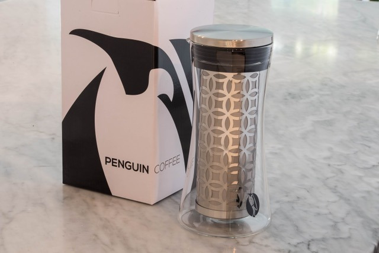
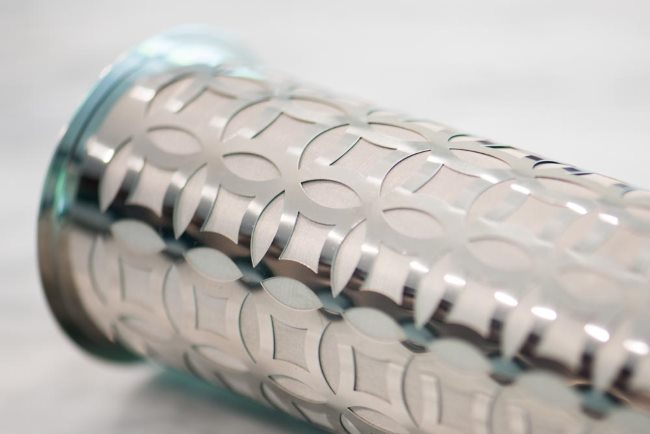
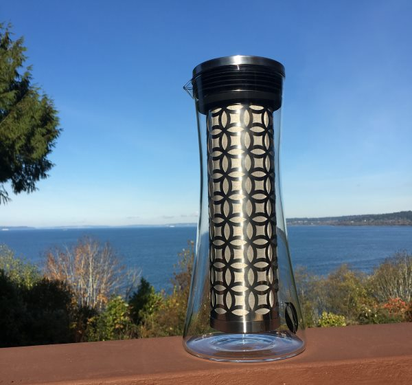
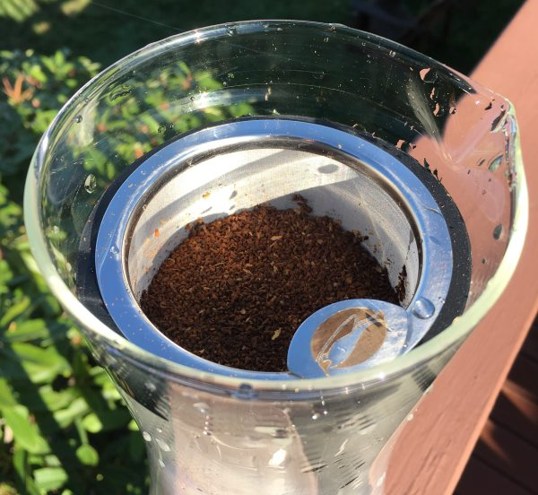
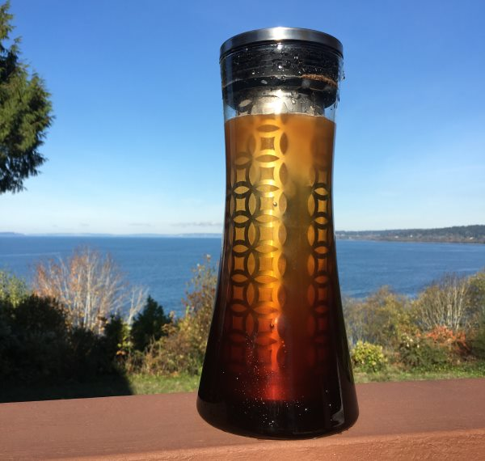
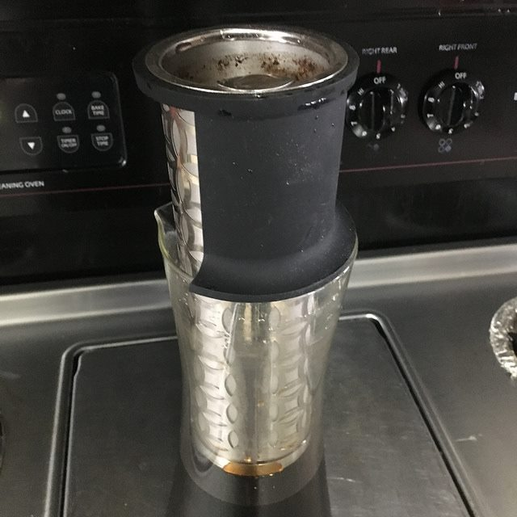
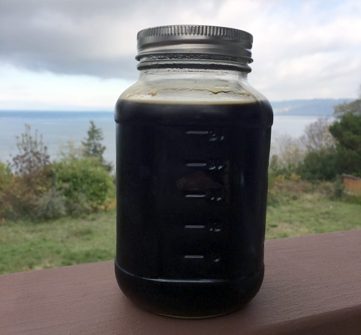
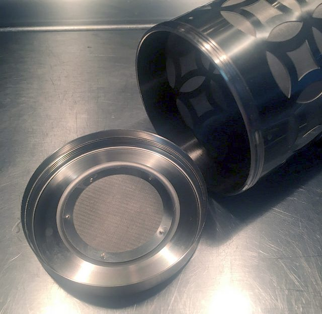
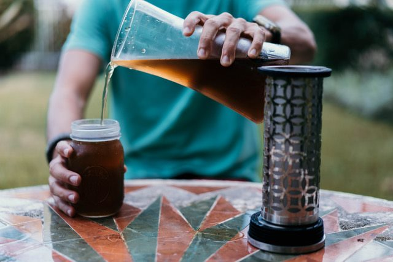

In the past few years, I’ve seen cold-brew coffee makers get better and better. How does a method of coffee brewing that requires no electricity get better? After all, making cold-brew coffee is really just a few steps: Soak ground coffee in water for a day and then filter out the grounds. How do you improve on that process? Three ways come to mind.

1.  Make measuring the coffee and water easier.
2.  Create a filter that does a good job of keeping tiny grounds out of the brew.
3.  Make it easier to clean up.

If the person making the coffee doesn’t mess up the amount of coffee and water needed, then the coffee will turn out great. The cold brew will be clean without sludge if the filter is good. And if the cleanup is easy, the coffee fan will be more likely to make cold brew coffee repeatedly.

Enter the Penguin Coffee. The new version of their cold brewer accomplishes all those goals while making a true cold coffee brew concentrate.

*Penguin Coffee Cold Brew* 

### The Penguin Cold Brewer

I’ve made cold brew coffee with several brewers. The first thing I noticed about the Penguin is that the glass is much thicker than the others. This is one sturdy cold brewer. If you tap the side of this brewer, it won’t go flying off the counter.

The second thing I noticed was the filter. The steel filter uses the smallest holes I’ve ever seen on a cold brew coffee filter. The Penguin product guide says they are microscopic holes. The smaller the holes, the cleaner the coffee. Also, the filter is larger and can hold more coffee than other cold brewers I’ve used.

*The Penguin Coffee brew steel filter has microscopic holes.*

Penguin Coffee Cold Brewer has two models: the 1.2 L makes 725 ml (24.5 ounces) and the 1.6 L makes 975 ml (33 ounces).

Let us make some coffee.

### #1 Grind Coffee

The 1.2 L model can hold up to 225 grams of coffee, and the 1.6 L model can hold up to 280 grams. You do not need to use that much coffee; those are just the amounts the filter will hold. If you want to make a concentrated cold brew, you’ll want to brew with a near-full filter, but you can always use less coffee.

Use medium to medium-coarse ground for the cold brew. See our Coffee Grind Chart for more guidance, but don’t be too concerned with being exact. Cold brew is forgiving.

### #2 Place Filter Inside Glass Carafe

The filter makes a tight seal with the glass, so go ahead and place the filter inside, as there is no risk that coffee grounds will get around the filter when added in the next step.

*My 1.6L Penguin Cold Brewer before adding coffee grounds to the filter.*

### #3 Add Ground Coffee to Filter

I often will reach for my AeroPress funnel to load coffee grounds into brewers, but the Penguin filter was wide enough that it wasn’t necessary. I just poured the ground coffee directly into the filter.

*The Penguin filled with ground coffee.* 

### #4 Fill Brewer with Water

Slowly add cold water to the Penguin Brewer until the coffee grounds are covered. The Penguin makes a more concentrated cold brew than other cold brewers on the market, so you will want to cut it with water later. Your other option is to use fewer grounds and more water during the brew. Either will work.

For this tutorial, I am using 280 grams of coffee (the 1.6 L) model and filling the brewer with water, which covers all the grounds.

### #5 Wait 24+ Hours

Put the lid on top of the brewer and wait. The lid covers the brewer fully, so no dust or bugs will enter your brew. Now place the brewer out of the way for the next day or so. I’ve gotten excellent results from brews between 24 and 36 hours.

Here is an optional tip that may or may not help with extraction. I’ve gotten into the habit of periodically lifting the brewer and giving it a gentle wiggle. My thinking is that a little water movement could assist with extraction. Again, this is an optional step.

*After taking this photo, I added a little more water.*

### #6 Use Filter Holder to Collect More Coffee

After the brew, you’ll want to collect your coffee, but you don’t want to lose the coffee still trapped in the grounds. The Penguin ships with a Filter Holder, which props up the filter so water still trapped inside the coffee grounds can be drained and collected. This is a clever way to capture the most concentrated coffee.

*Use the Filter Holder to collect concentrated cold brew from the filter.* 

### #7 Remove Filter and Jar

I was able to jar just over a quart of cold brew concentrate—I want to stress the word concentrate. For my tastes, I needed to cut it with 1.5 to 2 parts water to 1 part coffee before drinking. If you don’t do this, be prepared for a massive caffeine hit.

You can use the Penguin to store your cold brew. I don’t, just because I want to prep my next brew before I run out of the previous brew.

*Cold Brew Concentrate*

### #8 Clean Up

You can discard the used coffee grounds in a compost bin or your garden. Then, rinse the filter and jar well. Unlike other cold brewers, the filter bottom can be removed for easy cleaning.

All of the parts are dishwasher safe for less frequent and deeper cleaning. Occasionally, running the stainless steel parts and glass through the dishwasher can be good. Over months of use, coffee oils can build up on the inside of the filter, and the dishwasher’s super-hot water breaks them up and really cleans the filter.

*The filter has a removable bottom cap for easy cleaning.*

### Concentrated Cold Brew

Not all cold brewers are equal. The filter sizes and jar sizes vary, which means each brewer will make a cold brew of different strengths, so the level of concentration will vary. The Penguin makes a cold brew that is more concentrated than the other cold brewers I’ve used.

Because cold brew is a concentrate, you must cut it with water. How much water is really up to you and what you like. I advise experimenting with your first brew by mixing water with small samples at varying strengths to determine what tastes best for you, whether you use the Penguin or another cold brewer. Once you know your best ratio, you are set.

*Serve and enjoy!*

### Penguin Coffee Review

The Penguin Coffee Cold Brewer is my new favorite cold brewer. It is sturdy, doesn’t take up much space, makes a super clean, concentrated cold brew, and is easy to clean up. Because it is twice as concentrated as my previous cold brewer, I now only need to brew half as often, which saves me time as well.

If you want to save money by making cold brew at home, I highly recommend the Penguin.

**Update:** Version 2.0 is out now, with stronger glass and a better filter. I like how easy it is to remove the end cap of the filter now.

*Disclosure: This post was sponsored. INeedCoffee received equipment and compensation for this article.*