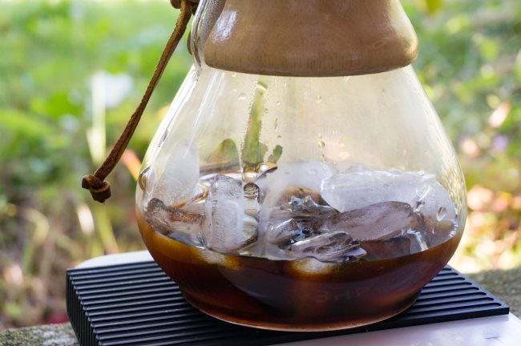
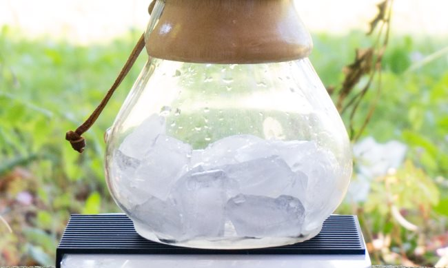
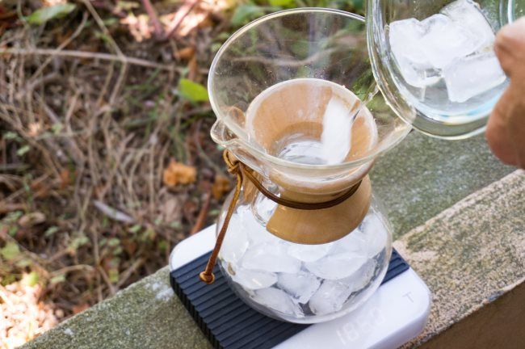
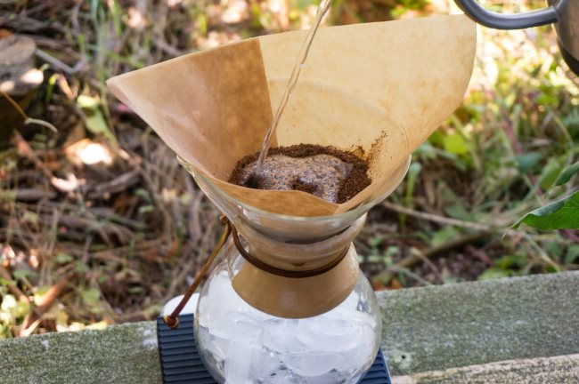
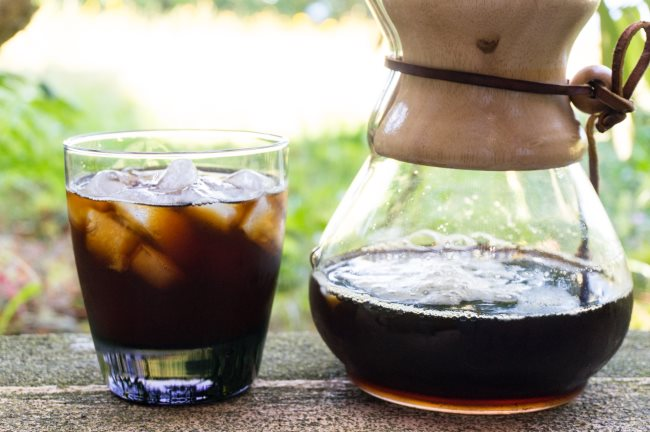

It’s time for another coffee brewing tutorial. This time, we are going to make iced coffee with a Chemex. The Chemex is a popular pour coffee brewer, which we covered in detail in the article “[Chemex Coffee Brewing—History and Tutorial](http://ineedcoffee.com/chemex-coffee-brewing-history-and-tutorial/).” In addition to making great hot coffee, the Chemex does a stellar job of making iced coffee.

Before we jump into the tutorial, I want to briefly explain how iced coffee is different from cold brew coffee. Cold-brew coffee, which has been surging in popularity in recent years, takes about 24 hours to make. Iced coffee is different. It just takes the same time it normally takes to make hot coffee. Iced coffee should taste as bright and as flavorful as the hot version without being weak and watery. Iced coffee excels at preserving the same flavor characteristics in the regular brewed hot version. Cold brew will create a low acidity profile and is higher in caffeine.

The big theme with making iced coffee is that the water will come from the hot brewing water and ice cubes. A smaller amount of hot water will pass through the coffee grounds. As the coffee brews, it will fall onto the ice cubes. The ice will mostly be melted, but the drink will be chilled and not taste weak or watered down. With the Chemex, the brew time for iced coffee is comparable to that of the hot version. If you want a slow-drip iced coffee, check out our [Cold Brew Dripper Tutorial](http://ineedcoffee.com/cold-brew-dripper-tutorial/).

### Step by Step Iced Chemex Brewing

For this tutorial, we are going to use the 6-cup Chemex. If you have the 3-cup, use half the coffee, hot water, and ice of this recipe.

#### Ingredients and Water Math

Besides the Chemex, you will need:

-   50 grams of coffee
-   466 grams of water
-   234 grams of ice
-   Chemex filter
-   digital scale (recommended)

Our brewing ratio will be 14:1, which means 14 parts of water to 1 part of water. This ratio is slightly stronger than the 17:1 we use for hot Chemex.

What if you don’t have a scale? Wing it. A general rule is that 1/3 of the water you would normally use should be added first as ice cubes. For the 6-cup brewer, the cubes will be higher than where the brewer curves back up.

#### #1 Heat Water

You will need enough water for both the hot water portion of the brew and to thoroughly rinse the Chemex paper filter.

#### #2 Rinse Filter

The Chemex uses a thick paper filter, which can impart a paper-like taste to the coffee. To avoid that, give it a good rinse first. Unlike other brewing methods, in which a quick splash of water is enough, the Chemex needs a longer rinse. Aim for 5-10 seconds.

Once the rinse is complete, place the filter aside and dump the rinse water. At this point, give the Chemex a quick rinse with cold water. If we were brewing a normal hot Chemex, we wouldn’t do this step to retain more heat on the glass.

#### #3 Add Ice to the Chemex

Place 234 grams of ice into the base of the Chemex.

#### #4 Place Filter on Chemex and Add Ground Coffee

Now that the ice is in the Chemex, return the filter to the top of the Chemex. Place 50 grams of ground coffee into the filter. Use a medium-coarse grind, which is in between a normal drip and a French press grind. See our [Coffee Grind Chart](http://ineedcoffee.com/coffee-grind-chart/) for visual guidance.

#### #5 Slowly Pour Hot Water over the Coffee Grounds

The hot water pour is the same as on a hot brew; we pour less hot water. From our Chemex Coffee Brewing tutorial:

> Once the water reaches boil, remove it from the heat source and let it cool 20-30 seconds before pouring.
> 
> The initial pour is very important. Instead of pouring all the water onto the grounds as you would with a press pot, only pour enough water to saturate the beans. Chemex states that wetting the grounds allows them to “bloom”. The importance of this step is to get all the coffee in contact with water. After you wet the grounds wait 20-40 seconds. During this time trapped carbon dioxide (CO2) escapes from the grounds.

If you can see areas where the coffee is clumping and not contacting the water, you can use a wooden spoon to stir the brew. This is optional. We will be adding 466 grams of water in total. Having a kettle with a gooseneck spout makes this task easy.

### #6 Remove Filter and Serve

Once the water has finished passing through the coffee and filter, remove the filter. At this point, the ice should be mostly or fully melted. The coffee should be cold. If you want, you can add ice to your glass before serving coffee. The ice will keep the coffee cold so you have a lot more time to sip on the beverage before it starts to water down.

### Last Words

We have another tutorial that uses a [Clever Coffee Brewer to make Iced Coffee](http://ineedcoffee.com/clever-way-make-iced-coffee/). That is still my favorite iced coffee brewing method. However, the larger Chemex sizes (6-cup and 10-cup) are best for making larger batches of iced coffee. If I’m just making an iced coffee for myself, I grab the Clever; however, for friends and family, I use the Chemex.

### Resources

[Chemex Coffee Brewing – History and Tutorial](http://ineedcoffee.com/chemex-coffee-brewing-history-and-tutorial/) – INeedCoffee tutorial.

[Clever Coffee Brewer to Make Iced Coffee](http://ineedcoffee.com/clever-way-make-iced-coffee/) – INeedCoffee tutorial.

*Brewing photos by Joseph Robertson of Extracted Magazine, a digital coffee magazine published for iOS and Android.  
*