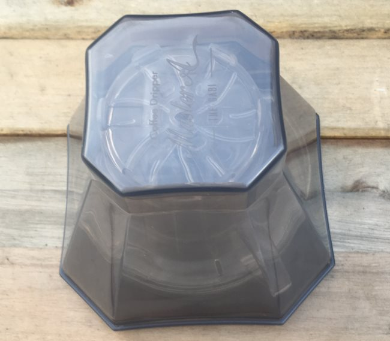
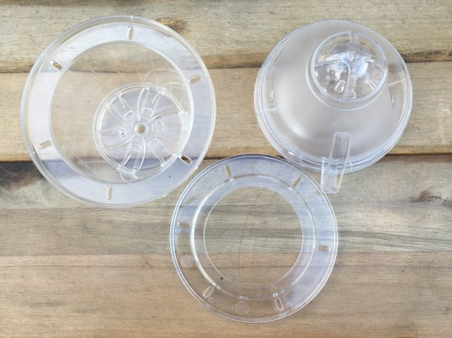
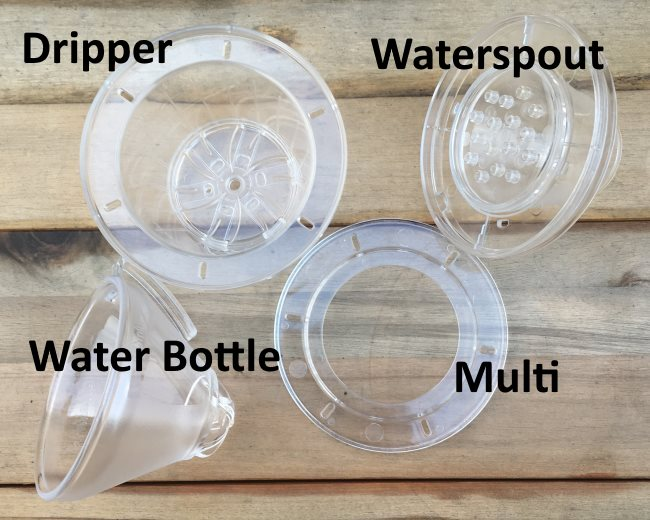
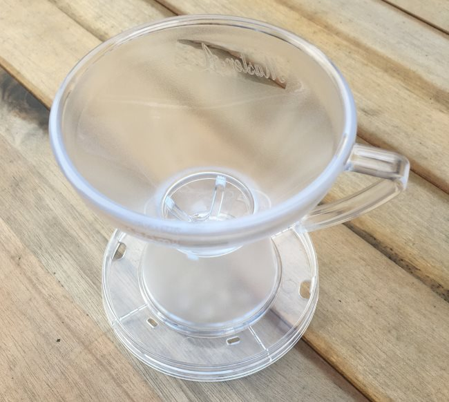
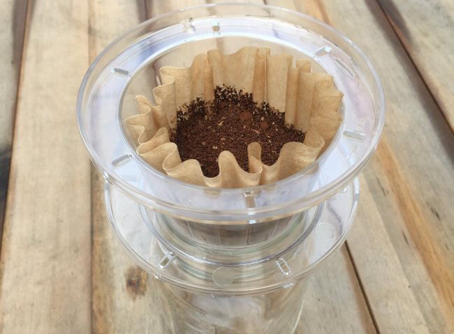
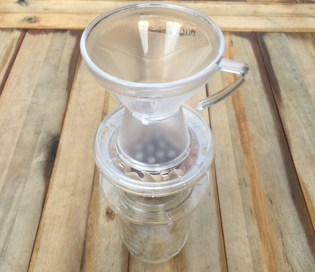
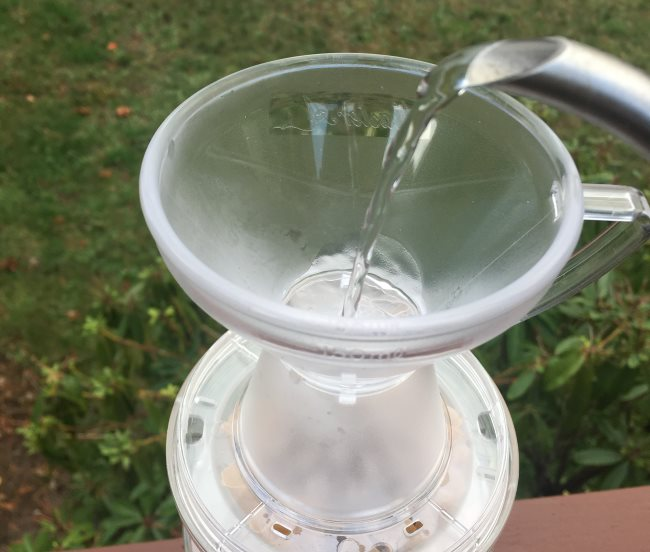
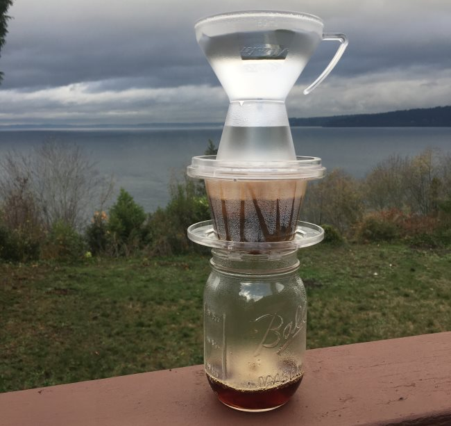
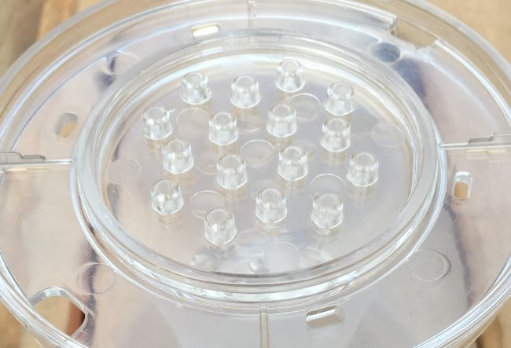

When I first received the Gabi Drip Master coffee brewer (aka the Master A), I had no idea how to make coffee with it. I’ve used many other pour-over coffee brewers, but this one was unique. Whereas other pour-over coffee brewers task you with controlling the water flow over the beans, the Gabi Drip Master adds a clever twist. It is designed to collect the water poured and then evenly distribute that water over the beans for you in a more uniform manner.

How well does it make coffee compared to other flat-bottom pour-over brewers? I’ll render a verdict at the end of the article. First, let’s make some coffee.

### The Equipment

Putting the Gabi Drip Master together the first time is like putting together a puzzle. All the parts collapse into a tight space. We will need to unpack and assemble the brewer.

Open the shell and pull out the parts.

The part in the upper right can be opened to find another section.

Here, we have the entire brewer. On the Top Row, we have the Dripper and Waterspout. Underneath are the Water Bottle and the Multi. We’ll go through each later. Now, all we need is a mug or jar to brew our coffee.

### Measuring the Coffee

Also included in the Gabi Drip Master is a scoop incorrectly labeled as 15 grams. It doesn’t hold 15 grams. It holds 6-7 grams of coffee. The mislabeling won’t be a problem because we will keep the math simple.

We are going to brew 10 ounces of coffee. This means three scoops will give us approximately 20 grams of coffee. Since 10 ounces is about 300 milliliters, this works out to a brew ratio of 15:1 (15 parts water to 1 part coffee).

Probably the second most clever part of the Gabi Drip Master design is that the top chamber holds exactly 150 grams of water. This means two fills will meet our water needs. **There is no need to weigh anything.** The most clever part is the Waterspout, which will be covered later.

This is a different recipe than the one included in the instructions. I think mine is better. Feel free to adjust the recipe for your tastes.

### Grinding the Coffee

Since this is a flat-bottom pour-over brewer, I used a [medium grind](http://ineedcoffee.com/coffee-grind-chart/), like I would for the [Kalita Wave](http://ineedcoffee.com/kalita-wave-coffee-brewing-tutorial/) or the [Stagg Dripper](http://ineedcoffee.com/stagg-pour-coffee-dripper-review-tutorial/).

Brewing the Coffee
------------------

### #1 Connect the Water Bottle to the Waterspout

The Water Bottle fits on top of the Waterspout. Connect the two. The Water Bottle will hold the water before it goes into the Waterspout.

Set this aside for now.

### #2 Rinse the Filter (Optional)

The Gabi uses the same 155 series filter as the Kalita Wave. Place the filter in the Dripper and rinse with hot water. Throw out the rinse water. Because the Kalita Wave filter is so thin and there is a debate on if it is best to rinse that filter, I’m labeling this as an optional step.

For my tests, I rinsed because I had the brown filters, which impart more of a paper taste to me. If I had the plain white filters, I might not have rinsed. It all depends on whether you can taste the paper in the brew.

### #3 Add Ground Coffee and Place Over Mug

Add 20 grams or 3 scoops of medium-ground coffee to the filter. Place the filter into the Dripper and set the Dripper over a mug or jar. For this tutorial, I am using a jar.

The Multi is used when the Dripper doesn’t fit your mug. If the Dripper fits your mug, then you won’t need this part.

*The Dripper here sits on the Multi, like a stand for your mug or jar.* 

### #4 Place the Connected Water Bottle / Waterspout Over the Dripper

Place the connected Water Bottle and Waterspout onto the Dripper. Now the brew stack is complete.

*Here is the full brew stack. From top to bottom: Water bottle, Waterspout, Dripper (with filter and ground coffee), Multi, and Jar.*

### #5 Add Water

Heat water to 200° F. Fill the Water Bottle to the top. Wait until all that water exits completely into the Waterspout. Then fill it again. At this point, you will have added 300 milliliters of water, which is all we need for our 10-ounce cup of coffee.

*Add hot water to Water Bottle.*

### #6 Remove the stack and enjoy!

Once the coffee has finished brewing, remove the stack and enjoy.

### The Waterspout is Pretty Cool

What makes the Gabi special is the Waterspout. Instead of having a human try to gently and evenly pour water onto the coffee grounds, the waterspout handles that task. It slows the water flow into cascading drops that hit the coffee grounds evenly.

As the person making the coffee, my only task, once the Gabi Drip Master stack is set up, is to add enough water to the Water bottle. Gabi does the rest. I’ve tried many different coffee pour-over devices, and this is the first time I’ve seen this part handled for me. This is what high-end automatic drip coffee makers do so well, but at a much lower price.

*This is a close-up view of the waterspout.* 

### The Verdict

When I first test a new coffee brewer, I expect the first few brews not to go smoothly, so I don’t use my best coffee. I use my worst coffee. It is better to make mistakes and throw out coffee you don’t like instead of wasting your best coffee. So, for this brewer, I used a naturally processed coffee from Indonesia that just tasted odd to me. It was bright but not sweet, with a sour finish.

To my amazement, Gabi made this coffee, which was underwhelming on the AeroPress, taste magical. It was rich, sweet, and with a clean finish—no sourness.

Then I pulled out my good coffee and made several more mugs of coffee. Each one was outstanding.

I’m a fan of the Gabi Drip Master. When I first stacked all those sections together, I felt silly, like I was playing coffee Jenga, but the coffee speaks for itself. It tastes great. The Gabi Master is a great flat-bottom pour-over device.

### Resources

[Stagg Pour-Over Coffee Dripper Review and Tutorial](http://ineedcoffee.com/stagg-pour-coffee-dripper-review-tutorial/) – Flat-bottom pour-over device.

[Kalita Wave Coffee Brewing Tutorial](http://ineedcoffee.com/kalita-wave-coffee-brewing-tutorial/) – INeedCoffee brewing tutorial.

[Coffee Brewing Guide](http://ineedcoffee.com/coffee-brewing-guide/) – Our guide includes several different pour-over tutorials.

*Disclosure: INeedCoffee received a Gabi Master Dripper for this tutorial.*