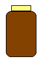
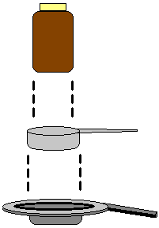
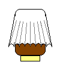
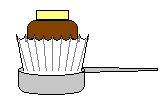
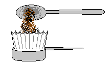
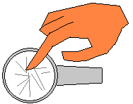
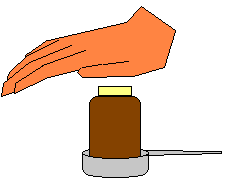

Do you really like your pod coffee maker, but wish you could use your favorite brand of coffee instead of paying a premium price for a mediocre blend — just because it is shaped like a pod? Why not make your own?

### What You’ll Need

Most of what you’ll need is probably already in your kitchen. Look for a stainless steel measuring scoop that fits into the pod holder on your maker. I have a Senseo brand maker and a 1/3 cup measure fits perfectly.

Next, look for a jar or a glass that fits nicely into the measuring scoop. I found a vitamin jar that worked very well. Finally, see if you have any Mr. Coffee style filters that fit the really small 4 to 5 cup machine.

 

### Test Equipment

Set the jar into the scoop and then scoop into your pod holder, just to make sure everything fits together. The better they fit, the better your finished pods will be.

### Making the Pod

Next, take a single Mr. Coffee styled filter and shape it evenly over the end of your jar or glass or whatever you are using. Try to center it pretty good — but it doesn’t have to be perfect. Next, invert the jar and filter, and press it into the measuring scoop. Press and spin the jar around a little bit to get a nice tight edge in the filter paper at the bottom of the measuring cup.

  

Remove the jar, leaving a cup-shaped filter in the measuring scoop. Add one scoop or about 2 teaspoons of your favorite ground coffee to this paper-filter cup — more or less to taste. The typical coffee scoops that come with makers hold about 7 grams of coffee which is just about right. Give the cup a slight shake to evenly spread the grounds across the bottom of the filter, and then use your finger to gently fold over the extra filter material, completely covering the ground coffee.

  

 

For a really well-formed pod, you can place the jar into the scoop one last time and press down really hard with the palm of your hand.

**Be Sure To Place SMOOTH-SIDE-DOWN In Your Machine**

Finally, invert the scoop and pop out your homemade pod. They cost a lot less, work just as well as the real thing and you can use your favorite coffee instead of the standard fare. I found that the best coffee to use with this method is any of the Melitta varieties because not only is the coffee excellent, but the powdery grind makes most other brands look quite coarse by comparison.

### Please Note

Be careful not to use too big of a filter or to make sloppy folds. If you plug up your machine the pressure build-up will either spray hot water all over the place or will engage the safety locks which prevent the lid from being re-opened. If this happens you’ll have to wait until the pressure subsides so that the locks release and you can remove the faulty pod. Clean your pod holder frequently and check to make sure nothing is blocking the hole(s) before each brewing cycle.

**UPDATE 2012:** If you have a Senseo machine, you can now purchase an Ecopad, the Refillable Coffee Filter for the Classic Senseo, or the Coffeeduck Classic: Permanent Refillable Coffee Filter for the Senseo models HD7810-HD7812 to streamline making your own coffee pods.

**UPDATE 2017:** From Mandy:

> The update 2012 says you can use an Ecopad or a Coffeduck.  I have a Senso Quadrante. The Ecopads and Coffeeduck won’t work in this new Senseo.  But the Ecopad can be hacked to work.
> 
> 1\. Use an Ecopad.
> 
> 2\. Discard the lid of the Ecopad. (the lid just makes the pod too tall and the Senseo top won’t close)
> 
> 3\. Instead, use filter paper as the lid of Ecopad.  The coffee shops near me all sell AeroPress, and the circular filter papers used in the AeroPress are just the right size to become the lid of the refillable pod.