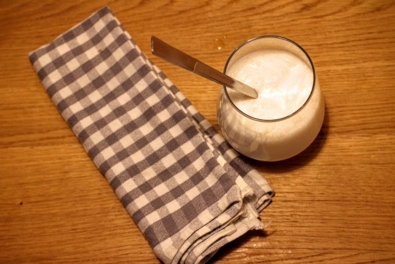
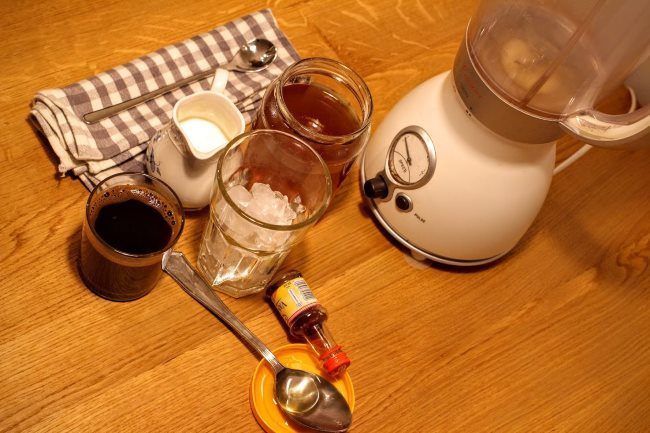
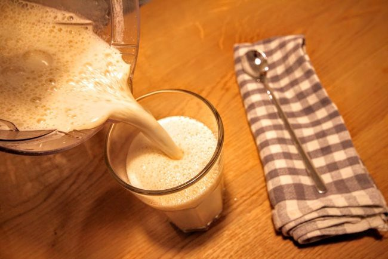
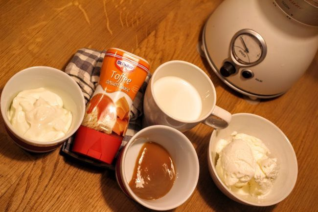
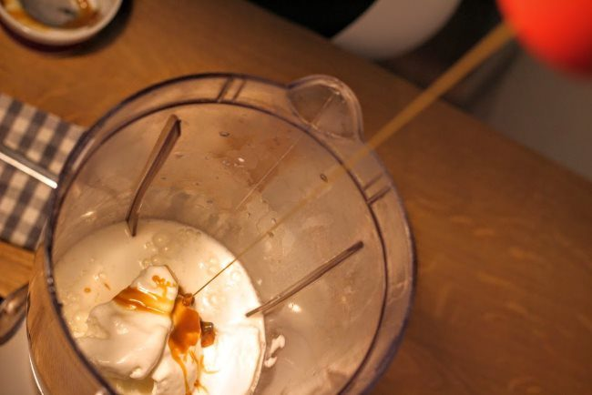

Would you like to save a few bucks on your beloved Starbucks Frappuccino®? Here is a step-by-step guide to different ways you can make yours at home. We will demonstrate how to make three different flavors: Vanilla, Mocha, and Caramel.

### The Basics

The Frappuccino you buy at Starbucks can be challenging to emulate. This is because Starbucks uses some specialized ingredients, such as the base, to fit its brand. However, this doesn’t mean one cannot make theirs at home, which could taste as close as the signature Starbucks brew.

The Frappuccino drink is based on an iced cappuccino and is sometimes topped with whipped cream. It contains espresso, coffee, whipped cream, sweeteners, and milk. In the following recipes, we use alternatives to the Frappuccino base, such as ice cream or condensed milk, to thicken and sweeten our homemade Frappuccino.

### The Coffee Component

Each of the drink recipes below will have a coffee component. Starbucks uses a mix of both coffee and espresso. If you have an espresso machine, by all means, use espresso. The intense flavor of espresso will hold up well against the other ingredients. If you do not have an espresso machine, you can make strong “espresso-like” shots using an AeroPress or Stovetop espresso maker. See the article [Making Lattes Without an Espresso Machine](http://ineedcoffee.com/making-lattes-without-espresso-machine/) for more details.

Another option is to use instant coffee. Starbucks makes a line of instant coffees called VIA Instant. Their Italian Roast is the best option for your homemade Frappuccino, but other varietals should be fine as well. Trader Joe’s also makes a decent instant coffee. Although using instant coffee is super convenient and cheap, the downside is that it has less caffeine than espresso or brewed coffee, so your drink may be missing the kick you require.

### Recipe: Home-made Vanilla Frappuccino

The first drink we are making is the classic Vanilla.

-   Preparation time: 5 mins
-   Serving: 1
-   Tools: Blender, Glass

#### Ingredients

-   1 teaspoon Vanilla Extract
-   ½ cup of milk (whole milk is best)
-   1 cup ice
-   2 Tablespoons of honey (or syrup)
-   Starbucks instant coffee – we used an espresso shot instead

#### 

#### Steps

1.  Add the ice cubes to your glass, followed by the milk and vanilla extract. This should be an estimate for one serving.
2.  Pour this into your blender and pour the contents of one Starbucks instant coffee sachet or espresso shot.
3.  Add the honey.
4.  For each extra serving, add an extra sachet of the Starbucks instant coffee or espresso shot, a tablespoon of vanilla extract, and a glass of the iced milk.
5.  Set your blender to medium speed, then whip until the mixture is creamy or icy.
6.  Serve in your glass and enjoy!

#### Notes

The strength of the coffee brew will determine the final taste. You need to make it strong because it will be diluted by ice, milk, and other liquids. You can always add more coffee to dial in your ideal strength level. Use whole milk and add an extra glass of ice for a thicker blend. You can also top your iced drink with whipped cream and other flavorings.

### Recipe: Coffee-based Home Rendition for the Starbucks Mocha Frappuccino

-   Serves: 1 large glass
-   Time: 5 Minutes

#### Ingredients

-   1 shot of espresso
-   ¾ cup of sweetened condensed milk (or more to taste or thicken)
-   1 cup ice
-   ¾ cup of chocolate syrup
-   Whipped cream

#### Steps

1.  Combine all the ingredients except the whipped cream in a blender with the ice on top.
2.  Blend on medium-low till your drink appears smooth (or the ice is fully broken).
3.  Depending on the consistency or taste you want, you can pour in more condensed milk, ice, and flavorings of your choice.
4.  Serve in a glass and top with the whipped cream
5.  Enjoy!

#### Notes

You can experiment with flavorings and toppings of your choice. Dark chocolate syrup is the best choice for mocha Frappuccino

### Recipe: Crème-based Homemade Caramel Frappuccino

-   Prep Time: 10 Minutes
-   Serves: 1

#### Ingredients

-   Vanilla ice cream, 2 big scoops
-   Milk, 2/3 cup
-   Ice cubes, 1 cup
-   Caramel sauce, 1 tablespoon (or more for topping)
-   Caramel syrup, 3 tablespoons
-   Whipped cream

#### 

#### Steps

1.  Add milk, ice cubes, caramel syrup, 1 tablespoon of caramel sauce, and ice cream to the blender.
2.  Blend for about 30 seconds and remove. It should appear smooth
3.  Pour into your glass, followed by the whipped cream.
4.  You can sprinkle the remaining caramel sauce on top for a breathtaking taste and beautiful appearance.

### 

### Conclusion

Starbucks definitely makes some good Frappuccinos, but as we all know, they’re not very affordable, especially if you love them so much that you want to drink one every day. These three recipes make really great copycat drinks for a fraction of the price.

We’re even sure that most of you already have these ingredients at home.

The taste is amazing, customization variations are endless, and preparing one of these really doesn’t take a lot of time. Pour them into a to-go cup or tumbler and spell your name wrong on it, and you won’t even notice it’s not Starbucks!