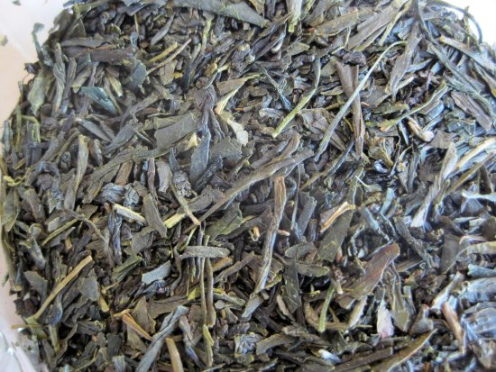
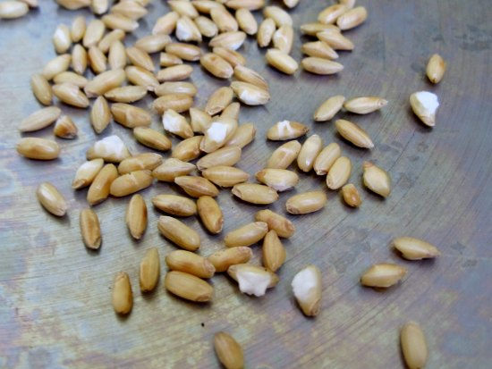
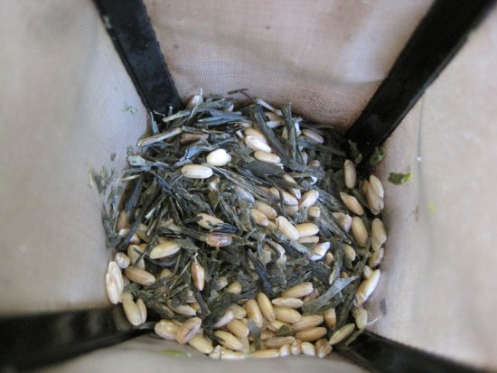

I’m a coffee drinker who also loves tea. When I chat with other coffee drinkers, they often don’t share my love for tea. One of the big reasons, I believe, is that often, their only experience is with low-grade bagged tea or that dreadful Genmaicha tea served at many sushi restaurants. In a future article, I’ll extend my hand and guide the coffee enthusiast into the world of quality loose-leaf tea. For this post, I’m just going to tackle Genmaicha.

Genmaicha tea is a Japanese green tea blended with toasted brown rice. The history of the tea is that poor families added rice to stretch out the tea and save money. I believe the toasted rice also serves a secondary function, and that is to cover up defects in the tea itself. The most common defect is staleness.

Earlier this year, if you had asked me what my least favorite tea was, I would have said Genmaicha. Then, I challenged my assumptions. What if I made my own at home and got each step right? Would it be enjoyable?

Now I know some people who like the Genmaicha tea served at restaurants—good for you. However, I think it is nasty and can be greatly improved when you make your own. I’ve discovered four reasons why Genmaicha tea can taste awful.

1.  Low-grade or stale tea.
2.  Too much rice. Stale rice?
3.  Brewed at too high of a temperature.
4.  Steeped too long.

### Source Fresh Bancha Tea

Bancha is a Japanese green tea that comes from the same tree as sencha. It is harvested later and has a lower market price. When I started this experiment, I first chose Sencha tea. Many Genmaicha blends use sencha, but in my tests, I preferred bancha. Sencha tastes wonderful by itself, whereas I felt the Bancha complimented the toasted rice better.

  
*Bancha Tea*

Low-grade tea is often used to make Genmaicha, and some producers know that the toasted rice flavor can cover up defects or staleness, so be sure to find a fresh source of Bancha tea. Many tea enthusiasts say Japanese green tea has a maximum shelf life of just 6 months. Other teas, such as oolongs and black teas, can last longer.

### Toast Your Rice

Get out a skillet and place the heat on medium-high. Pour out a few tablespoons of brown rice. It will get toasty brown, and some grains might even pop into what appears to be popcorn. Genmaicha is sometimes called popcorn tea. That “popcorn” isn’t corn. It comes from heating the brown rice. To prevent burning, I pulled most of the rice once it got a toasty look to it. Then, I returned some rice to the skillet and cooked a little longer until the grains started popping. Afterward, I post-blended the popped rice with the unpopped rice.

  
*Toasted Brown Rice*

Once you have your supply of toasted rice, you can add as much or as little as you like. I use just under one teaspoon for a single 14-ounce mug. I get the toasty flavor and can still appreciate the brightness of the tea. I keep my toasted rice in a sealed container. I don’t know how long it will stay fresh past roasting, so I only toast what I’ll need for the next few weeks.

### Brewing Method

Japanese green tea is the most sensitive tea to heat. You want a lower temperature. I use the range of 165-175F. Use a kettle that allows you to enter the exact temperature you wish to heat your water and then shuts off when it hits that temperature.

The standard brewing ratio for tea is 3 grams for every 8 ounces of water.

In addition to using a lower temperature, the steep time will be shorter. About 90 seconds is all you need. The tea becomes more bitter when you brew it at a higher temperature or steep it longer. My brewing parameters can be tweaked to your liking. I have found that the lower temperature and steep time allow me to get an additional one or two steeps, whereas a longer steep or higher temperature may only yield a single good cup of tea.

  
*Homemade Genmaicha Tea*

### A Good Genmaicha?

Two months ago I couldn’t stand Genmaicha tea. Now I am a fan. Not the swill they serve at sushi places, but the stuff I make at home. It is super easy to make. Give it a try and if you want to make it even better you can add a little powdered matcha, but that is optional.