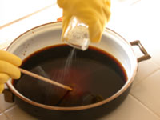

This tutorial shows you how to make coffee soap, which is a delightful gift to add to a coffee gift basket, and it’s one way to recycle some used coffee grounds. It’s not too hard, but making soap from scratch isn’t child’s play, either. Hard soap requires lye, which is a poisonous, caustic substance. The other drawback is that it’s several weeks before you can use the soap. The neat part about this soap is that it is not too feminine; it’s a unisex bar of soap that is mild — perfect for the kitchen. The addition of coffee grounds at the trace stage can turn this bar of soap into a heavy-duty soap, good for scrubbing your hands after working in the backyard.

  
*Coffee Soap by Linda Banning*

### Supplies Needed to Make Coffee Soap

-   Pam cooking spray
-   8 oz soybean oil
-   8 oz coconut oil (on sale in your nearest health food store)
-   8 oz olive oil (do not use extra-virgin; use the low-grade, cheap stuff)
-   2.25 oz lye
-   7 oz of double-strength coffee. (The coffee doesn’t have to taste good, so you can reuse grounds or mix different types)
-   2 tablespoons extra coffee grounds in case you want to add them later
-   1 oz Coffee Fragrance Oil for soap and candles \*\*Optional\*\* (You can buy coffee-scented oil over the internet)
-   2 medium-sized enamel or stainless steel pots (never use aluminum)
-   Soap molds (store-bought molds, shoe box lined with freezer paper, a small pan, small plastic containers, or a capped PVC pipe)
-   Cooking thermometer
-   Blender
-   Saran wrap
-   Old Blanket or insulated pouch
-   Yellow kitchen gloves
-   Safety glasses
-   A long sleeve shirt

Start off with at least 14 oz of distilled or filtered water (try not to use tap water as the minerals may affect the soap chemistry). Make the coffee by any method (vac pot or drip coffee works well.) When the coffee is done, place it in the refrigerator to chill. Expect some water evaporation. Grease the mold(s) by spraying Pam cooking spray liberally over the entire surface.

Change into your lye working clothes: put on a long-sleeve shirt, safety glasses, and yellow gloves. Lye is very dangerous stuff and should only be handled with caution, in a very well-ventilated location. Keep your long-sleeve shirt on, and the gloves and safety glasses handy until the soap mixture is in the molds. Getting this mixture on the skin irritates the skin and can cause a burning sensation, along with welts on the skin. If this happens, follow the instructions for handling emergencies provided on the container of lye.

  
*Lye Protection*

Measure exactly 2.25 oz of lye; no more, no less.

In a well-ventilated area, pour the chilled coffee into a medium-sized bowl. Slowly pour in the lye. The lye will get very hot and will emit caustic fumes that should not be inhaled if it can be avoided. Set the lye aside in an area that is safely away from children and pets.

In a medium-sized bowl, pour in the soybean and olive oils, then scoop in the coconut oil. Slowly heat the oils to between 100 and 110 degrees. All of the oil should be in a liquid state by this point. Remove the oil from the heat.

Check to ensure that the lye/coffee mixture has cooled to between 100 and 110 degrees or lower. You must be wearing your protective clothing for this stage. Pour the lye mixture into the oil mixture, being careful not to splatter.

  
*Lye and oils mixed*

### Stir, then Blend

Stir this mixture continuously for a few minutes. At this point, you may decide to put the mixture in a blender. This is not a mandatory step. Blending the soap in the blender will help the mixture get to the “trace” stage quicker (in 15 minutes instead of 2.5 hours), but it is not inherently better soap. Make sure not to splatter the mixture in the process of transferring it to the blender. Cover the blender with a lid and an extra towel to ensure that none of this very potent mixture gets out. Blend at the lowest settings only and expect the mixture to burp, meaning that air will get caught and a bubble will form and burst. You don’t want the mixture to burp in your eyes or face, so be very cautious about how you handle this mixture and continue wearing protective clothing.

  
*Lye and coffee mixed*

Do not keep the blender on continuously. Turn it off and on (on for one minute, off for 2, or so.) You want the soap mixture to cool slowly. Too much blending defeats the purpose of heating up the mixture.

If you blend by hand, you don’t have to blend continuously for 2.5 hours. Stir the mixture for about a minute in 15-20 minute intervals.

### Tracing

There is a stage in soap making called the “trace” stage. This stage is when the mixture thickens enough that you can take a spoonful of mixture and drip it onto a bowl and it will stay thick enough to leave a trace where it was dripped along the bowl. Soaps generally trace sometime between 15 minutes and 3 hours. When I did not use the blender, this particular soap recipe reached the trace stage in about 2.5 hours. When I used the blender, the soap traced within 20 minutes.

### Adding Fragrance

If you want to add fragrance or coffee grounds, you can add them at the trace stage, either by blending or stirring them in. I used 1 ounce of a coffee candle and soap fragrance oil. If you want to change the color of your soap, you can add about a quarter of a brown Crayola crayon. The crayon has to be made with stearic acid; most crayons are made this way. Since I didn’t add any color, but the coffee added some color, the soap at this stage is a light caramel color.

### Pouring the soap

Pour the soap into the soap molds. You may also decide to add stuff at this point in the soap-making process. In one soap mold, I added some coffee grounds to what would become the bottom of a bar of soap. After you fill the molds, place saran wrap over the top of the molds. Lift up the molds, then gently tap each soap reservoir to make sure there are no air bubbles.

### Insulate

You don’t want your soap to cool off too quickly. Place the wrapped soap molds in an insulated container or wrap them with a big blanket. Don’t disturb the soap for 1 to 2 days.

  
*Insulate the soap*

After a couple of days, you can pop the soap out of the mold. If you need to cut the soap into individual pieces, this is the time to do it because it will be too hard to do later. Place the soap on a paper plate and set it in a cool, dry, dark place for 3 weeks.

  
*Pop the soap!*

After 3 weeks, the soap will be ready to use. This soap produces a fairly rich lather.

  
*Coffee Soaps by Linda Banning*

### FAQ

*Why does it have to be in a cool, dark, dry place for 3 weeks?*

It takes three weeks for the water to evaporate.

*If I use freshly brewed coffee, will the soap smell more like coffee without the addition of the oil?*

No, I don’t think that has an effect. The actual coffee doesn’t scent the soap – – only the oil scents the soap. The coffee will make the soap a caramel color, and if you add coffee grounds at the trace stage the coffee will make the soap a heavy-duty soap. However, if you want a darker brown color to the soap you’ll need to use the crayon.

*And finally, would you feel safe giving it as a gift even with the lye in it? Could it hurt someone? Should there be special instructions enclosed with the gift?*

ALL hard soaps are made with lye. That’s how soap is made. According to Merin at *Soap-Junkie.com* (MAY 2011: site down), the saponification process (neutralization of the lye and turning the oils/lye combo into soap) takes 72 hours. During this time, contact with the skin should be avoided. After this amount of time, the soap is safe. However, the soap needs three weeks to harden fully; if it is too moist when used, it will dissolve away in no time.

*Thank you to Linda Banning for the updated photos. http://lindabdesign.etsy.com*
