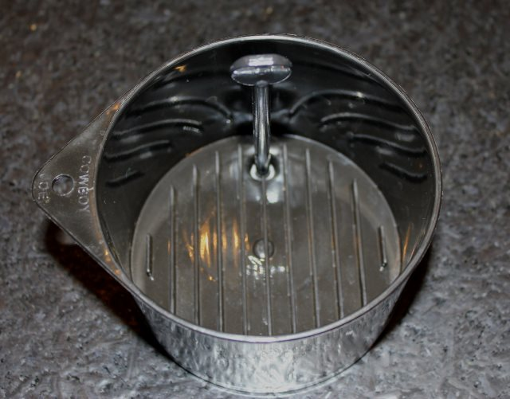
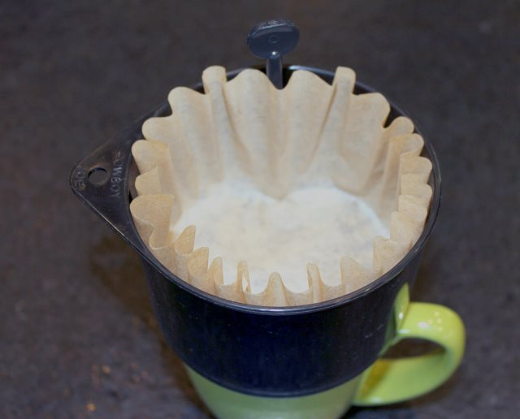
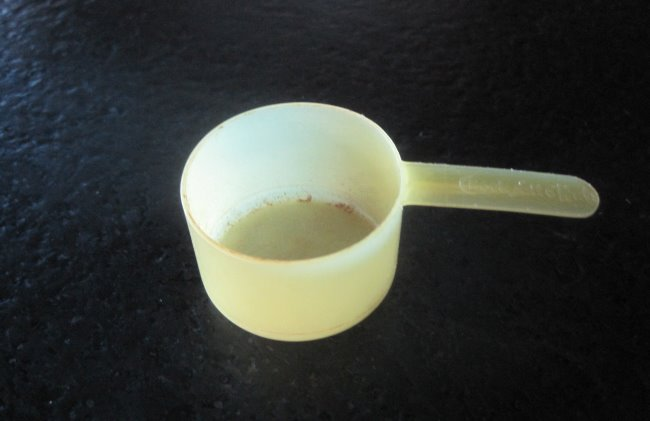
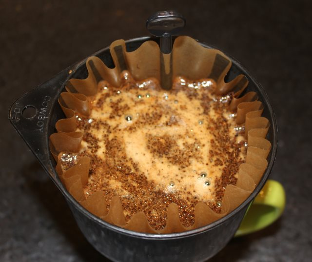
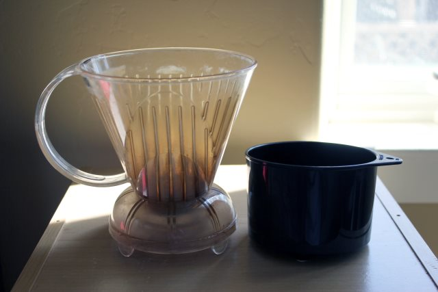

I recently had the opportunity to test out the Cowboy Joe Coffee Brewer. The Cowboy Joe is a single-cup plastic coffee brewer with a hole in the bottom that takes a standard 8-12 cup basket coffee filter. A plastic plug is placed inside a drain hole to allow the coffee to steep. Once the brew is complete, the plug is removed, and the coffee exits directly into the mug.

The lightweight and small size of the Cowboy Joe Coffee brewer makes it a candidate for traveling and camping. Unlike a French press or other brewers, there is no risk of breakage. The only concern I see is losing the plug. One idea I had was to add a little piece of bright-colored reflective tape to the plug so it would stand out more. And to keep the plug from running away from the brewer, you could use a string to tie it to the hole on the lip of the Cowboy Joe.

### #1 Place Plug Into the Drain Hole

I place the plug handle parallel to the ridges in the bottom of the brewer and then turn it one quarter or 90 degrees. This locks the plug into place.

### #2 Add the Coffee Filter and Ground Coffee

Place the basket filter into the Cowboy Joe. As the photo below shows, the filter ridges go around the plug. Place the brewer over a mug.

A tip I got from the Cowboy Joe website is to not use a mug that is too narrow as it can become *tippy* and is at greater risk of falling over should you bump it. Also, you want to have a mug that holds enough volume to both capture the brewed coffee and allows you to add additional water and or cream. The majority of mugs are fine.

Since the Cowboy Joe is small, there are two approaches you can take to brewing a cup of coffee.

1.  Brew a small 8 oz cup of coffee.
2.  Brew a more concentrated cup and then add water.

Option #1 wasn’t for me. I’d rather have more coffee. To make the coffee more concentrated, you can either increase the dose or the steep time. I decided to use the higher dose. Now, in other coffee brewing tutorials, we pull out the scale and weigh by grams to get the 17 to 1 ratio (water to coffee), but since this brewer is likely to be used when traveling, I will keep it simple. For a single brew, I used my trusty coffee can scoop, which I’ve had for over a decade.

*1.5 scoops is about 15 grams of coffee. Start there. I got good results using a basic [drip coffee grind](http://ineedcoffee.com/coffee-grind-chart/).*

### #3 Add Hot Water and Stir

Bring water to a boil, wait 10-30 seconds, and then pour slowly until the water line reaches about 1/2 inch below the top of the brewer. I like to use the pour to ensure all the ground coffee is in contact with the water. If, after the pour, you see clumps of dry coffee, give a gentle stir.

*Steep the coffee for 3-4 minutes.*

### #4 Remove the Plug, Wait, and Tilt

The coffee is done brewing. Hold the brewer with one hand, then turn the plug and remove it. The coffee will begin draining into your mug. Once you can see the grounds, tilt the brewer so the side where you removed the plug is lower. This will allow the last bit of coffee to drain into your mug.

### #4 Add Water to Taste

At this point, I add an ounce or two of hot water, just like I do for the [Aeropress](http://ineedcoffee.com/upside-aeropress-coffee-brewing-tutorial/). This is optional. Experiment.

### Comparisons to Clever Dripper and Melitta Pour Over

At first glance, the Cowboy Joe is similar to the Clever Coffee Dripper and the 1-cup version of the Melitta Pour-Over. Like both, the brewer is placed directly over the mug. The Cowboy Joe and the Clever are full immersion coffee brewing, in that you control the steeping time, whereas the coffee immediately begins to exit with the Melitta. The standard Clever is larger and can brew more coffee at once, which means it takes up more space and is more at risk for damage when traveling.

*The Clever Coffee Dripper (L) and the Cowboy Joe Coffee Brewer (R).*

The Cowboy Joe, like the Melitta, is dishwasher safe. Just use the top rack. The Clever is not. The Cowboy Joe and the Melitta do not have any parts that can go bad. Although it has not happened to my Clever, there are reports that the parts that initiate the seal with the Clever get stuck after a lot of use. As Chris Arnold pointed out in the [Clever Coffee Dripper Review](http://ineedcoffee.com/clever-coffee-dripper-review/), some mug sizes don’t work for the Clever. This is not an issue for the Cowboy Joe, as the coffee is released when the plug is removed from the drain hole and doesn’t require a seal mechanism to be engaged.

The Clever also has a lid to keep heat in during the brew. The Cowboy Joe doesn’t, but I’ve never once used the lid, so I don’t consider it a loss. However, if you were making coffee outdoors at a cold campsite, you might want to place something over the top during the 3-4 minute brew cycle to hold the heat in.

Which is best? That will depend on your needs. What is most important to you? Volume, durability, portability, or price? They all do a fine job of brewing. On my next trip, I will be leaving my Clever at home and taking the Cowboy Joe with

### Resources

*Cowboy Joe Single Cup Direct Immersion Coffee Brewer*

[Coffee Brewing Guide](http://ineedcoffee.com/coffee-brewing-guide/) – Our collection of coffee brewing tutorials.

[Cowboy Joe](https://www.cowboyjoe.com/) – Official site for the Cowboy Joe Coffee Brewer.

*Title photo by [Marko Horvat](https://unsplash.com/@lemondyt).*