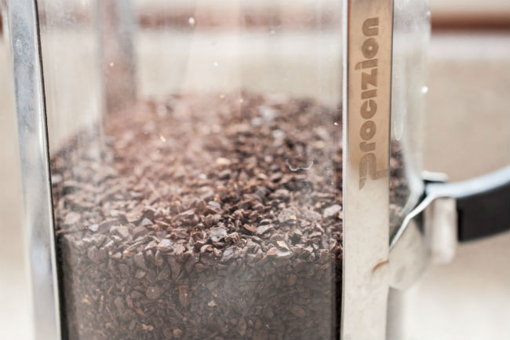
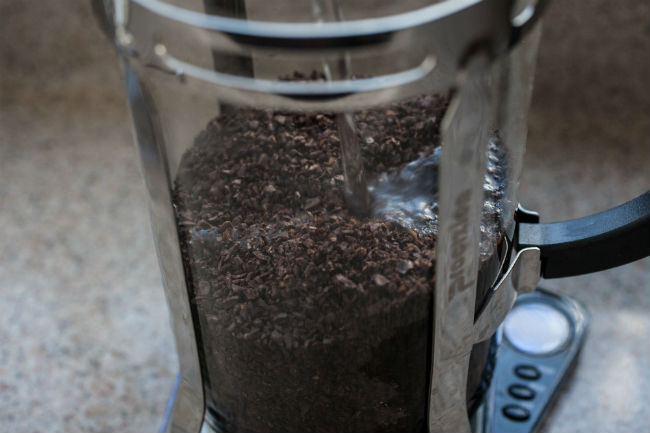
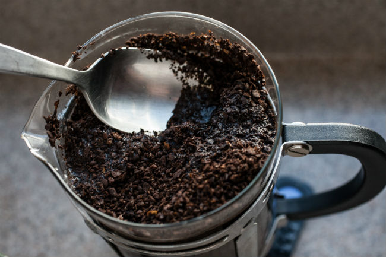
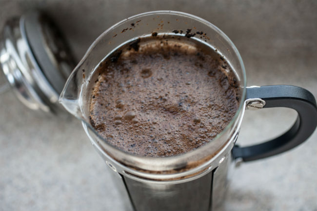
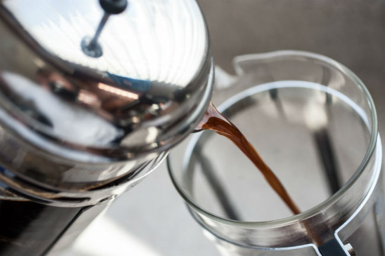

Here on INeedCoffee, we have several coffee brewing tutorials for making cold brew coffee. You can buy a [Primula](/making-cold-brew-coffee-with-the-primula-coffee-maker/), a [Toddy](/cold-brew-coffee-with-the-toddy-coffee-maker/), or a [cold brew filter pouch](/cold-brew-coffee-is-not-rocket-science/). Or maybe you don’t need a dedicated coffee brewer at all. That is what we decided to find out. We wanted to repurpose one of our existing brewers to make cold brew coffee. The perfect choice was the French Press.

For this article, we are using a 34-ounce French Press. The model we used is no longer available for sale, but other models should work the same.

The basics of cold-brew coffee are explained in the article [Cold Brew Coffee is Not Rocket Science](/cold-brew-coffee-is-not-rocket-science/). Let water steep over coffee grounds at room temperature for 12+ hours then filter and serve. Let’s get brewing.

### #1 Measure Coffee

How much coffee should you use? The answer to this question will vary depending on whom you ask. The short answer is more than you would for regular brewed coffee. If you do not want to deal with math or scales, just double the amount of the coffee you normally use when making hot French Press coffee. If you want to jump into the math, read on; otherwise, skip to Step #2.

In our [French Press tutorial](/press-pot-tutorial/), we use a 17 to 1 ratio, which means 17 parts water to 1 part coffee. The advice for cold brew is to use between 3 to 1 and 7 to 1. Due to volume limitations, we found a 7 to 1 ratio ideal for the French Press. If you find 7 to 1 is not strong enough, I would extend the brew time by a few hours instead of adding more coffee.

The sizes of French Press brewers are an interesting topic. The size listed on the box, how much liquid it holds, filled to the very top, and then the estimated coffee yield when you brew it. Seattle Coffee Gear comprehensively tested these numbers in the post [Coffee Presses: Overall Volume vs. Actual Yield](https://web.archive.org/web/20131215050955/http://www.seattlecoffeegear.com:80/learn/coffee-101/articles/coffee-press-yields). When you scan this chart, you notice that the actual yield of brewed coffee is always a few ounces less than the volume listed on the box. The difference is the coffee grounds and the amount of water lost.

The more coffee added to a French Press, the more space the coffee occupies and the more water is trapped in the grounds at the end of a brewing cycle. As shown in the Seattle Coffee Gear article, we can expect to lose a few ounces when we use a regular hot French Press. We will lose more for cold brew, so using a large French Press to make cold brew coffee is advised. Smaller French Presses might not be worth the hassle because they yield so little. And unlike a hot French Press, we aren’t ready to brew again in 4 minutes. We are waiting for another 12 hours.

For these tests, we used a 34-ounce French Press. For easy math, I’m going to round this to 1000 grams. I did three brew cycles, each at a different strength ratio. I aimed to keep the brew weights close and not fill it to the very top.

1.  **Regular 17 to 1:**  809 grams water + 48 grams ground coffee = 857 grams brew weight. Brew Yield = 733 grams (or 26 ounces)
2.  **Strong 12 to 1:** 800 grams water + 67 grams ground coffee = 867 grams brew weight. Brew Yield = 686 grams (or 24 ounces)
3.  **Cold 7 to 1:** 756 grams water + 107 grams ground coffee = 864 grams brew weight. Brew Yield = 588 grams (or 21 ounces)

As you can see, as we increase the strength of the brewing ratio, coffee yield declines. Using the same math, we would expect a 20-ounce French Press to yield 13.5 ounces of cold brew.

### #2 Grind Coffee

You can use a medium to coarse grind when brewing cold brew coffee in a French Press. We used a coarser grind, but either will work. If you find the coarse ground cold brew too weak, tighten up your grind. If the medium grind is too strong, add more water or loosen up the grind.

See our [Coffee Grind Chart](/coffee-grind-chart/) for the range between Medium Coarse and Extra Coarse.

### #3 Add Ground Coffee and Water to French Press

Just like you would for a regular French Press, add the ground coffee to the bottom of the brewer. Only this time, instead of hot water, you will add room-temperature or cold water. Filtered water is ideal.

*For this brew, we went Extra Coarse. Your grind does not need to be this coarse.* 

*Add room temperature water.*

### #4 Gently and Slowly Stir

You want to ensure all the coffee grounds are in contact with water. Stir the coffee slowly, trying to cover as much ground with water as possible.

*Gently stir the coffee.*

### #5 Cover and Set Aside for 12+ hours

You can cover the French Press however you like. A small plate or plastic wrap are two ideas. You could use the French Press filter; just make sure you press down only enough to hold it in place. You do not want to press the filter down until the brew is finished, which is still 12+ hours away.

There is a debate about cold-brew the coffee on the counter or in the refrigerator. Either is fine. I prefer the counter because it brews faster, meaning I can, if I need to, cut the brew cycle short by an hour. However, if I were going to be away for much longer than 12 hours, I’d brew it in the refrigerator.

*Peeking at the cold brew before pressing the filter down.* 

### #6 End Brew and Serve

This trick also works great for a regular French Press. By SLOWLY pushing the plunger down, you get a cleaner-tasting French Press. Strive for a 30-second plunge. You can transfer the coffee to a mason jar for storage or serve it up.

Not every grinder is awesome, so you might have some fine coffee particles that make it into your cup. If you experience this, you can filter the coffee again. Place a paper coffee filter over a jar and slowly pour the coffee. This will catch any loose grounds.

*You can pour it into your spare French Press as well.* 

### #7 Clean Up

The clean-up for cold-brew French Press is the same as for regular-brew French Press. You can put the grounds in compost or save them for [your garden](/top-3-ways-to-re-use-your-coffee-grounds/).

### Last Words

If you have limited space for your coffee gear, it is good to know that the French Press can do double duty as both a hot and a cold coffee brewer. But honestly, I found the yield not to be worth the effort, and the cleanup was more work than that of a dedicated cold brewer. If you have space and the budget for a cold brewer, check out the [Penguin](/make-concentrated-cold-brew-coffee-with-the-penguin-coffee/).

### Resources

[Make Concentrated Cold Brew Coffee With the Penguin Coffee](/make-concentrated-cold-brew-coffee-with-the-penguin-coffee/) – INeedCoffee tutorial on a dedicated cold brewer.

[Coffee Brewing Guide](/coffee-brewing-guide/) – A collection of coffee brewing tutorials on INeedCoffee.

[French Press Photos](https://www.flickr.com/photos/122258503@N04/albums/72157667724991381/with/26525308030/) – Original photos used in this article.

*Brewing photos by Joseph Robertson of Extracted Magazine, a digital coffee magazine published for iOS and Android.  
*
