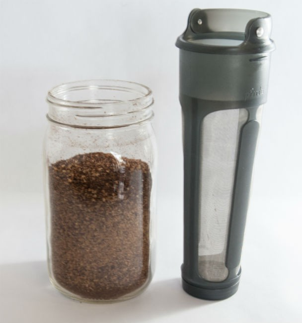
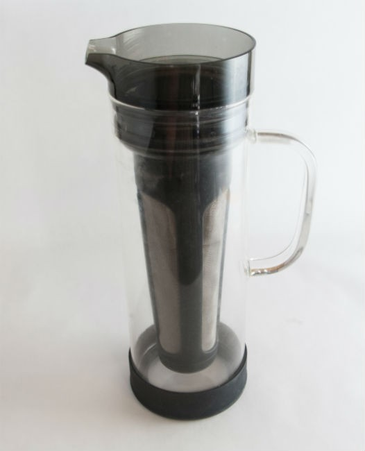
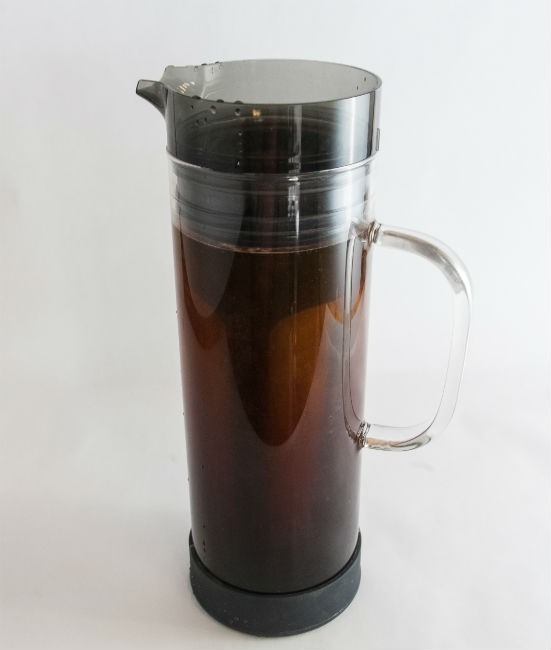
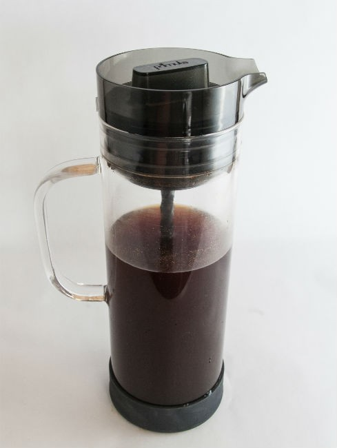

Cold-brew coffee continues to surge in popularity. Most coffee shops offer cold-brew options, but you don’t need to spend a lot of money in the cafes because making cold-brew coffee at home is easy. Save your cafe money for espresso-based drinks.

In this tutorial, we will make a pitcher of cold brew coffee using the *Primula Cold Brew Glass Carafe Iced Coffee Maker*. Although they call it an iced coffee maker, it is not. Iced coffee is coffee brewed at normal hot temperatures and then chilled. It can even be brewed directly over ice. The Primula is a cold coffee brewer, as it is brewed with cold water, takes 12-24 hours to brew, and makes a concentrate. Primula also makes a slick travel coffee brewer, which we will cover in a [separate tutorial](http://ineedcoffee.com/the-perfect-solution-for-cold-brew-coffee-on-the-go/).

The filter is referred to as the Cold Brew Core in the instructions.

### #1 Grind Coffee

The directions say to use 8 ounces of coarsely ground coffee. In our brewing tests, we discovered two things.

First, we discovered that there was too much coffee. The coffee filter would not hold that much coffee. Also, you do not want to completely fill the filter with ground coffee, as you will be adding water. When the water hits the freshly ground coffee, it can swell and spill over the top of the filter, making a mess.

Add enough ground coffee so there is at least a 2-inch (5 cm) gap between the ground coffee and the top of the filter. This works out to 6-7 ounces (by volume) of ground coffee. But instead of measuring the coffee with a scale or measuring cup, just use the actual filter. Fill it with whole bean coffee until you reach that 2-inch gap. Then remove the beans, grind them, and return them to the filter. If the coffee is already ground, just pour the ground coffee into the filter.

Our initial tests supported using a coarse grind, but as we brewed more with the Primula, we began favoring a more medium grind. A good starting rule would be to use a medium grind if you plan on brewing at the low end (12 hours) and a coarser grind if you go a full day. Experiment.

*Eight ounces ended up being too much coffee for the filter.*

### #2 Add Coffee to Filter

As stated above, do not overfill the filter. There is enough room between the edge of the filter and the edge of the carafe for coffee to spill out over the filter.

### #3 Place Filter in Carafe and Slowly Add Water

Fill the carafe with water by slowly pouring cold water over the coffee grounds. Pouring slowly is important because you don’t want the grounds on top to float up and escape the filter. That would create a mess, and coffee grounds would slip into the brewed coffee.

Once the water is in the carafe, stir using a long spoon. This optional step will ensure that all the ground coffee is in contact with the water. Once the lid is secured, you can also do a gentle rocking motion.

Set the spoon attachment aside for now and secure the lid.

### #4 Brew For 12-24 Hours

You can brew the coffee on the counter or in the refrigerator. I prefer the counter. Brew for 12-24 hours. You can gently rock the brewer to ensure water is making contact with all the ground coffee, especially if you use a medium grind.

### #5 Remove Filter and Add Spoon Attachment (optional)

After 12-24 hours have passed, the coffee has finished brewing. Remove the filter. The Primula has a spoon attachment that acts as a built-in stirrer that fits below the lid. You may decide to use it, especially if you make those fancy drink recipes included in the directions. Besides the fancy drinks, Primula has informed me that the mixer serves to aerate the coffee prior to serving.

If you don’t want to use the spoon attachment, you could just use your own wooden spoon. It’s your call.

### #6 Add Water and Serve

You now have a cold coffee concentrate that you will keep inside the refrigerator for two weeks. Unless you like a really strong coffee, you will want to add water (or milk). The directions recommend **three parts water to one part coffee**. We found that ratio will make a clean, delicious cup of coffee that is neither too strong nor too weak when brewed for 24 hours. For 12 hours, we used either less water or none at all. We advise sipping the concentrate and gradually adding water to match what you like best.

### Better Than the Toddy

A few years ago, I did a tutorial on the Toddy Brewer. It did a fine job, but I prefer the Primula for a few reasons. The Primula is much easier to clean up. Just pull the filter up, empty, and rinse. The Primula also uses a permanent gold filter, so there is no need to buy replacement filters. The Toddy can brew more coffee at once, but the Primula makes enough unless you go through a lot of coffee.

### Resources

[Make Concentrated Cold Brew Coffee With the Penguin Coffee](http://ineedcoffee.com/make-concentrated-cold-brew-coffee-with-the-penguin-coffee/) – Another cold brew option.

[Coffee Grind Chart](http://ineedcoffee.com/coffee-grind-chart/) – INeedCoffee article with photos displaying grind levels.

*Disclosure: INeedCoffee received a Primula brewer to use for this tutorial.*