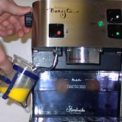
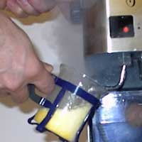
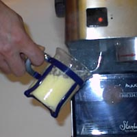
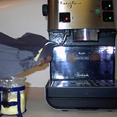

Recently, during a trip to Florida, I was at a coffee shop where they had a menu item called “Eggspresso”. Wondering what kind of sick concoction involved espresso and eggs, I inquired about this item. Would this be some sort of caffeinated cousin to egg drop soup, or would I find Folgers Crystals in my omelet? The real menu item wasn’t so daring.

I discovered that “Eggspresso” was a method of cooking eggs that involved no espresso at all. It did, however, require the frothing wand of an espresso machine. I needed to see this dish prepared before my eyes to get my wheels turning. Most mornings, I have a double espresso and a couple of eggs. I like both items. Now, I could see a way to streamline my morning ritual and have less to clean up.

### Selecting The Equipment

While making quality espresso requires you to have a high-quality espresso machine, making eggpresso doesn’t have such restrictions. Making eggspresso only requires a good steam wand. Most home espresso machines have decent frothing wands with which to cook the eggs. Next, you will need a good container to put the eggs in.

Oddly enough, I have found that coffee mugs work very well because you can fit three eggs in them, and they have enough depth for the wand to reach into. Using the frothing pitcher that came with your espresso machine or even your favorite coffee mug is probably a bad idea unless you don’t mind the risk of salmonella poisoning from your next latte.

### Cooking the Eggs

The first step in this dish is to crack your eggs into your container. Whip them a bit with a fork. Try not to be tempted to add such things as salsa, sauces, or other things you might find in an omelet. The moisture content of these items will add to the moisture which will come from the steam. Such ingredients should be added after the eggs have been cooked.

Next, open the steam valve on your espresso machine to bleed off the excess water that has collected. Shut the valve quickly. Immerse the wand into the eggs and begin steaming fully.

Cook until the eggs solidify. Shut off the steam valve. Congratulations! The eggs are now cooked. But before you begin greedily consuming, clean the eggs from your frothing wand.

At this point, you can either dump the eggs onto a plate or eat them straight from the cup.

Since the eggs are a bit more moist than normal, I have found that around a tablespoon of quick oats works well to absorb the moisture and doesn’t adversely affect the flavor. Going much further than this is probably a bad idea though. The idea I had for mixing espresso directly into the eggs with oatmeal was disastrous. Some might need to learn this firsthand, but at least you were warned.