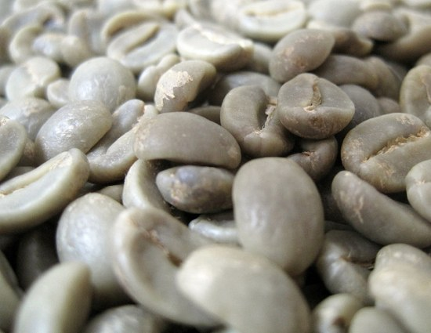
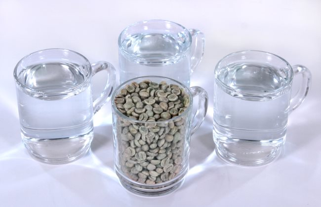
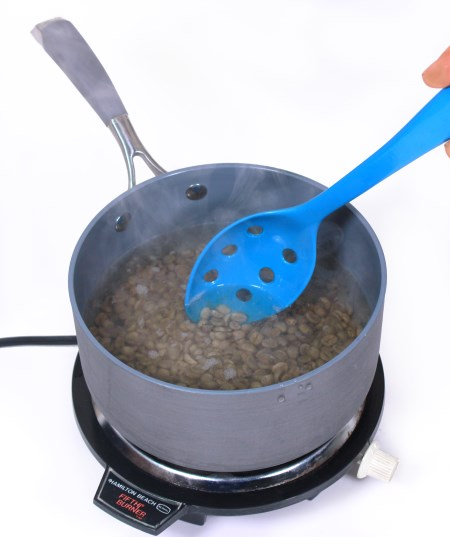
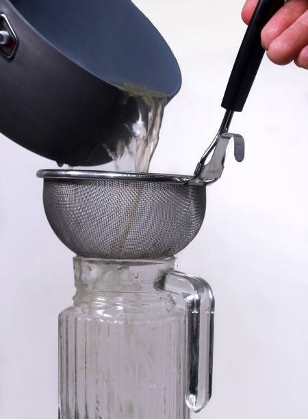
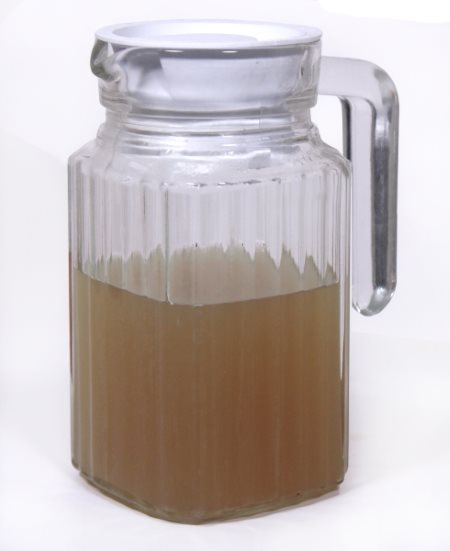
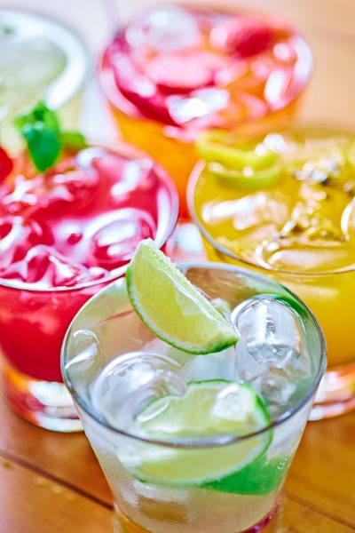

In the Brave New World of green coffee beverages, a topic that did not really exist just 5 years ago, it’s hard to find good information, techniques, and recipes. Plus a lot of what exists has been posted by people who prepare green bean extract for health reasons and seem to believe that if it doesn’t taste bad, it must not be good for you.

Recent articles cite stunning research results showing that the “silver skin” of the coffee bean (the paper-like outer coating of the bean, sometimes called the chaff) can contain antioxidants 500 times more powerful than Vitamin C1 \[2\]. These compounds become more active with the application of moderate heat, reaching a high level by simply boiling green beans in water. Other research shows that green coffee beans have a high concentration of Chlorogenic Acid or CGA, which can accelerate fat metabolism and aid in losing excess weight \[3\].

This makes the idea of making green bean beverages very attractive from a health-promoting standpoint. But can this be easy, fun, and delicious? We think so! Here is a practical guide to help you on your way.

### Understanding Green Coffee Beans

Coffee beans are actually seeds, and as many seeds, they are highly complex biologically. Coffee is so complex that over 40 substances are responsible for the basic taste of coffee, and there are 120+ perceptible flavor elements.

Moreover, coffee is called a “polyphasic” substance. It changes constantly in every stage from “new crop” green to “rested” green, through roasting and resting after roasting, and even during the 15 minutes it sits in your cup after brewing. A listing and description of the number of active processes taking place can fill a small encyclopedia.

So first, be aware that in raw green coffee beans there are many substances that are objectionable or undesirable, or even unhealthy. Please do not attempt to soak green beans in room temperature water and drink the broth. Heat needs to be applied to create changes in the substance of the green beans for them to become properly palatable.

*Green Coffee beans* 

### Why Green Coffee Bean Extract / Beverage?

We make no health claims here for green beans; there are plenty of studies available on the Web that promote these beliefs if you would like to research them further. Most of the claimed benefits come from antioxidants and other substances that are reduced in potency if subjected to temperatures above ~300°F. Coffee is roasted anywhere from 350 °F to 600°, whereas when you boil green beans the temperature never rises above 212°F, a good temperature is just high enough to develop the antioxidants and convert the unpleasant substances into palatable ones. Dark-roasted coffee contains relatively small amounts of these substances, whereas lighter roasts contain more… and green beans have the most.

### Consider the Caffeine

If you read about the Swiss Water Process® for making decaffeinated coffee, you learn that caffeine is an extremely water-soluble substance, able to leech out into the water until it is almost gone from the beans (97% removal of the caffeine is possible – sometimes expressed as being 99.9% caffeine-free by weight.) That’s a lot of caffeine coming out into the water!

We can respect this fact when making green bean beverages with the best taste. We want to boil the beans long enough to get the healthy elements and flavor out of the beans, but not cause too much caffeine to come out. Caffeine is very bitter, and if you steep the beans too long, you wind up with a caffeine soup that will send you flying, making it hard to get enough of the “good stuff” without getting the jitters.

### Selecting Your Green Beans

Everybody wants their food to be as clean and free of contaminants as possible. Coffee is very clean, generally testing free of any measurable contaminants, but many people are concerned about molds, as much has been written about it. The short story is that very few tests find significant mold, and the amounts found are on average far lower than many fruits and vegetables we consume daily.

That being said, you will probably nevertheless feel better if you use green beans with a known origin, that have been water-washed and peeled by a milling machine, and not subjected to fermentation to get the beans ready to remove the fruit skins.

The best beans for this process are high-altitude beans (they are lower in caffeine and denser) that have a clean, consistent appearance and aroma that is pleasant and like a vegetable or bean (our favorite coffee beans actually smell and look a lot like peas). Every crop and variety is a little different, but they should not have an unpleasant aroma. Two high-altitude bean recommendations are Costa Tarrazu and Papua New Guinea. Some high-altitude beans will have the designation SHB, which stands for Strictly Hard Bean.

Don’t worry about the thin paper-like coating on the beans. Called the chaff or silver-skin, many researchers feel this is the healthiest part of the bean! So don’t try to scrub it off.

### Simple Steps for Boiling Beans

Use a clean saucepan; a 1.5 or 2-quart is a good size.

For the first batch, you may want to start with one cup (by volume) of green beans. For reference, this will probably be about 6 ounces of beans, but this recipe goes by volume, not weight.

If you want to rinse the green beans because they are too “dusty” with chaff or because you just want to wash them, rinse them quickly in a colander, but don’t scrub them, and you will remove the nutrient-packed silver skin.

The ratio to use is 1:3 parts beans to water, so fill the cup with beans and pour into the saucepan, then fill the cup 3 times with water and pour that in. Down the line, if you want to make larger batches, just double the beans and water, 2 cups beans to 6 cups water, etc.

Put the pan on high heat until the water is at a rolling boil, then reduce the heat to a simmer and set a timer for 12 minutes. Stir the beans occasionally so they are making good contact with the water and are not just sitting at the bottom.

After the 12 minutes is up, take the pan off the heat, and pour the liquid through a kitchen strainer into a glass vessel or whatever you want to store the beverage concentrate in. Let it cool for a bit and put it in the fridge for later, or else use it immediately by pouring it over ice.

NOTE OF CAUTION: You may find some references that tell you to let the beans steep after boiling for as long as an hour. The only reason to do this is if you want to create “rocket fuel” – a drink super-high in bitter caffeine that is basically unpalatable and probably not healthy at all. We really strongly suggest you limit your steeping enthusiasm to 12 minutes for best results.

You can then discard the beans, or store them in the fridge and make another extract later on, up to a few days afterward. Then discard them.

### Delicious Green Bean Drinks

The basic vegetable taste of the extract pairs well with sharp and acidic fruit flavors. Our favorites are cranberry and/or citrus fruits. Here are a few recipes to get you started:

-   Cranberry-Lime Refresher: 4oz GBE, 4oz lemon-lime soda (such as Sierra Mist) or lime-flavored seltzer, 2 tbsp cranberry syrup
-   Green Coffee Fresca: 4oz GBE, 4oz lemon-lime soda or lime-flavored seltzer, 2 tbsp grapefruit syrup
-   Blueberry GBE Lemonade: 4oz GBE, 4oz filtered water, juice of 1/2 lemon, 2 tbsp blueberry pancake syrup, sweetener to taste (such as agave syrup)
-   Green Tea EXTREME: 3oz GBE, 3oz filtered water, 1 green tea bag OR 1 tsp green tea leaves. Brew the tea in the water/GBE mixture for a concentrated antioxidant shot! This is good with a bit of honey, too.
-   Green Coffee Mojito: 4oz GBE, 3oz crushed ice, juice of 1/2 lime, five fresh mint leaves, sweetener to taste (such as cane sugar syrup)–be sure to muddle (roughly stir) the ice with the mint leaves, as bruising the leaves will release their minty deliciousness into your beverage

You can also enjoy the green bean extract as a stock for cooking rice, as a soup ingredient, or for other creative uses.

If it stays continuously cold, the extract will stay fresh for 2-3 days in the fridge, or you can freeze it for weeks of storage.

We hope this guide makes selecting beans and making beverages from them easy and fun.

### References

1 (Antioxidant effects of coffee by-products 500 times greater than vitamin C, Science News Daily, 5/7/15, University of Granada)

2 (Assessment of Total (Free and Bound) Phenolic Compounds in Spent Coffee Extracts, Journal of Agricultural and Food Chemistry, 4/18/2015, Carmen Monente, Iziar A. Ludwig, Angel Irigoyen, María-Paz De Peña, and Concepción Cid)

3 (The Use of Green Coffee Extract as a Weight Loss Supplement: A Systematic Review and Meta-Analysis of Randomised Clinical Trials, 8/31/11, Igho Onakpoya, Rohini Terry, and Edzard Ernst)