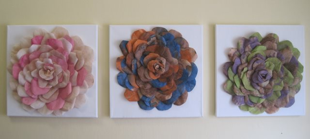

At INeedCoffee, we always want to see what artistic things can be created using coffee. We have [three](http://ineedcoffee.com/coffee-art/) [different](http://ineedcoffee.com/art-of-farr-coffee-greeting-cards/) [galleries](http://ineedcoffee.com/the-coffee-art-corporation/) by different artists that have used coffee grounds to create amazing artwork. Vilma Silveira Farrell takes a different path. Instead of using coffee grounds, she uses coffee filters to make her artwork.

In a series of emails, I learned that Vilma collects used coffee filters from coffee shops. The filters are cleaned and dried, then dyed to the desired color. If you want a dark brown color, the coffee grounds are left inside the filter during the drying process. Once dry, the grounds are removed.

### Coffee Filter Lampshades

The coffee filter lampshades are made with a wire mesh for sturdiness. A fire retardant is used on the filters, and the lampshades are open at the top and bottom for air circulation.

> Handcrafting a coffee filter lampshade is timing consuming. It takes hours and hours and sometimes days of work but is amazingly rewarding – especially when a lamp is finished, the light switch hit, and I can see how beautifully the light filters through the shade.

### Coffee Filter Wall Flowers

In addition to lampshades, Vilma has used coffee filters to create flowers on canvas.

### About the Artist

Vilma Silveira Farrell is the artisan behind Lampada. She is from Brazil, the land of dark coffee and rich spices. She was a journalist for many years, but now she lives in NYC as a stay-at-home mom. Rather than putting pen to paper to write a story, she puts on her artisan’s hat and dives into the stains of the coffee.

You can learn more about Vilma’s art on the [Lampada Facebook page](https://www.facebook.com/pages/Lampada/193191290786365) and the Lampada Etsy page.