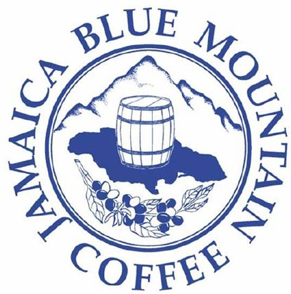

For generations, coffee aficionados have embraced the deliciously subtle coffee known as Jamaica Blue Mountain coffee. And for generations, only one supplier of Jamaica Blue Mountain coffee can match many fans’ demanding tastes: Mavis Bank Central Factory.

Nestled in the Blue Mountains of Jamaica, Mavis Bank was founded by Victor Munn in 1920 with one goal: to be the island’s only fully integrated processing facility for the production of Blue Mountain coffee from the berry to the cup. Victor knew the value of maintaining quality in Jamaica Blue Mountain coffee; after all, his father, Cecil Augustus Munn first cultivated and processed the coffee.

Victor’s nephew, Keble, has continued to carry on the tradition of producing the world’s finest coffee, all the while upgrading Mavis Bank’s facilities and expanding to include roughly 40-percent of all Jamaica Blue Mountain coffee processing.

  
*Jamaica Blue Mountain*

The challenges toward keeping quality control over such an expansive business can be daunting, but Edgar Munn, Victor’s nephew, says the rewards are worth it. As the primary licensed importer of all Jamaica Blue Mountain coffee in the U.S., Edgar works closely with the Coffee Industry Board of Jamaica, which regulates and certifies all export quality Jamaica Blue Mountain coffee.

“Jamaica Blue Mountain coffee is a very special type of coffee,” says Edgar. That may sound like he’s stating the obvious, but he continues to explain that Jamaica is blessed with more coffees than what has become known as the world-class Jamaica Blue Mountain.

“The coffee that is Jamaica Blue Mountain is grown in a very specified area in the Blue Mountains,” he says. In addition to tight restrictions on the geographic area, there are also rules about the elevation at which certifiable Jamaica Blue Mountain coffee can be grown.

“There is Jamaica Blue Mountain, grown in a specific area, at 3,000 to 5,000 feet (in elevation); then, there is High Mountain coffee, from a specific area, grown from 1,500 to 3,000 feet; and then there is Jamaica Supreme, or Low Mountain, beneath the High Mountain coffee.”

Each class of coffee requires a review and certification for export from the Coffee Industry Board.

Yet, according to the New Economy Project from USAID, that seal of approval has not always guaranteed either consistency of quality or regulatory oversight beyond the time the coffee is exported from Jamaica.

Edgar acknowledges that there have been difficulties maintaining the certifiable quality of Jamaica Blue Mountain coffee, especially in the United States.

“There is no regulation in the United States that prohibits roasters from selling coffee that isn’t Jamaica Blue Mountain under the Jamaica Blue Mountain label,” he says. “There is not even a minimum quantity of pure Jamaica Blue Mountain coffee that must be added to be called a Jamaica Blue Mountain blend.”

In Japan, where enormous quantities of Jamaica Blue Mountain coffee are exported, the minimum standard to qualify as a Jamaica Blue Mountain blend is 30-percent. In Jamaica, ironically, the standard is lower – 20-percent must be pure JBM.

“But here in the United States, some roasters will use anywhere from six to 10-percent, and some will use all the photos and items they can to indicate that their coffee is quality and a certified blend,” says Edgar. “Yet, they don’t actually put what the percentage is.”

Some roasters have been caught by Edgar and the Coffee Industry Board fraudulently selling Jamaica Blue Mountain coffee, and have been brought before the courts for trademark infringement.

But Jamaica Blue Mountain coffee isn’t merely another brand. Its legendary balance; its subtle sweetness and delicate “mouth feel” – these have made authentic JBM both rare and embraced by consumers worldwide. When people pay a premium for such a singularly refined coffee, they’re paying for the coffee, of course, but they’re also paying for the dream. In fact, some may care less about the coffee than in the dream.

Edgar readily acknowledges the power of that perception; it is, after all, part of the power behind the brand. While he sells directly to the consumer through his own website – www.bluemountaincoffeeinc.com, he’s cautious about selling to coffee brokers or coffee wholesalers. Those to whom he does supply bulk coffee (such as Gillies Coffee Company, in Brooklyn – and Cohveca Coffee) are long-term contacts in whom he can place his trust.

“When we sell to some brokers, then we lose control,” he says. “We can’t afford to lose that control. It is not good for the coffee. The Coffee Industry Board must maintain and develop the best product, and we must supply the best coffee that can match everyone’s dream.”
