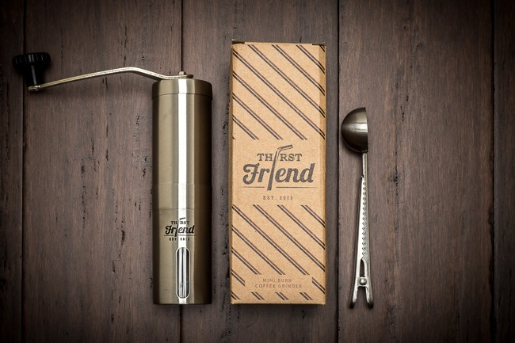
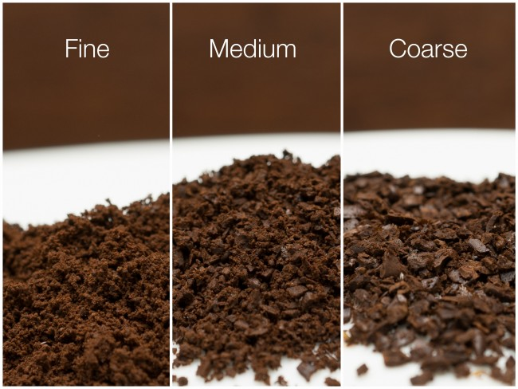
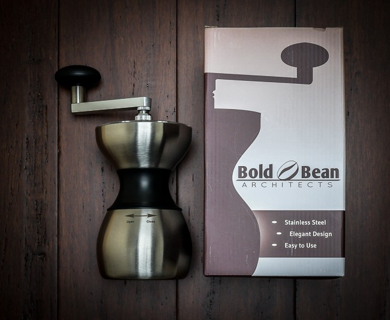
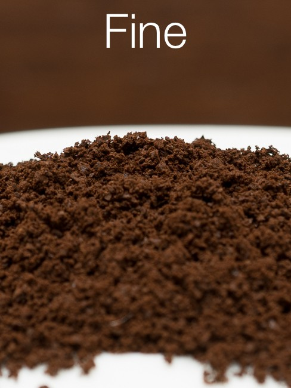
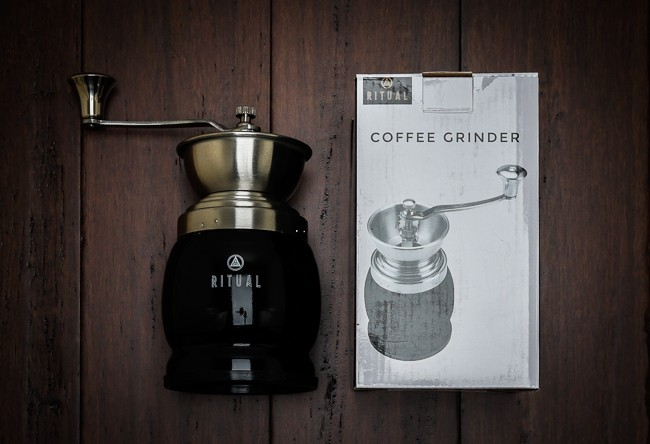
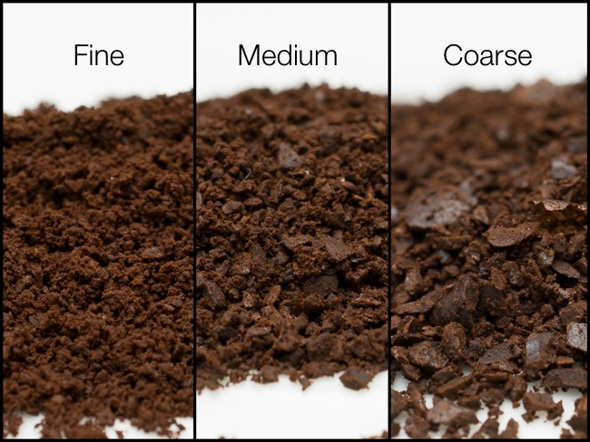

***UPDATE (September 2020):** The grinders featured in this article are no longer available for sale.*

A manual coffee grinder (aka coffee mill or hand grinder) has a few advantages over its electric-powered brethren: lower cost, portability, and, in some cases, even consistency. They can be great for those on a budget, travelers, campers, or even those looking to lower their electricity bill a few watts at a time.

We will be taking a look at three manual ceramic burr coffee grinders from Thirst Friend, Ritual, and Bold Bean Architects. We will compare the ability to [grind different levels](/coffee-grind-chart/): fine for espresso, medium for drip, and coarse for French press, as well as things like ease of use, ease of adjustment, size, and build quality.

### Thirst Friend

The Thirst Friend Large grinder is actually the smallest in the roundup, with its reservoir holding just about 3 ounces by volume. It is very compact and easy to grip both the body and handle, even for someone with small hands. The handle does not attach with any hardware, it simply uses gravity and a keyed slot. Lack of locking hardware never seemed to be a problem, and this means it is very quick to disassemble.

*Thirst Friend Large Coffee Grinder with included coffee scoop/clip*

There was no printed manual included, but it took less than 30 seconds to figure out how everything worked. The top just pulls apart, and beans are loaded in. The bottom also pulls apart where your finished grind ends up. This is also the place where you can very easily tighten or loosen the burr to adjust the grind level.

The adjustment range is very wide and does a respectable job for fine, medium, and coarse grind. The fine grind worked great for espresso and was very consistent. The medium grind also did quite well for drip. The coarse grind was reasonably consistent though not perfect, and French Press did not have too much fine sediment, though consistent French press grind is one of the hardest of all to achieve.

The beans were relatively easy to load and had no problem feeding into the grinding mechanism. The unit didn’t have a super solid feel, but just about everything was metal (albeit slightly thinner than the others). I expected the unit to ding if dropped, but nothing stood out as feeling cheap. They also give you a coffee scoop/bag clip combo for free, which is cool.

*Thirst Friend Grind Levels. Did very well, from fine to coarse.*

> What I liked most about the Thirst Friend was how easy everything came apart and went back together so fast. And zero hardware to unthread and rethread. Even the grind adjustment had a nice rubber knob that stayed put.

### Bold Bean Architects

The Bold Bean Architects’ grinder is relatively large but only holds approximately 5 ounces by volume. It is not too difficult to hold thanks to a thinner middle section but does take a little work to get a decent grip.

*Bold Bean Architects Coffee Grinder*

There was no manual included, and the website instructions were not too helpful. The top section has a little plastic window that slides out of the way, exposing about half of the hopper. The beans were somewhat hard to load and had problems feeding into the grinding mechanism towards the end, which needed some help in the form of shaking. The bottom section threads nicely and tightly to the main body. The handle is quite difficult to remove and involves taking just about everything apart in order to do it. But the thing is built like a tank.

There are 3 different nuts total, and 2 of them are used together for the grind level adjustment. It turns out the adjustment range is very narrow, and after fiddling for several minutes it is clear the design is to blame. As a result, it only produced a fine grind for espresso at both ends of the range.

*Bold Bean Architect Grind Level. Only a fine grind was possible, given the limits of adjustment.*

> What I liked most about the Bold Bean Architects Grinder was it’s solid build quality.

### Ritual Grinder

The Ritual Grinder is the largest in the roundup, with its reservoir holding about 10 ounces by volume. It is quite large and awkward to hold with a firm grip.

There is a top rubber piece included that presumably keeps beans inside, but I found it didn’t really seat well and was sort of unnecessary.  The top piece sort of unscrews from the base but doesn’t use matching threads on the top piece, just little divots, so it took a little work to get it locked in. Beans are easy to load given the fully open hopper (with the rubber piece removed), and the beans fed fine when the hopper was full, but as it got emptier, it required some manual help to move the beans into the grinding mechanism.

*Ritual Coffee Grinder*

The handle detaches with a single top nut. The grind level adjustment requires dealing with three pieces: the top nut, a middle locking nut, and the bottom adjustment nut. The adjustment range is decent and produces a good medium grind and a decent coarse grind, but I wasn’t quite able to get fine enough for espresso. Adjusting this design took a lot of time. It is built well, but the fit was a little lacking; it just felt a little loose in places.

*Ritual Grind Levels. Did well on Medium, decent on Coarse, but not fine enough for espresso*

> What I liked most about the Ritual Grinder was it’s extra large reservoir.

### Conclusion

At $35, the Bold Bean Architect Manual Grinder can only be recommended for use with espresso. Its fiddly adjustments and other design choices leave a lot to be desired, but it is probably the best-built.

At $25, the Ritual Manual Grinder is a good choice for pour-over/drip/cone, where a large volume of coffee is desired.

At $25, the Thirst Friend Manual Grinder is recommended for use with espresso, pour-over/drip/cone, or French press, where a smaller volume of coffee is suitable or where maximum portability is important.

### Resources

*Bold Bean Architects Grinder, Ritual Grinder, and Thirst Friend Grinder are no longer available on Amazon.*

*Disclosure: INeedCoffee was sent some of these products at no cost, which did not affect its review.*
