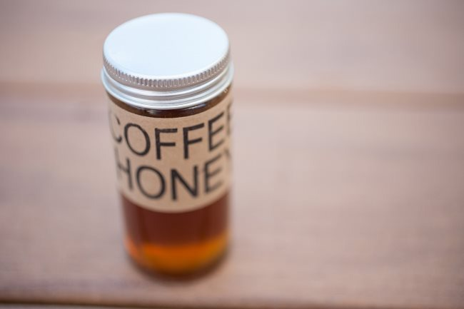
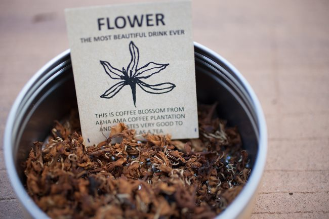
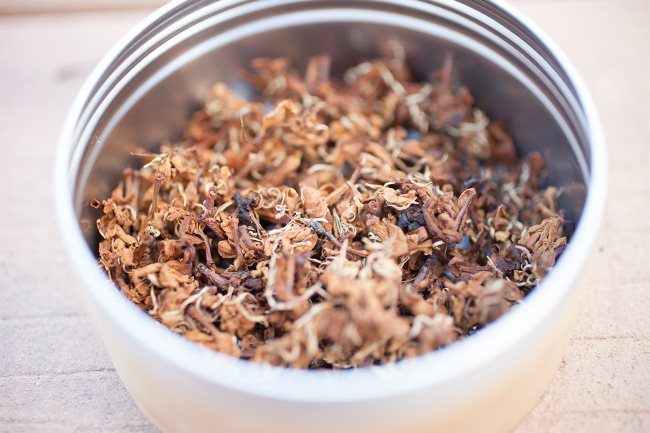
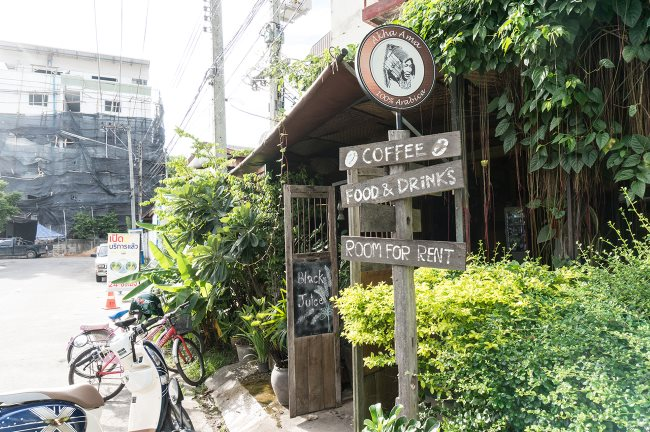
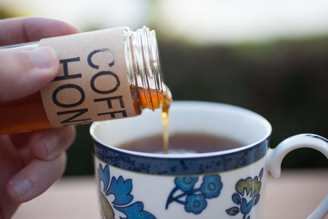

“Coffee Honey” – the first time I saw this, I was exploring the original Akha Ama Cafe in Chiang Mai, Thailand.

I was doing as I do when checking out a new cafe – tasting their coffees and just letting my eyes wander around the shop.

I usually ignore the pastry display cases because, well…I’m there for coffee, not undeniably deliciously flaky pastries that I clearly have no need for (temptation is always hiding under those lights). In this case, my eye caught on the tiny 4 oz jars simply labeled ‘Coffee Honey.’

“Excuse me!” I said with an open smile. Side note: a smile takes you miles further than any other facial expression. I would say, ‘especially in Thailand,’ which is known as ‘The Land of Smiles’ – but I think this applies anywhere. In Thailand though, it seems you can say anything so long as there is a smile with it. In any case, I was curious about this honey.

“Is this Honey made for coffee, or made with coffee in it?” I was imagining one of two scenarios. That this was just poor translation / an awkward attempt at marketing (it’s honey we made specifically for coffee!) – in Thailand it is pretty ordinary to see completely false claims about products right out in the open – or they had some strange concoction involving mixing coffee with honey.

Well, I was straight wrong on all accounts.

“It’s…Honey from the Coffee Flower,” the Thai girl working there said after a pause to consider her words. “It’s honey from the coffee flower? You mean, the bees did their business with the flowers from YOUR coffee plants, and you harvested THAT honey?” I said, entirely too quickly, with a mixture of incredulity and wonder. “Uh…yes!” She responded with a smile (that is, she probably didn’t understand what I was saying, but her yes satisfied me and ended the conversation).

I immediately grabbed a jar, and got the contact information for the owner – I just had to learn what this was all about.

After returning to my apartment, I opened my new prize and had a taste.

Immediately, my eyes popped open wider, and I started searching for flavors to associate with – just as I would do with a new espresso, for example.

Right away, it struck me. Hiding on the back of the flavor – strong, sweet, silky smooth honey – was the very distinct floral flavor I had already tasted that same day.

I had tasted it in the very coffee whose plants originated the flowers which fed the bees that created the honey I was now enjoying.

Wonderous!

It’s such a small thing but so very cool to discover this direct flavor, which I had tasted in the coffee itself, again in something so very different, but so well connected.

I tend to think of the flavors in coffee as being something you simply connect associations with – that is, we say this Ethiopian Yirgacheffe tastes like blueberries because it gives us the same flavor/aroma sensations as walking through a wild blueberry field. It’s easier to attribute the responsibility for this flavor (the coffee seed comes from a berry). In a similar vein, I’ve declared coffees to have floral elements, but I have no strong understanding of where that element comes from.

The fact that a bee can extract, transfer, and convert the exact same flavor I find in a coffee, into honey, is wickedly cool.

It doesn’t stop there.

I had the pleasure of meeting with the owner of Akha Ama, Lee Ayu Chupa – a young man who has gone beyond all boundaries that one in his position typically faces, and is forging a very impressive company around coffee.

I asked him about the Coffee Honey, and he explained it quite simply. As his family is the owner of their primary farm, they are able to experiment in a few ways. A couple of years ago, they decided to place beehives directly on the coffee farm, so that when harvesting the honey, they could be reasonably certain that the majority of the honey was from the coffee flowers.

No one else was doing it.

As we know – bees love coffee – so why not enjoy honey that they make directly from that coffee?

I asked Lee – well, since you are experimenting, have you thought about Coffee Flower Tea? I had the fortune to try this out at the Melbourne International Coffee Expo in May, as Ninety Plus Coffee brought some of their Geisha Flower Tea.

Lee smiled and said, “of course.” There was a bit of trial and error involved. Lee had heard about other people doing coffee flower tea, so one year he decided to give it a shot – shortly before the petals of the flowers were to naturally fall off, he picked a few and tried to make some tea.

“It was…not right,” he said, with a mildly disgusted look on his face. The coffee flower brewed as tea directly was bitter and uninviting.

So his mother took a handful of the blossoms, tossed them in a pan on the stove, and roasted them ever so delicately to a slight golden brown color.

He showed me the coffee flower tea – it smells absolutely wonderful. So sweet, savory, and floral…very much like smelling the coffee – but as if you could only smell the floral element.

5 minutes later, I had my face over a small cup of brewed tea – inhaling I could tell the tea was relatively strong in flavor – much less delicate than the coffee the plants eventually would produce (the Ponlamai). The first sip brings a strong flavor, smooth, and sweet tea.

When I brought these components back to the states and had a little tasting event with folks in Seattle, the initial reaction of one person was “this tea is flavored, right?”

It’s a remarkable balance between honey and coffee. Compared to the honey, the tea is far lighter and smoother in flavor, like the coffee. Looking at the coffee, the tea clearly illustrates the floral element that is present there.

This is what tied it all together.

The coffee flower tea, sweet and simple, presents the exact flavor of that flower.

This flavor is evident in the honey and coffee.

Three elements, all connected, but not directly – all displaying flavors of the coffee plant as a whole, which to me just opens up the world of coffee all the more. It isn’t just a roasted seed, and it isn’t even just the seed of a cherry. What you taste in coffee is a distinct representation of the plant as a whole, and I imagine contains elements that are evident throughout the plant.

The last piece of the puzzle which brought me to that final conclusion – Lee shared with me that he likes to eat the top leaves of the coffee plant, usually in a salad with some tuna (I, unfortunately, didn’t get a chance to try this). He said they are citrusy and sweet.

Sound familiar? Citrus and sweetness – are two elements common among coffees.

I wonder what other parts of the coffee plant could be equally enjoyed…

*The Many Faces of Coffee first appeared in [Extracted Magazine #23](https://www.extractedmagazine.com/brewing-on-the-v60-issue-59/).* 

### Resources

Coffee Lovers Radio #7 – Interview with Lee Ayu Chupa.

[Coffee From Thailand](/coffee-from-thailand/) – Article by Len Brault.

[11 Crazy Coffee Drinks You Won’t Find on a Starbucks Menu](/11-crazy-coffee-drinks-you-wont-find-on-a-starbucks-menu/) – Unique coffee drinks from around the world.
