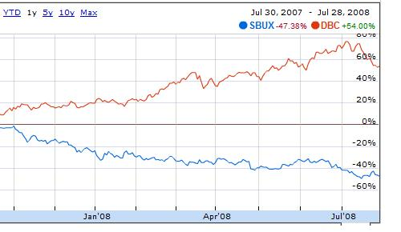
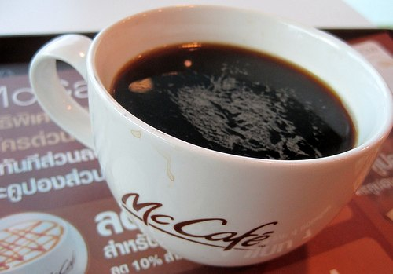

*This article was released in August 2008.*

The Starbucks stock price topped out at nearly $40 per share twice in 2006 but has been steadily falling since that double top formation and now sits at around $14.40 per share. By many accounts, 2006 was also the peak of the housing bubble, and leaky home values have issued a strong blow to consumer spending since that time. Two of the hardest-hit states in terms of housing are also two states that makeup nearly 30 percent of the Starbucks stores in the United States. A $5 latte may not have been a stretch two years ago, but in the midst of this deflating economy and credit crisis, consumers are cutting back.

However, consumer spending is not the only thing that is ailing Starbucks. They are also struggling with higher acquisition costs of their two staple ingredients – coffee and milk. In fact, over the past two years, the Deutsche Bank commodity index (DBC) and Starbucks (SBUX) appear to be an exact mirror image of each other:

  
*SBUX vs Commodity Index*

McDonald’s is another company affected by higher commodity input costs, but that fact is certainly not reflected in its share price, which has hit several 52-week highs already this year. McDonald’s healthy operating model allowed it to pay off $1 billion in long-term debt in 2007. Yet Starbucks, which operated most of its life with insignificant near-zero long-term debt, suddenly racked up $550 million in long-term debt during 2007.

  
*McCafe – Phuket, Thailand*

McDonald’s is also pursuing the high-end coffee market through its aggressive expansion of stores offering the McLatte. This is happening at the same time that Starbucks is reversing its expansion into McDonald’s traditional breakfast sandwich territory. It seems that in every area where Starbucks is struggling and failing, McDonald’s is thriving and conquering. However, Starbucks’s struggle will not last forever.

Howard Schultz is taking significant steps to reverse the downtrend – revising the menu, closing poorly performing stores, and even offering a new customer loyalty program. Global commodity prices have also shown signs of leakiness, and any continued price relief on the milk and coffee front could be a potential windfall for Starbucks. If McDonald’s is serious about its coffee expansion plans, it must take action now. The opportunity to acquire the biggest name in coffee during their weakest days won’t last forever—Mcdonald’s needs to buy Starbucks now.

*Disclosure: The author of the above article holds a long position in Starbucks.*
