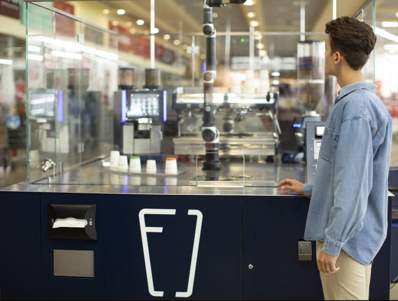
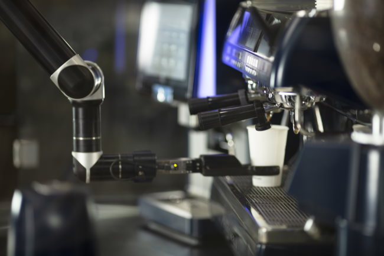
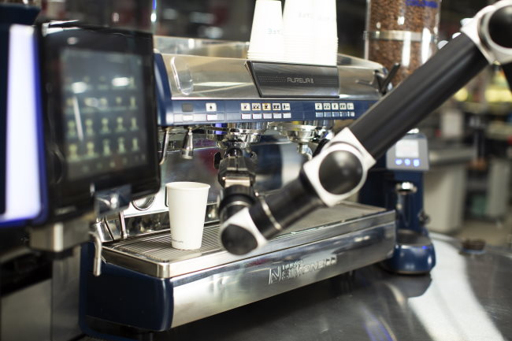
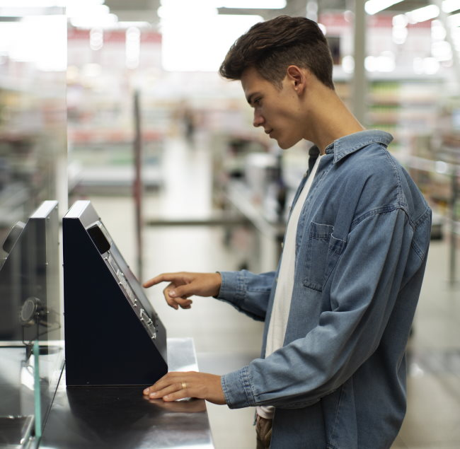
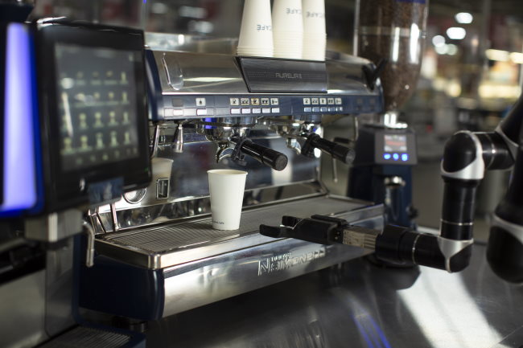

Recently, I watched a very cool video of a robot capable of making espresso drinks. This wasn’t a vending-style machine where the coffee is made under the hood. This robot had an arm that actually pulled espresso shots from an espresso machine.

The coffee robot is called the Rozum Café. I interviewed Anna Kidron from the company to learn more.

#### When did the development of the Rozum Café begin, and how long did it take to build the robot?

The company Rozum Robotics was opened in 2015. The main Rozum products are the collaborative robotic arm PULSE and motors for robots. How did it all turn into the robotic Rozum Café? One day, at the beginning of 2019, our developers and engineers were in the kitchen, laughing, chatting, and programming a robot to pour and serve them ready-made coffee just for fun. A few weeks later, the CEO of the company who was also in the kitchen at that time was like ‘Hey, dudes, why not make a real robot barista?’ That was the beginning. We searched the market and found out that there was nothing like an autonomous, available-for-purchase robotic café.

During the next 6 months, we built the framework, bought all the tech components like a grinder, a tamper, an espresso machine, etc, taught the robot how to work with this equipment, and asked the human baristas to share their experience with us and the robot. We conducted numerous tests and drank liters of coffee. This was a sleepless time.

When six months were over, the first working version of the robot café was installed in a shop mall in Ukraine.

#### What were some of the biggest challenges you faced during the design process?

The biggest problem we faced at the very start was to make a robot take a cup. Sounds banal, doesn’t it? But paper cups differ in size, structure, and thickness. A robot arm should take an empty cup very carefully not to crumple it. After the robot fills the cup with coffee, milk, and syrup, the cup gets heavier. If the robot’s grip is not tight enough, the cup will fall. So first, we had to find out how to make the robot grab carefully but tightly at the same time. And secondly, we had to develop recommendations for clients on the cup’s size and parameters.

#### How well is the Rozum Café being accepted? Are you getting any negative reactions from the existing coffee market?

The reaction from potential clients was positive. Automation was already in the air before the year 2020 arrived and made contactless service trendy. The USA market was maybe a bit more prepared than Europe, as some similar projects were launched here before (but were not available for purchase). In Europe, the autonomous robot barista is a novelty. We installed cafes in Emirates, Ukraine, and Belarus. The solution was also presented in tech and coffee contests in Russia. We’ve participated in exhibitions in other European countries. Many orders are in progress now. We believe this is a good result if you take into account that the first version of the café was presented less than a year ago.

When describing robotic cafes, some writers use loud titles like ‘’Robot will steal baristas jobs’’. Such titles are misleading and made to grab your attention. Rozum Café will not eliminate human baristas or standard cafes with on-seat places. Our niche takes care of quick autonomous brewing of high-quality coffee. The visitors of Rozum Café are people who want to get their freshly brewed coffee quickly and want to be sure that it’s great coffee instead of the brown liquid from the vending coffee machine. Of course, in today’s situation, the coffee market is even more open to automation tools, as it is not only about speed and quality but also about safety. The owners of Rozum Cafe are people who want to start a coffee business quickly and with minimal time investments and remote control options.

As I’ve already mentioned, when developing the café, we invited the human baristas to set up the coffee equipment. The robot repeats the movements that the barista would do, but espresso machine settings and grinder settings have to be tuned additionally. We deliver Rozum Cafe with pre-installed settings. The cafe owner can invite a star barista to change the settings and adjust the coffee taste to the clients’ preferences in the region. Robots have nothing to do with eliminating jobs. They have a lot to do with building partnerships and spreading good coffee service. Coffee culture has grown highly in the last 20 years. There are not as many great baristas as people who love great coffee. Why not see the robot barista as a solution to this problem?

#### Since no barista can take an order verbally, how does one order and pay for a coffee drink? Does the customer need to download an app on their phone?

In the standard version of the cafe, a client makes a few clicks on a 10 inch multi-language touchscreen. The system accepts payments by card or phone. For one of our clients, we’re developing an app as a part of a customized robot cafe.

#### Whenever I make espresso, there are loose coffee grounds everywhere that require cleaning on the counter. I don’t see the robot cleaning in the video. Are there no loose grounds? How is the workspace kept clean?

After each order, the robot takes the tamping holder and cleans it in the special dry cleaning system. The coffee grounds are collected in a special bag hidden inside the café. The café owner can then control how the used coffee grounds are recycled or reused.

#### Does the Rozum offer different milk type choices?

The standard package doesn’t include this option, but the system can work with some non-dairy kinds of milk. Each new milk type requires testing to make sure that the milk dispensers are working well, the time needed for good foaming doesn’t change, etc. Several milk options will be in the next Rozum Café update.

#### In cafes, baristas need to tighten or loosen the grinder when conditions change, such as humidity or the age of the beans. Is the Rozum system capable of adjusting the grinder in real-time if the espresso shots start pulling too fast or too slow?

The Café is maintained once a day before the working day of the robot starts. The maintenance includes filling in supplements and checking the grinding and tamping settings. If there are any changes in the taste of coffee, the settings should be updated following the instructions we provide with each Rozum Café.

#### Can the owner of a Rozum access any metrics remotely, not just on sales, but on water temperature and the speed of shots? If so, can they remotely make adjustments?

No, now there is only remote access to all sales data and video access to the Rozum Café. So the owner can get a live view of the coffee station in 1900х1980p video on any device.

#### Are you working on any new features for the next version of the Rozum?

In the nearest time, we plan to make the brewing/cup delivery process faster by up to 30%. We also plan to add audio and visual effects. For some clients, we work on the aforementioned double milk system, ice coffee system, etc. It’s essential to understand that we are primarily a robotics company, so if a client comes to us and says that it’s important that the robot adds two syrups at once, it’s part of our task to find out how to do this.

#### Thank you for sharing your invention.

The vision that we would like to share not only with our clients but also with end-users of Rozum Café, is that there is no need to be afraid of automation. It might seem strange at the beginning. It might seem unusual. But then it becomes a part of our daily lives, just like cars or gadgets. Robotics makes comfort and great quality available for a wider range of people.

### Video Demonstration

[Rozum Café. Your robot barista](https://www.youtube.com/watch?v=KghcLrAumww) (YouTube)

### Resources

[Rozum Robotics](https://rozum.com/) – Official website.

[Espresso Tamping Visual Tutorial](/espresso-tamping/) – A tutorial for humans on what is involved with tamping espresso.

*The photos in this article are from Rozum Cafe.*
