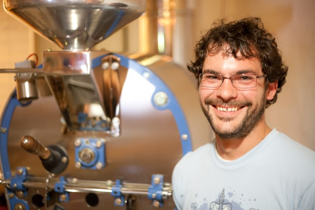
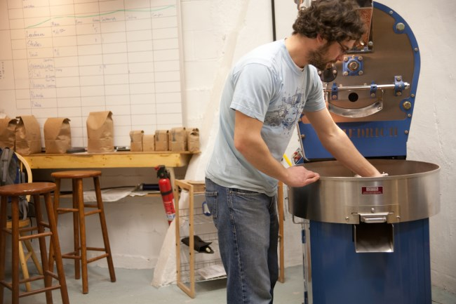
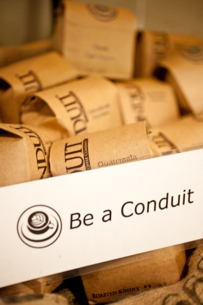
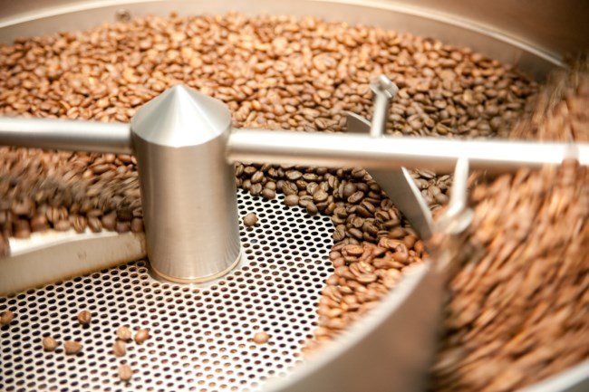
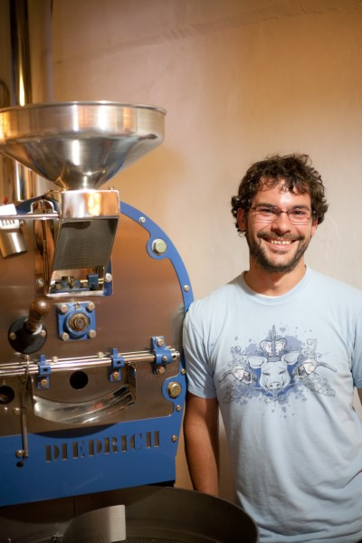
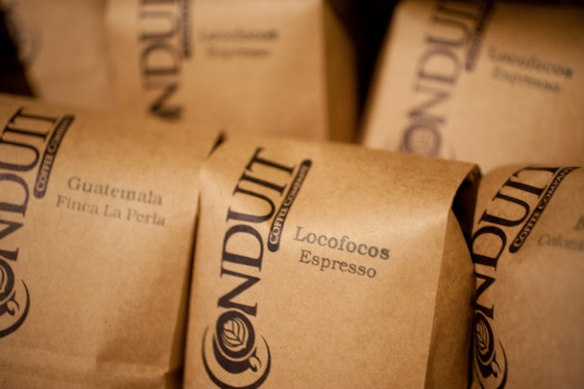
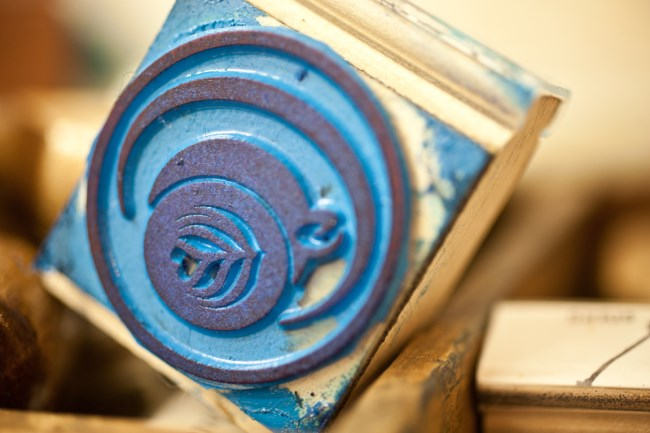

*This interview took place on July 13, 2013, between Jesse Nelson of Conduit Coffee and Joseph Roberston of Extracted Magazine.*

### The Studio

**Joseph:** So, sitting here with Jesse at the Conduit Coffee studio, actually I was thinking about that on the way, how you call it a studio, which is pretty awesome because there’s a lot of art and craft.

**Jesse:** Right, we like calling it a studio partly because its artsy, it makes sense, we do a lot of networking, it’s really just kind of active space centered around our little coffee business.

**Joseph:** And you’ve had parties here, you have people visit, you have your Tuesday open house?

**Jesse:** Yea we do the open houses and the parties are a lot of fun, what is really cool is we are also supporting a couple of nonprofits by providing space for them to have meetings here as well so we can cater that and it’s a nice sort of professional place where they can come, they have a table, we can bring food and we have all of the facilities here for that, it’s kind of fun to bring in other ideas and other good people that aren’t necessary related to the coffee world who come and appreciate what we are doing here.

### Hawaiian Coffee

**Joseph:** I like that. Before we get into talking about the nonprofits because I didn’t think about that but that’s cool, we are sitting here with Jesse’s brew of something, what am I drinking?

**Jesse:** Let me taste it first and I’ll tell you. This is a peaberry from Hawaii, from a region near Kona, it’s a direct trade, actually, a family friend that retired and bought a farm in Hawaii, that may be the last of it, I think they are selling it because of health issues this year, but it’s nice, it’s a really nice coffee and it’s been fun to watch him grow, you can really see instantly the quality of the coffee beans when out there, less broken beans so as their business grew, it was fun to see that over the course of the last year. Hawaiian coffee is really nice and smooth, not remarkable, I shouldn’t say that on recording, David this is the best coffee I’ve ever had, I love you, thank you ha-ha.

**Joseph:** It is delicious on initial impressions, I have been drinking a lot of coffee lately that has really outstanding fascinating notes to it, the other day I went to Ballard Coffee Works and I had a siphon of some Ethiopian coffee which had notes of blueberry to it, and it tasted like I was walking through a field of blueberries which was remarkable.

**Jesse:** You can taste that landscape and you instantly get that image in your head of where this is growing. Coffee like this is something that Americans are generally used to, the kind of smooth full-bodied coffee and that’s why Hawaiian coffee has captured that marketing, it’s interesting because it’s grown over 1200 feet versus 1200 meters or more, so it’s really low altitude and they have an ongoing growing season there with the weather patterns that move in and move out on a very consistent basis so the beans are big, even these peaberries are a lot bigger than the other beans I get.

**Joseph:** Is that due to the altitude?

**Jesse:** I think that and I’d love to dive into this more with a biologist but I think that it is just that they grow easier so the beans are larger because there is more availability of sunlight and moisture versus the little tiny beans in Peru or the high altitude areas that are small because they have to struggle that much more to get that through.

**Joseph:** That makes sense.

**Jesse:** That’s also why you tend to get much more bright and fruity coffees from higher altitudes because there is that much more packed in there and much more effort, just like wine berries, you don’t want a wine berry to just grow and grow and grow to be big and juicy, you want them to be dense and sweet, so it’s the same concept.

### About Conduit

**Joseph:** That’s an interesting point, I never thought about that. So Jesse, Conduit Coffee, what brought you here? Perhaps a short two-minute version of who you are and what brought you here and why conduit.

**Jesse:** Conduit is a name I have used as an internet handle for a while in various forms and it’s something I took upon myself when I was an undergrad working with Paul Dixon, doing that stuff was just a conduit for information, I had a website called *PolitiConduit* which was just a *Drudge Report*, a filter for news that I found interesting and relevant and I put it in orders and sent it out. It wasn’t like I was producing my own news but it was a conduit for information for people so that’s where it took off and then I was working with agriculture in Washington state, doing single development and alternative energy in agriculture communities and started roasting coffee.

The agriculture side of coffee and the agriculture side of fine organic vegetables are very similar in a lot of ways, with a lot of the same challenges and marketing and pressures from business, so they really went hand in hand, I burned out on the politics, it was really frustrating to see these beautiful people and these farms, all these great ideas that just weren’t getting funded by the government or weren’t getting looked over by banks because they weren’t sexy enough with multimillion dollars or things like that, they were looking for 10 thousand dollars to help the family by buying a small piece of land and some farming tools, that just doesn’t sell to the banks.

So I took off, went to Europe and farmed in Sicily and just really went on a coffee tour, decided after a few months that I was going to try out roasting more professionally and came back, backpacked in Colorado for a while then decided I better get back to work, I had taken about two years off from the world and sort of had a vision and a goal, at least to experiment with it, and suddenly I had some investment money. I found this space when I got some checks in the mail, kept the roaster small and the space small because at that point it very much was an experiment. I had done some work with roasters in Colorado, helping them bag and all the tedious parts of coffee roasting, beautiful coffee is easy to do, it’s the bagging and cleaning and the sales and marketing that’s the struggle. That’s definitely been the hardest part, but it was an experiment. So I bought this small roaster and just did everything ourselves, as much as we could by ourselves, here we are. The name Conduit was part of that goal of just sharing what we know and what we don’t know about coffee and food and also knowing that coffee is a catalyst for sitting around and talking and stimulating the mind.

**Joseph:** Sitting next to this nice little sign here, it says “Be a Conduit”, I like that.

**Jesse:** Yeh that’s all we want people to be, just start sharing what you love, share what you don’t love, the more we communicate and bring stuff to the table, the better the world will be and the more interactive we will be so that’s a part of the name.

**Joseph:** I was curious because I noticed on your bags, on the bags that you sell the coffee in, you have roasted kindly. That I think is a pretty neat touch, it says a lot to me, but I’m curious what brought you to put that.

**Jesse:** Honestly I’m not quite sure, we had a lot of funny little things and we still put some Cracker Jack surprises on some of the bags, I had a sample at one point, it just said roasted kindly and the date and people loved it, so when we got the bags printed we put it on there in a more profound place, really it’s just kindness and appreciation for where the coffee is coming from, who’s drinking it and anything in between, so saying that we are roasting it kindly I think just touches that, it’s a marketing technique that just touches people and lets them know that we are putting care into this and that we notice every single batch and we are very hands-on, you don’t make nice anything if you’re angry.

### Roasting

**Joseph:** So the studio, a pretty small space, in a previous issue, March I think, we had chatted. Before this time I knew nothing about roasting, I have a little bit of a better idea, but could you walk us through roasting and I guess because your space is so small and your roaster is so small, I feel like that brings out a very specific…

**Jesse:** I figured that it might be the mud that’s seeping through the walls, we started off just in that little room there, 284 square feet, that’s small. It’s all part of one organ so when that fan kicks on to that roaster at 352 feet per minute, where’s that air going to come from and so we have to have another fan coming through from the hillside to the roof, and the hillside used to be an unincorporated jungle, all that air is coming from the roof and the trees so every little weather pattern and humidity change, it all ends up back in this room. We have a dehumidifier and we try and keep the humidity consistent, I believe it’s the most important but there are also temperature changes so from the moment I walk in, I walked in this morning and it was 16 degrees in this room, it’s just this habit of going in and thinking this is what the beans are basically going to do because the temperature and humidity are not at certain points, that’s all part of the roasting game. Keep stuff as clean as you can, there is always wiping down the buckets and sweeping, weighing down the coffee, then into the roaster, it takes a while to get that all warmed up. Do you want to know about the physical process?

**Joseph:** No just an overview of the whole roasting process, I see bags of green coffee there, and then you have buckets of roasted coffee.

**Jesse:** For anybody that’s listening, I really recommend some awesome videos on YouTube, there’s a video of one bean being roasted over a Bunsen burner and it talks about the physical changes that the bean is going through real close on the camera. So essentially you put the green beans in when they are at room temperature, they go into the hopper then into the hot drum, we use a drum buster, that’s going in and that’s hot, you put the beans in. What’s really cool about roasting is that there are very distinct stages of the roast that follow very specific changes in the physical reaction and what’s going on with the water, the moisture content, the acids and the fats in the beans, all those changes and all those have very scientific base points where those changes start to take place.

When you see these changes you know that this is what’s happening with the bean, that’s why the sight and smell are so important with roasting when watching and paying attention, it’s not just a clock and timer and set it to go, that’s one reason why we have a fully manual roaster, it’s very hands-on, it’s also a lot cheaper than buying the computer package that goes with it. There’s a lot of consistency that can come from a computer control but it also takes away that element of trying to figure out what’s going on and learning, every time I roast I learn something new. So there are two coffee cracks when roasting coffee, essentially the first crack is an endothermic reaction when it’s like popcorn popping in the water, the vapors are finally expressed from the beans and that’s at that point when coffee becomes edible, you can start grinding it and they go from green and yellow stages, they hit a crack and that’s when you know the coffee is going to be edible.

When you have very light roasted coffees they are cut off pretty much at first crack or during it. From there it gets darker and darker, when you get up a couple of minutes later you hit the second crack which is an exothermic reaction and that’s actually the creation of new oils and new acids in the roasting process, it’s from the heat combination, essentially its creating its own reaction, from that point is generally considered a dark roast, you keep going and those oils start coming out, you get the French roast, that’s also where fires start because with that exothermic reaction, if you have too big a batch or the power goes out or something like that, or you’re careless, that’s a lot of heat in an exothermic reaction that you can’t stop. You can’t open up the roaster and stop the drum because that’s just going to create more heat, there are a lot of roaster fires coming from that.

**Joseph:** So you mention dark roast and French roast, I think there are a couple of different understandings of what that is? To clarify, how does your coffee and your scale of light to dark compare to say Starbucks for example?

**Jesse:** Starbucks isn’t really a fair example, its economics when you get to roasting in that volume, I try and do a well-developed light roast, often right after the first crack but I give it some time to sit there and play depending on the coffee but sit there and play and let the sugars develop because that first crack is the caramelization stage where the sugars are starting to caramelize and that’s when you get that sweetness in the cup. It’s also where the acids start toning down a little bit, so for espressos, you want to get a little bit deeper into that roast so they are not quite as bright, theoretically, but everyone is doing something different now as far as what they want. So we take a long time, I usually hit the first crack around 9 minutes in, and then I cut the roaster, the earliest would be around 11 minutes 45 seconds, that’s a really quick light roast for us, I go as long as 16 minutes on out darker roast usually in the middle of the second crack. So we don’t even go with dark as a French roast on our dark beans but we take a long time to get there, it’s very Italian, practically northern Italian style just letting it slowly evaporate, you’re not doing any harsh curves with the beans.

**Joseph:** Which coffees do you have that you roast darkly, past the second crack?

**Jesse:** Our Studio Style blend. I do some other custom roasts for friends that want that darker Italian style roast but really personally I enjoy the flavors that are more natural in the coffee, there is some really cool sweetness that you can play with right at that edge of roasting. So with Starbucks, they are almost 300 million pounds a year, tremendous, it’s an unfathomed amount of coffee that we drink and that one company can produce and so they have these roasters when you are looking at the difference between 6 minutes or 15 minutes on a roast, you are looking at the difference of twice as many BTU’s, twice as many labor hours, twice as much time and energy and money that has to go into that same product, so if you take your beans and roast them quickly and efficiently, you get a more consistent product, you also save a lot of time and money when you are talking that kind of volume. Starbucks does what we are doing here but with a tremendous amount of labor costs, so their roast curve is a ski slope, get as much heat in there as quickly as possible, I believe they roast for about 9 minutes to get to that dark, that’s almost twice as fast.

**Joseph:** Same amount of time but far more roasted.

**Jesse:** Yes so they are reaching the first crack around about 6 minutes in, it’s a big difference, sometimes about going darker I think a lot of the history of that has just been the coffee itself hasn’t been that quality and why put the effort in to bring out the new notes of whatever farm they are from if they are not tasty, you are much better off taking the natural sugars and getting it to that caramelization because then it’s a consistent product and its cheaper.

### Green Coffee

**Joseph:** So speaking of the green coffee, where do you get yours?

**Jesse:** I work very closely with an importer, some friends of mine, they are absolutely wonderful to me, but we get coffee from all over, there are certain areas that I am not a huge fan personally so I have to eat it a little bit and get coffee that I don’t enjoy too much or roast it which I don’t think I’ll enjoy but then I get surprised. So we have some new Sumatrans, speaking of coffee which I don’t ordinarily enjoy, some good musky island coffee but it’s such an important piece of the dark roast that a lot of people are expecting. I haven’t really found any Sumatrans lately that have impressed me so I’m really excited we are going to get some of those in a couple of weeks here. We have had Ethiopian, Rwandan, and Kenyan coffees, part of our espresso blend is a Rwandan, central, and South American coffees, and we have a New Mexican coffee, twelve Salvador’s.

**Joseph:** How closely do you work with the farms? I noticed you have stories of the farms over here for some of your coffee but you work with the importer.

**Jesse:** I work with the importer who works very closely with the farmers, the direct trade is an area which, as a traveler, fascinates me, I would absolutely love for the business to get to the point where I do travel to go to these places, we certainly can’t afford it as a business right now and there is nobody else that is roasting. So I can’t go off and try and meet these farmers, honestly, I think it’s really important that the stories are being told and people are recognizing that which is great, it’s just as important for me to share their story as it is for me to create my own story about those farmers, trusting my importer who is doing good work with these farmers, I know a little bit of their story but I don’t think their trade is particularly important as an activity for a roasting company, telling the story is certainly important but actually meeting the farmers who bring that in, it’s a marketing thing in a lot of ways.

On the other hand, if you have money going down there and building schools, replacing bridges, all that stuff is absolutely wonderful, that’s so much more than just knowing the farmer and buying coffee from them, that’s actually a two-way learning experience and training people and it is very much a co-operative thing, it’s much more than just trading with them for coffee, so I think it’s so much more than just a direct trade, what they are doing is beautiful, its micro-lending and development work. That’s probably the direction that I would like to go just to go hang out in Guatemala for a few months.

So we get our coffee from all over, I said that Hawaiian is direct trade and that’s fortunate that we know the farmer, I do know the farmer from one of our Guatemalans just from the coffee industry, he has worked with the importer for long enough and now his coffee is nice enough he is selling it as a single order and so I’ve known him just because he has been to Seattle a few times. That’s a cool relationship, we are friends on Facebook and his daughter’s soccer team won the Central Americans youth cup. It’s fun knowing that stuff about him when it’s totally irrelevant to the coffee but it’s also a resource I can go and say what’s going on with the rust in Guatemala and he sent back this heartbreaking story of him and his neighbors and the rust.

**Joseph:** Is that affecting you?

**Jesse:** It will, we are looking at a 40% cut in all central American coffees next year across the board, everybody, I asked my importer what’s going on with the rust and she said F you for asking, do you want me to tell you you’re not going to have any central American coffees next year, that was it, it’s scary, they are panicking, they specialize in central American coffees too because their own business does that but that’s a really frightening thing for the whole coffee world and nobody really knows what’s going to happen. I wouldn’t be surprised if prices double in some ways next year.

**Joseph:** I have personally been on Ethiopian kick lately so…

**Jesse:** I love Ethiopian coffees. We’ve talked about this before but the bright fruity coffees are absolutely fascinating to me, the first time I had a cup of coffee that I roasted myself I was like that’s blueberries and cream this is amazing and it’s just the excitement that comes from that it’s much more, I get more excited about that than this Hawaiian even though this is delicious.

**Joseph:** There are some interesting videos and articles on the origin of coffee and how Ethiopia being the origin of coffee has thousands of different varietals but how I guess most of the rest of the coffee in the world essentially originated from one point.

**Jesse:** Coffee is fairly easy to hybridize. Ethiopia I believe has 12,000 known species of coffee that they have found in Ethiopia and really we use 32 different species for commercial production in the world, most of that is the top 6, and a lot of that is because of how much coffee they grow per plant, how big the plants are, how easy they are to harvest and where they grow best, there are hybrids now they are creating which grow really well in certain conditions and that’s interesting how that’s happening.

**Joseph:** Getting back to the roasting aspect of things, you have a Bolivia coffee, a Bolivian roast I had a couple of months ago was fantastic but I guess you made some changes, was it changes on your end, or did you get a different bag.

**Jesse:** No it’s the same bag of coffee I believe.

**Joseph:** But it tasted so different.

**Jesse:** I didn’t know if people could really notice the difference tremendously, maybe if you put them side by side, but that’s what’s fun about my little shop that it doesn’t matter if they notice or not because it’s part of the story that we are telling, beans aren’t the same, the weather is different, things like that. I had an epiphany actually, you know I said I learn stuff every single time I roast, I was reading up on some ideas I had about airflow and changing the airflow, I started researching some of that, and a lot of times these things strike me as a new metaphor, a new language that I am hearing, new words to describe what’s going on, it was like oh my gosh this is what I should do on some of these coffees, this is a way to bring us these much fruitier assets that make those lighter notes.

So I adjusted the profile, the Bolivia is fun because it’s a really nice sweet coffee but has some really nice fruit notes in it too. It’s pretty good as a darker roast as well. I almost reversed the curve, I put a lot more heat earlier in it and less at the end, adjusted the airflow and it was beautiful, the first roast I did I could smell the difference when it came out and I made four different roasts that day, put them all side by side and you could definitely taste the difference which is fascinating that its literally just 2 degrees and ten seconds different, it’s just where that heat is entering and where that air flow is entering, makes all the difference to how that heat transfers into it and when changing how that heat gets in there makes a huge difference at the end so if you can get that heat locked in there and roast quickly, you’ve created a nice coffee whereas if you let it dry out and go long, it flattens it basically which is not necessarily a bad thing.

**Joseph:** It’s really fascinating this combination of art and science.

**Jesse:** I call it superstition and I get a lot of criticism for using that word so much including last night. There is so much science that goes into this and so many known scientific properties of the physics of heat transfer and the chemistry of those things changing with heat and all that stuff is very well known but what isn’t known which there are a lot of rules of thumb for are when that happens and what the telltale signs are, then you get to a room like this where the humidity and the temperature changes and stuff like that, there are so many variables that could possibly go into that roast that yes you know that this reaction is going to happen at this degree but that degree might be 25 seconds later, there are so many variables that go into it that a lot of what we perceive and enjoy about coffee is actually just superstition that they either make a big difference or they don’t, people are going to notice it.

So when I buy the green coffee, one of the bags was torn open so the beans were spilling out which is fine, it’s like I wonder if that’s going to make a difference, I roast it, and its pouring with rain but its muggy and humid so it’s a totally different variable. If someone is talking to me and I miss the temperature by two seconds or ten seconds, whatever, all that comes out and the beans look fine, they taste great, then you can’t really notice the difference, you get them over to a coffee shop and brew them on 125 PSI at 202 degrees on an espresso machine which is going to extract all those differences and it may end up in a cup that wasn’t washed fully, there are so many variables that go into that fine cup of coffee at the end, you can’t possibly plan for all that so there’s a lot of superstition that defines, it is what it is and if you possibly try and control that, you’re never going to relax and never going to enjoy the coffee for what it is as an organic agricultural product.

### Roasting Trends

**Joseph:** Whenever I am drinking a cup of coffee I always like to think about the person who sat there and nurtured the beans and created this roast and to be its an artistic process like you say, all that stuff is just another world to me so I imagine like Mickey Mouse in his wizard outfit and then a roast comes out. This is something I’ve been pondering when I’m sitting there in a cafe, how can I look at the coffee I’m drinking, what about that cup that I’m drinking is from the roaster, so much of the cup comes from the person who’s been preparing it too.

**Jesse:** You can notice the difference, my color has been getting better as I’ve been roasting more and drinking a lot of coffee, you can start to tell the difference as to whether it’s a roaster air or a barista air, if it tastes grainy then it’s probably a dirty filter from the barista.

**Joseph:** Even not just airs but character.

**Jesse:** I think a lot of what you taste assuming the cup is prepared nicely and timely, there is personality in a roaster as to how much they want to do. Traditionally coffee has been roasted dark and we’ve talked about why, the economics, now that farmers are getting more involved because of these direct trade relationships they are learning what the American and northern European markets really want, now they are started to cater their farming operations to grow higher quality beans to get into that because they would make so much more money, rather selling for $1.30 per pound they can sell it to coffee importers for $4-$5 per pound, so much more money goes to the farmers and its better for the whole industry for people to be drinking higher quality coffee, it improves the lives of everybody in between.

The new theme of roasters is to go really light and preserve the natural beauty of the farm. That’s a trend, the whole industry is changing by any means, you can taste that when you get that light fruity cup and you think that’s delicious, a lot of that is the beans, they’ve just brought enough heat to accent those natural flavors, they’re not actually putting too much of the fingerprint from the roaster on that. I really appreciate that it’s difficult, that’s a tough market to sell, and it challenges what people are used to in coffee.

**Joseph:** Do you think that roasters should be invisible in the process?

**Jesse:** Personally no, I think the roaster has all the right in the world to make the imprint on the coffee, it’s up to the roaster to decide, some coffees are better, some aren’t, depending on how much effort you want, how much you want to adjust that. I like calling our coffee a well-developed light roast because I really like the natural flavors but there are some really nice sugars that come out when roasting coffee, it’s not from the farm, you are actually caramelizing sugars in the roasting process, that’s where a lot of body and things like that come from. For me, I don’t like to put too much of an imprint on it but in a way, I’m putting a huge imprint on it because I see that there are these sugars that I really want to accent and that’s what I’m going to do, it’s beyond the natural bean and we don’t go too dark at all so to me maybe I’m putting more of an imprint on the dark roast, it’s like the physical roaster itself putting the imprint on the bean versus the roaster, the human that’s roasting the coffee.

**Joseph:** I end up getting a lot of coffee just in the stuff that I do, people give me coffee or I just go and buy a lot of coffee and try them out but when I get a bag of Conduit versus a bag of Kuma for example, maybe if I was blindfolded I wouldn’t be able to tell, but I can smell a bag of Conduit and know that its Conduit, I don’t know why that is but I can just tell, it’s very distinct.

**Jesse:** *Kuma Coffee* is wonderful coffee, he is kind of a hero of mine, he does well to develop light roasts but they are really light and I don’t know what he does, but it’s a different roaster, he is not doing infra-red heat, the thing with real light coffee versus anything darker is that it takes longer for those gases to degas, there’s not quite as many of them and it hasn’t been developed long enough to release those in the roasting process so that’s why when you get the real dark stuff, you think that’s some pungent coffee. Those are the aromatics that come out of roasting, a lot of times I recommend letting the coffee sit. I reckon the Bolivian coffee is great after 2 weeks, it just gets time to settle down and relax and the Co2 is out of it.

**Joseph:** I definitely notice the difference, I came in last week or the week before and I got a bag of Bolivian, the day after you roasted it and it had a very amazing aroma to it. But it changed, it’s still amazing but different.

**Jesse:** What’s fascinating is actually this Hawaiian coffee, it was some of the most amazing education in that regard, it was like ripe papaya when I first roasted it and within 4 days it was like this nice fruity papaya, and then a week later it was like it went off a cliff and hit this chocolaty smooth full body, I was like wow there is virtually no papaya fruitiness in that at all, it had all been gassed out. Maybe it’s more than the aromatics that I taste in my nose but it’s fascinating how that stuff changes.

I was talking to a roaster who doesn’t roast anymore but he comes here and gives me pointers. He was fed up with clients because one client wanted 17 days out and they wanted him to roast every day and then hold the coffee for 17 days and then deliver it to him. He basically had to cut the difference and say we will hold it for 8 days and then you’re going to have to take it and hold it because they didn’t have room. It was a couple of hundred pounds per week. That’s a lot of coffee to be sitting on the shelf for 17 days. Some people get really particular when dealing with espresso. It is really good to let the coffee age a little bit before you put it in espresso so you’re getting the full coffee and not the gases.

### Espresso and Coffee Fest 2012

**Joseph:** Speaking of espresso, we haven’t talked about your Locofocos.

**Jesse:** Locofocos is a silly name and people don’t often want to say it so I just want to explain real quick, everybody please just look it up, type in locofocos on Wikipedia, and you will see the first line is that it is a radical wing of the Democratic Party in the 1800s and I came across that term in graduate school and thought I’m going to name my espresso blend that. That was in 2007. There were people who were big Democrats and they were challenging the gas companies and they were pro-labor and pro-union and they were getting bullied around in New York city so when they shut off the gas light during their protest they would use candles and they got names the crazy lights, the Locofocos. That’s why it’s kind of a radical idea that goes into this, just for the record locofocos is an awesome concept. The word was really fun, the competition was, I really enjoyed it, and there is a lot of criticism…

**Joseph:** This was America’s best espresso competition?

**Jesse:** Yes at Coffee Fest 2012. They had a call out to roasters who want to be a part of that so we signed up and did a little spiel and got into the 32 they picked in the western region, there were a lot of funny things in the competition that they could plan out better, but there was a tournament-style bracket system and there weren’t points associated with it so it wasn’t like all the judges tasted all the coffees and the one with the highest points won, it was totally informal head to head like your shots are better, your shots are better, and you just move through the bracket system like a tournament.

It’s silly in the coffee world, there are no real bragging rights in there, and there’s nothing to lose. Because there were no points and it was a brackets system, you may be a roaster over there and I’m a roaster over here and you got bumped out by whoever, they move forward, it doesn’t mean their coffee is better than yours, there wasn’t anything to lose by joining this thing, it was just about how many times they were going to say our name over a microphone. Then it turned out we had pretty good espresso and we went all the way through and got second place, what I liked about it is the top 4 were no-name roasters, none of the bigs made it in. Some got knocked out right away and all these big names get really finicky and they didn’t get through it. The whole tournament itself made all these people mad because they didn’t win and they weren’t recognized and they think they make great coffee which they do, it really highlighted the community aspect of it, the whole scene at Coffee Fest was really fun, everyone was cheering and hugging, it was great. Never did I think we were going to do as well as we did, made us a lot busier of a weekend because for so long we had to rearrange all of our schedules to be there.

**Joseph:** I was there but I wasn’t paying attention to that competition as much but it was pretty wild. Did they just taste the espresso straight?

**Jesse:** Yep, and there’s a time limit to my friend Cole went and pulled shots, there were three judges so they were each given a shot of espresso, and in the first round, there were a lot of roasters on, they each had 6 minutes to get in there, do what was needed and pull the shots, the second days we had 10 minutes which was really funny, Cole was there and he would pull a shot, smell it, taste it, lick it, throw it away and pull another one, he used over 20 cups in 10 minutes, 20 single shots of espresso, he would taste one and think that’s good than hand it to one judge then pull another one and then do the same process over and over because he is just so smooth, that’s probably mostly why we won back then, superstition, it wasn’t just our espresso, we had this awesome character pulling our shots for us.

**Joseph:** I remember listening to you just talking about espresso because I think your Locofocos has gone through some changes since then but listening to you talking about balancing the bright flavors and also the ability to work well with milk which is not something I ever think about.

**Jesse:** A good espresso blend is the bread and butter of coffee roasting, that’s what sells volumes, you can love all your single light coffees as much as you want but how many are you going to sell, rarely are you going to find a client that will by 40 pounds of organic Bolivian coffee a week, it doesn’t really happen, shops aren’t that big and the industry isn’t really there yet. An espresso blend that works well with milk has enough body to carry through on a latte, you have to have that so I like to think in terms of profiles, coffee is an agricultural product and we are a small roasting operation with limited money so we cannot possibly buy all the coffee and keep the blend consistent. Plus it’s really boring, what’s fun about having a blend that’s always the same and doesn’t have the ability to change with the industry.

Our Locofocos is actually two different roasts that I blend back together, there is a lighter portion and a darker portion and I use a natural process. So we have this profile where our lighter portion is definitely on the well-developed light roast side but that gives a nice acidic nuttiness to it and I don’t have a particularly bright coffee in that role, so it’s not going to be super free, I don’t want to surprise people too much. Having that lighter portion that gives a lot of vibrant character in an Americano or a single shot of espresso and then we have the darker portion that is brought up just about 45 seconds away from the second crack, the beans are just about to show a tiny bit of oil, that’s where we go with the darker portion, it gives a little bit of freeness to it, then I blend it all back together so you get this nice mixture of the two.

All in all, they are not too far apart, you don’t want to have the inconsistencies between shots of espressos that you are pulling, so yes our espresso changes because the coffee changes, pretty much guaranteed to all of our clients that our espresso profile is going to be the same, there will be a lighter portion and a darker portion, we will bring it to the height of sweetness in the lighter realm, the height of the body in the darker realm and put it back together and trust us, it will be fine. It’s very hands-on, I definitely wouldn’t want to experiment with a new blend, and I may hand out a lot of samples of it to other cafes and get their feedback and see if they are interested in it. We had a really nice Ethiopian that was super fruity and like walking in a blueberry field and that was the version after the competition, people liked it but it surprised a lot of people so when the Ethiopian ran out, I replaced it with this Rwandan which is much more savory, it’s like a meaty protein sort of taste. It adds a nice standard espresso body to the whole thing, since then people love it, it’s one of those learning things.

### Final Words

**Joseph:** I feel like we could talk forever. Shall we wrap up with what is your favorite coffee that you have roasted thus far with Conduit?

**Jesse:** As far as big bags of coffee go, I love this Bolivian, the learning process and the quality of the coffee, even the bag, and the bags just seem vibrant colorful bags.

**Joseph:** We will come back and get some pictures.

**Jesse:** Look online too, we have pictures of the bags next to our beans but the Bolivian is beautiful. I’ve had a few absolutely remarkable coffees including a Kenyan, you had some of that as an espresso a couple of weeks ago, or maybe you were out of town.

**Joseph:** Right before I left you had a box of something roasted that I got a bag of, I can’t remember what it was. It wasn’t a Kenyan but it was absolutely remarkable. I wish I could remember.

**Jesse:** That’s the fun part about this is that it changes all the time. There are some beautiful coffees, and as we grow we have more money and figure out our routines more and the roasters get broken.

**Joseph:** Jesse, Conduit Coffee, It’s been fun.

**Jesse:** It’s been really fun, I love this, really appreciate it, Joseph. You can find us at [conduitcoffee.com](https://www.conduitcoffee.com) and we are in several cafes listed on our website. Our studio is open on Tuesdays.

*This article first appeared in Coffee Lovers Magazine (now [Extracted Magazine](https://www.extractedmagazine.com/)).* 

### Resources

[Roasting Coffee: Conduit Coffee Roasters Seattle](/roasting-coffee-conduit-coffee-roasters-seattle/) – Article by Joseph Robertson

[Conduit Coffee](https://www.conduitcoffee.com/) – Seattle-based coffee roaster.

[Locofocus](https://en.wikipedia.org/wiki/Locofocos) – Wikipedia page

[Audio version of interview on YouTube](https://www.youtube.com/watch?v=9NQajtVg0No&ab_channel=JosephRobertson)
