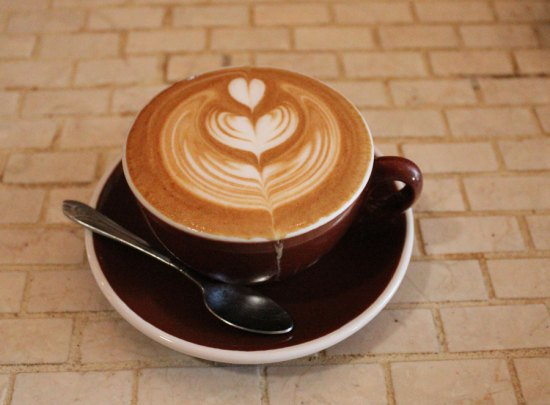
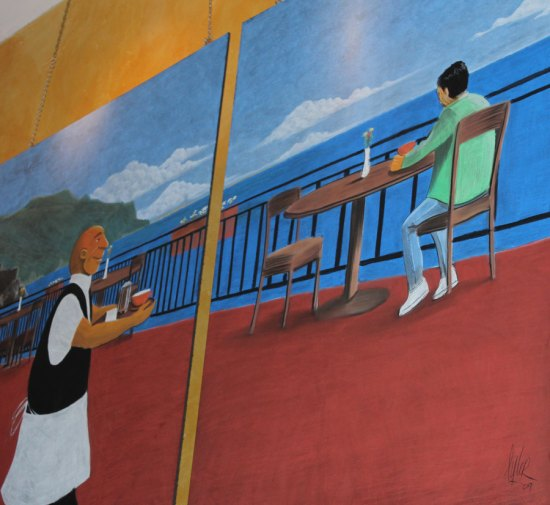
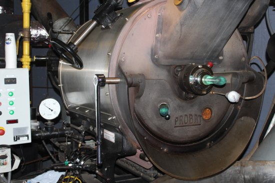
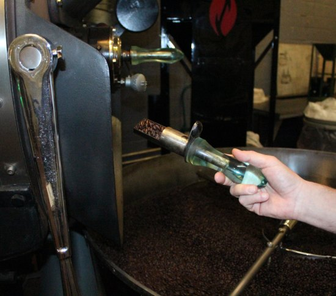
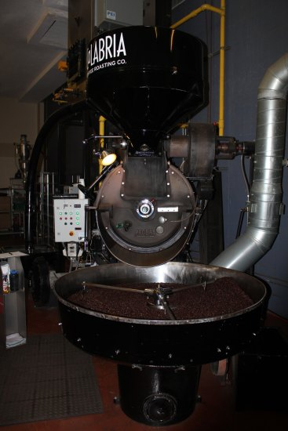

### Turning San Diego into a coffee capital, one roast at a time.

“Roasting coffee is a culinary art,” says Arne Holt, owner of Caffé Calabria in North Park. With ten different blends sold to 150 grocery stores and cafes, Arne runs not only a wholesale roasting company but also a popular cafe.

Arne started out with a coffee cart at Grossmont Hospital in 1991. Born and raised in Seattle where a coffee cart stood on every street corner, Arne spent many years in the food business before coming down to San Diego. He noticed the city had no coffee culture at the time, so he wanted to break open the business.

Once he established his coffee cart, he tried his hand at roasting. “My coffee turned out terrible,” Arne recalls. By 1995 he expanded, opening another cart in Mission Valley as well as a wholesale roasting factory downtown. That’s when he realized that he’d have to take roasting as a serious art form.

“Think of it as a concerto where all the flavors and aromatics have to come together in perfect harmony,” Arne says. When beans roast, more than 800 reactions happen at once. The process is so complicated that even scientists are at a lack to explain it. Roasting is an art form. Either you’ve got it, or you don’t.

The passion Arne had for coffee roasting paid off. By 2001 he opened up his 14,000 square foot space that now includes thirty employees, a roasting factory, and a cafe, which, since a year ago, turns into a Neapolitan pizza restaurant in the evenings.

The entire cafe is made from authentic Italian items. An apple-pie American, Arne loves everything Italian and has visited the country more than twenty-five times. His favorite place is the Amalfi Coast and to prove it, a muralist painted the hotel where he often stays as well as a barista serving coffee.

Whenever Arne visits Italy, he buys items for the cafe. His cups, saucers, water glasses, knives, and spoons are all imported from Italy. At the back wall, he uses Italian olive oil tins for his juices. The bar is made of Italian tiles, and he also has an elegant wine collection on display.

Behind glass windows, customers can also catch a glimpse of Arne’s twenty batches of coffee roasted every day, five days a week. (That comes out to about 10,000 pounds of coffee per week.) Arne shows me the entire roasting process, which takes about twenty minutes. But “the finish time isn’t important,” he explains, “it’s how you get there.”

He buys the raw green beans from brokers in San Francisco. When they arrive on palettes, the beans are weighed and placed in a hopper. For Arne’s house blend, he uses Sumatra beans as the foundation. That provides the low notes, and importantly, the beans don’t have a lot of acidity. For the medium notes, he uses Central and South American beans to bring some brightness and sweetness. Finally, he mixes in Ethiopian beans that provide the ‘high notes’ with hints of citrus. The bean mix must be blended just right so that one flavor doesn’t overwhelm the other.

An air conveyor vacuums the beans into an overhead hopper. Then, the beans are charged into the roaster. They heat for about 5-6 minutes, which drives out the moisture, turning the beans from a green to cinnamon color.

The beans begin to crackle, called the ‘first crack’. That’s when the fiber inside the beans is released. The roaster must watch the time, and the temperature and pull the tier from the roasting machine to check the color of the beans. He adds and takes away heat to develop the flavors based on what he observes.

After the first crack, the beans go quiet for just a little bit. A ‘second crack’ then begins, and three reactions happen at once: the development of lipids, the release of gases, and the caramelization of sugars. Arne explains that roasting coffee is about the caramelization of sugar, which can’t happen too quickly or too slowly. The lighter the roast, the less sugars are caramelized, and you get a coffee that is bright, acidic, and even sour. When you create a darker roast, you’ll find the sweet spots. The first notes that come out of darker roasts are nutty, then caramel, then chocolate. Arne’s ‘gold standard’ is reaching the chocolate notes.

When the beans are finished, the roasting machine opens quickly, and the beans spill into a vat, where they are rotated for about five minutes. A fan underneath blows to cool the beans evenly.

Every morning, Arne and his team take several batches of beans and test them upstairs to the cupping room. They taste coffee with a spoon and pull it through their palate to see if the blend meets their standards.

You can have excellent beans and a well-crafted roast, Arne says, but if the barista doesn’t know how to have the water hit the coffee just right (for either espresso or drip) then the coffee cup won’t come out well. All three have to work together to create an excellent cup of coffee.

Arne has plans for exporting his blends to Asia and expanding his cafes to other parts of San Diego, but he also has to convince cafe owners to learn the craft of making a good-tasting cup. San Diego isn’t a coffee capital – yet. But if anyone can turn that around, Arne has the vision and patience to make it happen.

### Resources

[Caffé Calabria](https://caffecalabria.com/) – Caffé Calabria is located at 3933 30th Street, San Diego, CA 92104. (619) 683-7787.