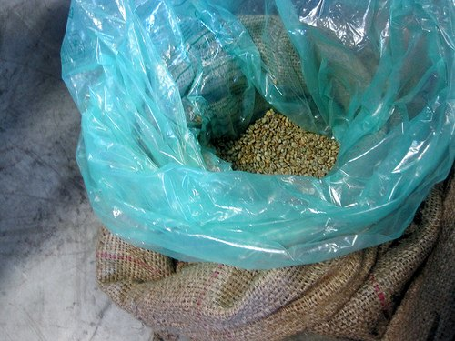

While researching the economics of home coffee roasting, I wanted to learn more about a green coffee buying cooperative. Green bean coffee cooperatives are groups that pool their money together to buy sizes of unroasted coffee that are usually only available to commercial roasters. Fortunately, I knew that INeedCoffee contributor Chris Arnold was active with the *Green Coffee Buying Club*. He agreed to an email interview.

**INEEDCOFFEE:** When did the Green Coffee Buying Club start?

**Chris Arnold:** The *Green Coffee Buying Club* started approximately April 2005. It started out of a desire for a laid-back approach to getting great coffee at lower prices. Thus the motto, “*Splitting bags of Green Coffee, and have fun doing it.*”

**INC:** What is your role with the site?

**Chris:** I mainly handle the technical side of things. I maintain the website, technical support, user permissions, etc. However, I also am one of four other founding members. We all discuss certain site-wide (and even user-specific) issues that come up from time to time, and always come up with a game plan that is agreeable to all. We always try to do what is best and try to maintain a few goals such as keeping the site ad-free.

**INC:** How many members are there?

**Chris:** We currently have upwards of 3,000 members, but in the past, we were more aggressive with deleting inactive users. Had we not done that, I suspect we would have somewhere around 8,000-10,000 members. We have never advertised, and I don’t even think we come up in many Google searches. Bear in mind that most of our free membership is from word of mouth.

  
*Open bag of green coffee*

**INC:** Do you have any recent examples of pricing and quality?

**Chris:** We get a wide variety of specialty grade coffees, as well as COE (Cup of Excellence) coffee. Pricing can be as little as $2 per pound on an Ethiopian, on up to $20+ on something like a Jamaica Blue Mountain or COE. Most of the coffee is “Cupped” by our more experienced members, and based on that taste test, the decision is made whether to go forward or not. Point is, I have always gotten a good coffee and in most cases very good to excellent. We don’t want to distribute something that we don’t enjoy drinking ourselves.

**INC:** Walk me through a typical transaction, from locating the beans to having the individual roaster receive his portion of the shipment.

**Chris:** Several of our distributors maintain relationships with coffee importers, so they can get bulk pricing. Once a coffee of interest comes up on the position sheet of the importer or broker, the distributor makes a post in our “*Potential Offering*” area. This is simply to gauge interest. Once enough interest has been shown, then the post is moved to the “*Open Offering*” area where people can post firm commitments. Sometimes a prepayment is required, but in general, the honor system is pretty much the standard. The coffee usually comes into port cities in places like San Diego or even New York. The distributor may pick up the coffee or have it shipped to him. Once at his place, he will ship it to those who have paid, and from there, the buyer gets to enjoy some really great roasting sessions and the resulting coffee.

**INC:** What can the home roaster expect to pay for a 5# or 10# order?

**Chris:** Like in the retail world, prices fluctuate, but our entry point starts quite a bit lower. Also, since most shipments are done with US Postal Service Flat Rate boxes, your best price per pound will be when that box is maxed out. Most boxes hold between 10-15 pounds of Green (unroasted) Coffee. So a typical nice Ethiopian Harrar, for example, might come in at $2.50/lb. So on 15 lbs, the coffee is $37.50, shipping is about $10, and the “PayPal, insurance, & packaging fees” are about another $10. So $37.50 + $10 + $10 = $57.50/15 lbs = $3.83/lb, or about $4/lb in round numbers. That is a pretty good deal, considering most of the coffee we get is of very good quality. In the retail world, there is a lot of average or below-average coffee, not to mention old coffee that has been sitting on the shelves for some time.

**INC:** Is there a certain type of home roaster that this club is best for?

**Chris:** I think any level of home roaster can benefit from the GCBC. I have never been a fan of ordering 1 or 2 pounds of a given coffee, especially for beginners. They will burn through that before they even know how to roast it. That is why five or more pounds actually works out well (which is the typical minimum anyway on GCBC).

**INC:** And is there a type that would be better off going through traditional stores?

**Chris:** Traditional online stores are where most of us bought our first Green Coffee. So if you want to get your feet wet, retail is fine. However, as I said before, 1 pound is not enough to get a feel for a certain coffee. The only real advantage to a retail outlet is when they get that one special coffee, that nobody else can get. I think those situations are rare, but certainly, do come up.

**INC:** How does one become a member?

**Chris:** Very easy. Go to [www.greencoffeebuyingclub.com](https://www.greencoffeebuyingclub.com/) and sign up for free. Just read the “*New Member*” starter page, and you are in!

*This interview happened in 2009.*

### Resources

[Green Coffee Buying Club](https://www.greencoffeebuyingclub.com/) – Site for the Green Coffee Buying Club.

[Chris Arnold](/by/chris-arnold/) – INeedCoffee contributor page.

UPDATE December 2018: Confirmed current member count at 2,382.
