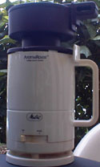
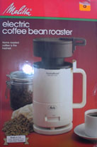

Last month, I located a Melitta AromaRoast Coffee Roaster on eBay. Even though I already have several other home roasters, I figured it would be fun to tackle a new one and, in the process, write up a roasting tutorial for INeedCoffee. My initial research told me that roasting in a Melitta AromaRoast would be more difficult than most roasting methods. What started as a roasting challenge almost burned my house down. But I’m getting ahead of myself.

### History

The Melitta AromaRoast is an electric fluid-bed home coffee roaster. According to Kenneth Davids, the author of the home roaster’s bible Home Coffee Roasting, Revised, Updated Edition: Romance and Revival, the AromaRoast was imported by the Melitta Corporation from Hong Kong in the early 1980s. The roaster apparently infringed on the American patent holders, who successfully removed it from the consumer market.

Even though you can no longer purchase an AromaRoast from the store, you can still find them occasionally on eBay or other auction sites. I ended up buying mine for around $30 with shipping.

### A Roasting Challenge

One goal of home roasting is not to roast the beans too fast or too slow. If you roast too quickly, the beans won’t fully develop the flavors one associates with home-roasted coffee. On the other hand, if the beans take too long to roast, they are baked, which results in a very flat taste. The AromaRoast has a reputation for being underpowered.

My first roast confirmed this. After 11 minutes of roasting, the beans still had a lightly roasted cinnamon hue. Another problem with the AromaRoast, besides its being underpowered, is that there is no way to monitor the roast visually. Other roasters such as the [Hearthware](http://ineedcoffee.com/home-roasting-with-the-hearthware-precision/) and the [Fresh Roast](http://ineedcoffee.com/home-roasting-coffee-with-the-fresh-roast/) have a glass casing so the operator can stop the roast when the roast gets to the desired color. Getting perfect coffee out of the AromaRoast would take a little practice.

To roast the beans quicker, I needed more power or some way to trap the heat. I decided to use the box concept Ryan Jacobs described in his article [Cold Weather Roasting](http://ineedcoffee.com/cold-weather-coffee-roasting/). At this stage, I made three big mistakes.

The first mistake I made was using a small box, which ended up trapping way too much heat. The second mistake I made was bending the flap back, which trapped even more heat. Finally, the biggest mistake I made was leaving the roast unattended.

### Burning Down the House

Instead of monitoring the roast, which all home roasters, regardless of method, should practice doing, I was upstairs surfing the Internet looking for Melitta roasting tips. Exactly 5 minutes into the roast, I went downstairs and saw my porch filled with smoke-filled mounds. Oops! Without a moment’s pause, I sprinted to the backyard. I leaped to the outlet and yanked the cord from the wall. The box was still spitting out a column of smoke. Grabbing only the box, I shook the red-hot roaster onto the concrete. The coffee that spilled out was black as charcoal and still smoldering. The inside of the box was scorched.

The coffee was destroyed.

### Coda

Day one of roasting with the Melitta AromaRoast was a complete failure. The first batch was under-roasted, and the second was, to put it mildly, a tad over-roasted. The next weekend, I struck out in search of the holy grail of getting perfectly roasted coffee. Armed with a stopwatch, a notebook, a larger box, and a bucket of water, I was ready to master this roaster. However, it was too late. The inferno from the previous week had toasted the machine. It was dead. The important lesson here is **don’t leave a roast unattended**, especially when it’s a new roasting style.

  
*It wasn’t this bad, but the coffee and the roaster were ruined.*

### Related Resources

Many home roasters will tell you that you can roast better coffee cheaply and easily with a popcorn popper. Once you have mastered the basics and would like to fiddle with the electronics, search the Usenet (aka Google Groups) for Melitta posts by Ken Mary.