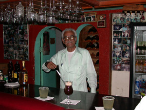
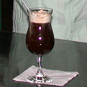

Tony works at La Gondola restaurant in Rosarita, Mexico, which is located in the area of Mexico known as Baja California. This little bar, with an Italian name, is near the beach where the salt water breeze blows in from the ocean. All the tourists come by inquiring about the different tequilas, and Tony has all the answers. His recipe for Mexican coffee uses white tequila, which has a more subtle taste and has less of a bite than some of the other types of tequila.

  
*Tony at La Gondola in Rosarito, Mexico*

### Ingredients

-   Fresh, drip coffee
-   1 oz. of White Tequila (example: Orendain brand tequila)
-   1 oz. Cacao liqueur/syrup
-   Whipped cream

  
*Mexican Coffee With White Tequila*

In a daiquiri glass, pour the shot of tequila first, then pour the hot coffee. Leave enough room at the top for plenty of whipped cream. Spray a mound of canned whipped cream, then slowly drizzle and pour a shot of Cacao liqueur on top.