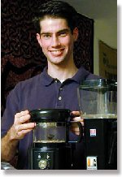

For the past four years, Davidson student Michael Griffin has pursued an insatiable curiosity about coffee with the passion of a connoisseur and the discipline of a scientist.

Some of his friends claim he’s gone too far. His student apartment is equipped with “a few grand” worth of the finest grinders, stainless steel milk pitchers, and espresso machines worldwide. He wants more, too. “My mom won’t let me, but I want to sell my car to buy an espresso roaster,” Griffin admitted. “They start around $5,000… I think it’s perfectly reasonable, though. I’d save a lot on car insurance!”

He also stores about 30 pounds of green, unroasted coffee beans, bagged by the pound and labeled carefully to indicate the very plantation from which they originated in a dozen or so countries around the world.

  
*Mike Griffin*

He brews some of those beans in his apartment as espresso or cappuccino for personal consumption. But he also subjects them to experimentation in the Martin Chemical Laboratory as he seeks to discover the molecular components of the ultimate bean. “Research is imperative to the quest for better coffee,” he stated.

This undergraduate chemistry major from Los Angeles is quickly becoming one of the foremost coffee experts in America. He has read scores of scientific papers about coffee and spent the last two years conducting his own experiments in the lab.

He has studied “latte art,” from some of America’s foremost “baristas,” learning from them how to pour heart and rosetta shapes into the steamy foam of a cappuccino. He also worked for eight months as a barista in a Charlotte Starbucks, learning first-hand how coffee houses both educate consumers and compromise quality for commerce.

Griffin refines his palate by studying a coffee “flavor wheel” poster that hangs on his wall, and by sniffing a set of 24 vials of coffee aromas he bought. The most valuable lessons come from taste-testing brews from different origins four at a time. “The key for me was brewing four at a time and comparing them,” he said. “When you do that you can begin to discern their different aspects.”

He has held several “tastings” for campus friends, and many have gained a new appreciation for the common beverage. But Griffin is wary of spending too much time serving his friends. “If you convert them you have to make them coffee all the time,” he laughed.

Griffin grew up in Los Angeles and began drinking cafe mochas at age 12. “I would have started earlier if I had known what I was getting into!” he joked.

He became a serious aficionado of fine coffee in about 1995, then launched his career as a coffee scientist two years later when the coffee world was rocked by an amazing crop of Kenyan beans. The coffee harvested from the Kagumo plantation in 1997 carried an extraordinary amount of “brightness,” making it a very hot and expensive commodity.

Experts speculated that the desirable “brightness” was a reflection of the phosphoric acid content of the beans. Griffin realized the opportunity to contribute meaningfully to the science of the subject and decided to initiate his own experiments on the Kagumo bean’s phosphate levels. He proposed the study to his academic advisor, David Blauch, associate professor of chemistry, and conducted it in Blauch’s class, and as part of an honors thesis research class. “It ended up being quite a detailed study of how phosphate levels vary with roasting levels,” said Blauch. “Michael did a really nice piece of work.”

So nice, in fact, that his final paper is being published in a scientific report, *The Proceedings of the 18th Colloquium of the Association Scientifique Internationale du Cafe.*

That initial investigation launched Griffin into a frenzy of scientific experimentation that has continued for almost two school years and during the past summer. He is now being funded by the Specialty Coffee Institute to conduct chromatographic experiments on coffee acids.

He plans to continue at the graduate level, with the eventual goal of learning to identify the origin of any coffee based solely on its chemical components. “That’s never been done,” he said, “But it would allow you to figure out if you’re buying what you paid for.”

To extend his outreach, Griffin learned HTML and established an Internet domain for an informal organization he calls The Coffee Research Institute. Its attractive Web pages educate the visitor and impress with their precision. For example, his description of espresso reads, “Espresso is a 30-50 mL extract that is prepared from 14-17 grams of coffee through which purified water of 88°-95°C has been forced at 9-10 atmospheres of pressure for a brewing time of 22-28 seconds.”

But lest one think that the author approaches his subject solely as a calculating scientist, the description concludes, “Espresso brewing is defined by four “M’s”: the Macinazione is the correct grinding of a coffee blend, Miscela is the coffee blend, Macchina is the espresso machine, and Mano is the skilled hand of the barista. When each factor of the four M’s is precisely controlled, the espresso beverage that is produced is the ultimate coffee experience.”

He views that perfect brew with an artist’s eye, writing that it drips out of the porta-filter “like warm honey,” with a deep reddish-brown color, and a golden-red crema.

He approaches coffee with a rare combination of enthusiasm and discipline. Griffin understands there’s a proper way to do everything and applies that equally to his work in the lab and in preparing a cup to enjoy. It is just as important to him to keep his apartment coffee equipment sparkling clean as it is to maintain his lab apparatus. Measurement and technique are equally important in preparing a cup of espresso as they are in preparing coffee grounds to analyze with a gas chromatograph.

As he roasts, grinds, doses, and tamps a shot of espresso, he describes in fascinating detail the proper method for each step, and why it is important to the taste of the resulting coffee. “There are at least 30 variables that affect the taste,” he concludes. “If you’re not precise about each one, you’ll never be able to isolate those factors that change the taste.”

Griffin feels fortunate to live in a time of coffee renaissance and is eager to find purpose and meaning in a career in coffee science. But as much as he loves the lab, he knows he can’t complete his education there.

Despite his encyclopedic knowledge, he has never visited a coffee plantation, held a coffee cherry, or smelled the fragrant jasmine aroma of coffee blossoms. Toward that end, he’s written a proposal accepted by the college for presentation to the Thomas J. Watson Foundation. If funded, it will take him next year to plantations in Brazil, Costa Rica, and Guatemala to learn about coffee from those who plant and cultivate it. The proposal also involves travel to Italy and Vienna to study the art of espresso making in lands where “coffee permeates the culture and espresso is a national pride.”

Despite how much he has already accomplished and learned, Griffin recognizes that the world of coffee is almost boundless, and is passionately eager to explore it all. His proposal to the Watson Foundation concluded with the statement, “My journey is only beginning.”

**UPDATE (April 4, 2000):** *Michael was one of sixty students in the United States to receive the Watson Fellowship. He will be studying the art and chemistry of espresso in Brazil, Guatemala, Costa Rica, Italy, and Vienna.*