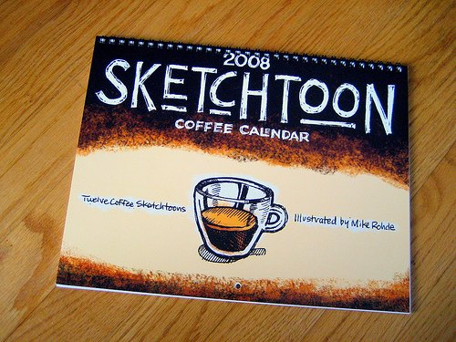

*Editor Note: This coffee profile was published in December 2008. An update on Mike’s book, The Sketchnote Handbook, was added in December 2012.*

When Mike Rohde was 5 years old, he spilled hot coffee on himself at his grandmother’s house. It was an unlikely introduction to the beverage for the Wisconsin-based visual designer who created the [Sketchtoon Coffee Calendar](/creating-the-sketchtoon-coffee-calendar/). While the Sketchtoon Calendar may not be among the ones in the seasonal stand in your local shopping mall, it has a major online presence. Google “coffee calendar” late in 2008, and Sketchtoon is one of the two organic (standalone) hits on the first page. The “colorized” ink sketches have a steady theme, they’re informative, and they are the work of a true coffee lover.

“Coffee is very important,” Rohde said in a recent e-mail interview. He and his wife start each morning with home-brewed coffee, and there’s more coffee to come at the workplace. “At Northwoods Software, where I work, I often pull shots of espresso or make cappuccinos on the office DeLonghi Magnifica, which I have to say is great to have around. … I also have a Krups espresso maker at home, which takes pods as well as ground coffee, a French press, and a handy Moka pot.”

  
*[Sketchtoon Coffee Calendar](http://www.flickr.com/photos/rohdesign/2111160077/in/set-72157600161864325/) by Mike Rohde*

As for local coffee spots, Rohde is especially fond of John Harbor’s Main Street Coffee House in his hometown of Menomonee Falls, as well as Milwaukee-area roaster and cafe chain Alterra Coffee. “Now and then I like getting away to my local cafe for coffee to read, or do a little sketching or design work in a relaxed environment,” Rohde said.

In general, Rohde gravitates toward premium coffee – he likes darker roasts and prefers cappuccino or a well-pulled espresso – but he’s not a snob about it. “I like exploring a wide variety of coffee and surprisingly, some diner coffees aren’t so bad. I think in the US there’s been a positive effect of Starbucks and other coffee establishments improving the quality of coffee overall,” Rohde said. “But I will say that when I encounter truly bad coffee I won’t drink it. Life is just too short to torture my taste buds.”

### Sketchnotes: Visually Noted

The coffee artwork in Rohde’s calendar is an outgrowth of his Sketchnotes. They’re a twist and a major upgrade on the margin doodles of a note-taking student – Sketchnotes capture an event utilizing visual elements and fonts that are as crucial as the text in the overall presentation.

Rohde created [his first Sketchnotes](http://www.flickr.com/photos/rohdesign/sets/72157600139569147/) in 2007 when he attended a UX Intensive event put on by Adaptive Path in Chicago. “I decided to try intentionally including drawings and fonts in my notes to see if it was possible and how well I would be able to capture the event,” Rohde said. “It worked out so well, I’ve continued to take \[Sketchnotes\] at other events.”

Since then, organizers of such events as SEED 3 and An Event Apart have asked Rohde to be the official “sketchnoter.” His Sketchnotes will also cover upcoming events this month and in March 2009. “I’m very excited about these and other future sketchnoting opportunities,” Rohde said.

### Flavoring the Notes

So how did the Sketchnotes get their coffee flavor? Rohde and his wife have a friend with a coffee-themed kitchen and sought a coffee calendar for her as a Christmas present. Rohde took matters into his own hands. He and his wife first created a coffee calendar with photography, but as Rohde began sketching more, he created a coffee calendar with Sketchnote-style art. In 2006, he began the sketches that would eventually form his calendar.

All of Rohde’s SketchToon coffee sketches are originally [done in black-and-white](http://www.flickr.com/photos/rohdesign/2059959887) in a pocket Moleskine sketchbook. He then “colorizes” them through Photoshop, and the result is a color-themed sketch immediately recognizable as Rohde’s own. “I’ve found a few special brushes in Photoshop to create the mottled look for the dark brown, and the color for the coffee drinks was painted so it overprints the black artwork,” Rohde said.

It’s a technique he’s used with some of his graphic design in the recent past, including some sketch work for the Archdiocese of Milwaukee. “I like this approach because I can easily change direction or colors by simply re-doing a layer of the Photoshop file,” Rohde said.

Most of the time, Rohde sketches from experience – he’s had most of the drinks portrayed in his calendar and has sketched some of them with the real beverage before him at a local cafe.

### Conclusion: Artistry and Professionalism

Last year, Rohde posted his calendar on Cafe Press, and he sold more than 100 copies. He said this demonstrated to him that there is some general interest in a coffee calendar. “It’s been very popular as a gift, I think, because there are so few good coffee calendars out there,” Rohde said.

One exception he goes out of his way to praise is *The Coffee Calendar*, the work of his friend Ricardo Levins Morales. (It’s the other organic hit on the first page of a ‘coffee calendar’ Google search.) Both Rohde’s and Morales’ calendars blend an artistic edge with substantive coffee knowledge.

[Mike Rohde’s website](https://rohdesign.com/) demonstrates his ability to blend artistry with professionalism, tradition with technology, and the visual image with the written word. A look at the 2009 Sketchtoon Coffee Calendar may inspire one to ask why nobody has done something like this before, but the question is moot. Mike Rohde was the one with the artistic talent, sketchnoting technique, initiative, and love of coffee to make the calendar a reality, and INeedCoffee salutes him as a Coffee Achiever.

*Mike Rohde hosts an [interview version](https://rohdesign.com/weblog/2008/12/2/coffee-achiever-interview-at-ineedcoffeecom.html) of this article over on his site rohdesign.com.*

### (December 2012) The Sketchnote Handbook

Mike Rohde has taken what he has learned about sketching and written a book titled *The Sketchnote Handbook*. The description on his website says:

> You can create visual notes that are a fun, engaging, valuable reference. Anyone can do it – especially regular people who feel they can’t draw. Sketchnoting is about ideas, not art. This book gives you tools to start sketchnoting right away.
