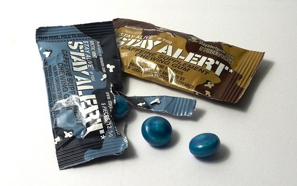

Although none of the soldiers were likely to have complained, it probably didn’t take long for military generals to realize that those alcohol rations they were giving the soldiers were doing more than just boosting spirits (pun intended)… they were increasing morale to the point where the soldiers were having more fun drinking than heading out on the battlefield. And as great as it is to have your soldiers fired up for work… that’s not really the kind of firing that President Andrew Jackson wanted to see!

It was in 1832 that the President signed an Executive Order that would replace each soldier’s allotment of alcohol with coffee and sugar – and to this day, caffeine has remained an essential part of a soldier’s complete breakfast. And lunch. And whatever else he’s eating! In fact, for one year during the Second World War, the entire American production amount of Nescafe’s instant coffee was purchased by the military.

While there is no denying that this prior strategy of caffeine rations was the best way to ensure that the army’s soldiers stayed awake and alert on the battlefield, it always seemed like there was room for improvement. After all, in order to have a coffee, a soldier needs to boil water, get out his mug and coffee grinds or plastic one-cup dripper, pour, and wait… all of which can be a bit of a hassle for mobile troops. Fortunately for American soldiers across the nation, the military has no shortage of resources when it comes to developing new technology – and in 1998, the first packages of Stay Alert chewing gum hit the public shelves.

  
*Stay Alert Gum by [mr smashy](http://www.flickr.com/photos/wmode/3499255158/in/photostream/)*

Originally developed for public consumption, the concept of chewable caffeine piqued the interest of the military and since Stay Alert had a short-lived, rather unsuccessful test run in the general public, the military was able to take control of the gum’s production and develop it for their own purposes. An initial study was done in 1999, and after numerous tests on the product and its impact on the human body and reaction times, approximately 300 cases of Stay Alert gum were shipped off and rationed to soldiers on active duty.

It turns out that Stay Alert gum is actually 5 times faster than coffee in delivering caffeine to the human digestive system – and the bonus for soldiers is that unlike coffee, which is a diuretic, chewing caffeinated gum won’t cause someone to need a bathroom break.

After years of testing and development – and use in the field – the military’s secret tactic for wakefulness is now available to the general public. According to the studies, the gum is perfectly safe for an average user, however, the best approach is to chew one piece, wait 5 minutes and then take a second piece if it’s needed.

Talk about being able to answer the call of duty!