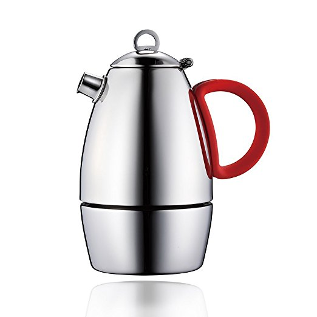

Recently, I’ve had the opportunity to make stovetop espresso with the Minos Moka Pot Espresso Maker. The Minos is a beautiful coffee maker. It is made from heavy stainless steel with a Mirror finish, not polished aluminum, which Bialetti uses. The brewer ships with three different-colored handles (yellow, light blue, and red), so you can customize the Moka Pot to match your kitchen.

For this tutorial, I will be brewing coffee using the Minos Moka Pot’s 3-cup model. There is also a 6-cup Model. The 3-cup model makes 5 ounces of stovetop espresso, whereas the 6-cup model makes double that at 10 ounces. The Minos Moka Pot has an intuitive design, but I learned a few things after brewing several cups of coffee.

*Minos Moka Pot Espresso Maker  
*

### #1 Add Cold Water to the Bottom Chamber

Before you add water, look inside the brewer for the safety valve. Add water up to 1 cm below the safety valve. If the safety valve is submerged, the coffee will not brew properly.

*Looking inside the Minos Moka Pot.*

*Find the safety valve before adding water to the Moka Pot.*

### #2 Place Funnel in Brewer and Add Ground Coffee

Minos recommends using a medium to coarse grind, as a fine grind could cause blockage. View our Coffee Grind Chart to see what a Medium Grind looks like. Fill the funnel until it is full, which works out to about 18.5 grams.

### #3 Smooth with Tamper

The Minos Moka Pot ships with a metal tamper. Use this to smooth and flatten the coffee grounds. Do not pack the coffee in the funnel like you would for a traditional espresso machine. A gentle press is all that is needed.

*Once the grounds are in the funnel, use the tamper to smooth the coffee level.* 

Wipe off any loose grounds that remain on the funnel’s lid. Make sure the tamper is removed before proceeding to the next step.

### #4 Attach the Coffee Pot to the Bottom Chamber

Screw the coffee pot onto the bottom chamber tightly.

### #5 Make the Coffee

Open the lid of the Minos while brewing and keep it open during the brew cycle. Monitoring this will let you know when the coffee has finished brewing. Once finished, you can close the lid and turn off the heat.

You can use whatever heat source you like to brew the coffee. I am using an electric stove set to medium, which is the same as is recommended for the Bialetti.

If you have a gas stove or campfire, Minos advises that the flame not exceed the diameter of the brewer.

*Around 3:30 in my brew, the coffee begins to exit the center tube of the Minos.*

*The coffee is almost finished brewing.*

### #6 Serve

Once the coffee stops coming out of the tube in the center of the coffee pot, it has finished brewing. Close the lid, take it off the heat, and serve. The handle can be very hot (more on that below), so either pinch it or use an oven mitt to shield your thumb from the metal part of the handle.

*The Minos Moka Pot with a yellow handle. Light blue and red are also shipped with the brewer.*

### #7 Cool Before Cleanup

Unlike other coffee brewers, which can be cleaned shortly after brewing, the Moka Pot will remain hot. Give it time to cool completely before you break it down for cleaning. You can use dish detergent to clean the Minos Moka Pot.

### Classic Bialetti vs Minos: Battle of the Moka Pots

Is the Minos Moka Pot better than the classic Bialetti Moka Pot? Even though both brewers make coffee in the same manner, a few differences stood out to me.

#### Design

I really like the Minos’s mirrored design combined with the interchangeable colored handles. This look is a modern take on a coffee brewing method that has been around since the 1930s. See our article The Story of the Bialetti Moka Express to learn more about the Moka Pot’s rich history.

I also like the Bialetti’s classic design. I don’t have a strong preference for which I like better, but I give the Minos a slight edge.

#### Stainless Steel vs Polished Aluminum

The biggest difference between the two Moka Pots is that the Bialetti is made with polished aluminum, and the Minos Moka Pot is made with stainless steel. Which is better? To get that answer, I found a resource on the site Metal Markets that breaks it down. In the article “10 Differences Between Aluminum and Stainless Steel,” I focused on the items that would be most relevant for coffee makers.

-   Aluminum is prone to corrosion. Stainless steel is not.
-   Aluminum conducts heat better than Stainless steel.
-   Stainless steel can be used at higher temperatures than Aluminum. (Aluminium gets soft over 400 F)
-   Stainless steel is stronger than Aluminum.
-   Aluminum is more likely to react with foods than Stainless steel.

I could not taste any metallic elements in either brew. My Bialetti, which is several years old now, is starting to look a little worn, but there is nothing to be concerned about.

The Bialetti brewed faster than the Minos. Using my electric stove set on 6, the Bialetti and the Minos first saw coffee exit the tube at 3 minutes and 30 seconds. However, Bialetti finished the brew at 5:20, whereas Minos finished at 6:44. The differences may not have been due to the difference between aluminum and stainless steel. The Bialetti filter is wider and less deep than the Minos. The Bialetti also has a larger opening for the coffee to exit. Regardless of the reason, if you are an impatient coffee drinker, the edge here goes to Bialetti.

And because stainless steel holds heat longer, the Minos took longer to cool down. This could be a factor if you do multiple brews back to back.

A reader informed me that if one has an induction stove, that aluminum will not work. Stainless steel will.

#### The Handle

The Minos handle is pretty but may not be safe to grab at the end of a brew cycle. As you can see from the photo above in Step #6, the colored portion, which is safe to touch, only partially covers the handle. Depending on how hot your burner is and how long the Moka Pot remains on the stove, the metal portion of the handle can vary in temperature.

You might be fine if you always grab a handle in a pinching manner. I tend to wrap two fingers inside the handle and then use my thumb on top before I close my grip. So, I need to grab a dish towel to protect my thumb before I remove the Moka Pot from the stove.

*Depending on how long you leave the Moka Pot on the burner and how hot your burner is, this handle design can potentially burn your thumb. Use a dish towel or something to protect your hand or pinch so your fingers are only touching the silicon part of the handle.*

The entire Bialetti handle is covered and safe to grab when the brew is complete.

*Bialetti covers the entire handle.* 

### Price

At the time of this writing, the 3-cup Minos costs $80 USD, which is triple the price of the 3-cup Bialetti.

### Taste

I could not tell much difference in the taste between the Minos and the Bialetti. Both produced a rich, strong *espresso-like* coffee. I use the term *espresso-like* for reasons explained in the article [Making Lattes Without an Espresso Machine](/making-lattes-without-espresso-machine/).

Some users of the Bialetti have reported a slightly metallic taste, which is not present in stainless steel Moka Pots such as the Minos. My Bialetti did not impart a metallic taste, but it is several years old. Had I tested with a brand new Bialetti, perhaps I would have given the taste edge to the Minos.

### The Verdict

Right up until I went to pour the coffee, I liked both Moka Pots equally, but for different reasons. Then I got too close to the metal part of the Minos handle and came close to burning my hand. Even if the pinch grab method is always used to remove the Moka Pot from the burner, it is not the ideal grip for pouring.

If Minos redesigned the handle so that the silicon part covered the entire handle like the Bialetti, it would have the edge. However, since I prefer not burning my hand first thing in the morning when I’m trying to wake up, I like the Bialetti more than the Minos. However, if you have an induction stove or are sensitive to any metallic tastes, the Minos is a better option.

**UPDATE:** Shortly after this review was published, a reader informed me that Bialetti now makes a line of Stainless Steel Moka Pots, which would also work with induction stoves. If I can brew with one of them, this review will be updated.

### *Bialetti Stainless-Steel Stovetop Espresso Coffee Pot*

### Resources

[Stovetop Espresso Brewing Tutorial](/stovetop-espresso-brewing-tutorial/) – INeedCoffee tutorial.

*Minos provided INeedCoffee with a brewer for this review/tutorial, which did not affect our review.*
