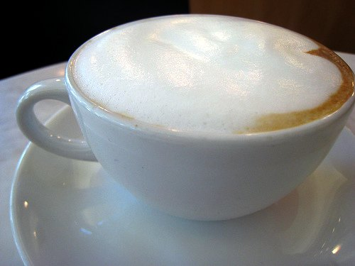

In a dimly-lit cabin, in a black spaceship careering through the outer reaches of our solar system, a large alien sniffed, sniffed, and sniffed again, his snout wedged into the top of a large mug. His eyes were closed; his face carried an almost mournful expression.

“Zytor! Watch the monitors, you idiot! They’ll be plenty of time for that after we make the run!” Mengwan leveled a menacing look at the crewman for a moment, then turned his large, reptilian, striped form back to the ship’s main console. He gestured at the screen with one of three meaty fingers. “There’s the strange little green planet ahead – I can just barely make it out.”

Raktoff was flipping through a mag-vid. He kept returning the display to a digitized image of Juan Valdez. Looking up cautiously at Mengwan, he said “Sir, could we try the Kona blend this time? I mean, I don’t think we had that one on the last go-round, and…”

Mengwan turned around even more quickly than he had in response to Zytor’s actions. “Quiet! One more uncalled-for comment and I’ll cut off your third leg! And put away that mag-vid. You’re supposed to be monitoring the ship’s vital signs, you imbecile. This is not a pleasure cruise.” Muttering further to himself, Mengwan rounded again to face the master control panel. After gazing without expression at the slowly enlarging image of Earth for a moment, he then turned his attention to a small side-screen. Quickly punching in the necessary commands, he brought up a geographical database and began to zero in on a particular area of the Earth, using smaller and smaller grids.

“Here it is, you worthless excuses for a crew!” Mengwan pointed at the screen, swiveling his head around to make sure everyone was watching. “Blast the seven moons of Hrenipus! Snark, put down that comic-vid and pay attention! We’re nearing the planet. I’ve got Seattle on the grid. Raktoff! Lock in on the coordinates!”

“But sir, hadn’t we discussed that before? According to the galactopedia, the principal growing regions of the required bean are to be found in what is known to the Earthlings as Central and South America, are they not? And if I remember correctly, the ‘Seattle’ you refer to is in North America.”

Mengwan stared incredulously at Raktoff. “That just about borders on insolence. I give the orders here, and I say we go to Seattle, because I am party to a little bit of information that you may have missed while poring over your precious galactopedia, Raktoff, and that is: Seattle happens to be at the very pinnacle of coffee consumption in this hemisphere.” He turned around, focusing once again on the grid.

“But sir, wouldn’t it be better to go to the source?”, said Raktoff, a little meekly this time.

Before Mengwan could offer a rebuttal to this latest outrage, Zytor jerked his nose up and out of the mug. “No, Raktoff! Don’t you see? The captain is right – let’s go to where huge quantities exist of ready-to-prepare coffee, and better yet, ready-to-drink coffee!” He held his mug up during this last remark, as if hoping for a refill from out of nowhere.

Mengwan turned his gaze to Zytor. “I appreciate the vote of support, Zytor. I also do not forget that we wouldn’t even be making this little trip if you hadn’t picked up that crate full of this insidious beverage on our last trip.” He swiveled his head this way and that, taking in the whole crew. He gave them a small smile. “Right! It’s on to Seattle, then.”

“Coordinates locked in, sir. May I suggest something, sir? I saw something else in the galactopedia that…”

“Yes, yes, what is it?” Mengwan glanced back impatiently.

“Well, sir, it seems that there are establishments which serve the ready-to-drink beverage, as well as the unbrewed form, which are known as Starbucks. I was thinking that perhaps, given their name, they cater to a clientele consisting of beings more like us.”

A large, fleshy lid lifted from a drooping position over one of Mengwan’s eyes. “Raktoff, that may be the first intelligent thing you’ve said since we left Dahrvonn.” He began to play with the database, attempting to locate a Starbucks.

\* \* \* \* \* \* \* \* \*

Evelyn was just stuffing some bills in the cash register when she heard — and felt to some degree — the sudden ‘thump’ on the roof. She looked up at the ceiling, shook her head, and began making yet another of the cappuccinos-to-go that seemed to disappear as fast as she could make them. Frantically busy, she’d almost forgotten about the unexplained noise only a couple of minutes later when Dennis suddenly pointed excitedly at the front windows.

“Look! What the hell is that? There’s a ladder being lowered from the roof!” Dennis’s eyes were wide behind his wire-rimmed glasses. Half of his customers turned their heads to see what he was getting agitated about, but the other half looked up from their newspapers with red-rimmed eyes that only reflected a deep need for caffeine.

One customer, a large man in a heavy overcoat, quickly folded his Wall Street Journal and glared at Dennis. “Can you speed it up? I’m a very busy man, but I’d still like my double hazlenut vanilla decaf latte.”

Dennis snapped out of his haze and met the man’s eyes. “Yes sir, I’m sorry, but I don’t understand what’s happening outside. Maybe it’s some kind of fireman’s training exercise.” He turned his attention to the large mugs in front of him.

“Yaaaaaaaaaaaagggggghhhhhhhh!!!!” Evelyn screamed as she dropped a cappuccino on the floor. This time all customers – well, almost all – turned to follow Evelyn’s eyes, which were riveted on the front windows. A rather large dark green and brownish foot, with three toes ending in large, sharp nails, appeared on the first visible rung of the ladder. Another foot followed closely, then another, which were soon joined by a massive, fleshy tail that waved aimlessly around the three legs.

Pandemonium erupted. Customers screamed, plowed into one another, and ran out the front door. Others scrabbled over the counter, joining Evelyn and Dennis. A few crashed directly through the windows and fled down the sidewalk.

Evelyn grabbed the phone and dialed 911, watching a fairly slow-moving… dinosaur? …reaching the sidewalk, while other feet began to follow down the ladder.

“Yes, quickly! Send police, Army, whatever, to the Starbucks on… aaaaaaagggghhh!!” She dropped the phone and held both of her hands to her cheeks, ignoring the frothy milk on both palms. The reptile was coming through the front door, which was actually a tight squeeze for it. Another was on the sidewalk by now, followed by yet another down the ladder. The large man who had been impatient with Dennis was cowering behind the counter, trying to light a cigarette, but his hands were shaking too much.

Dennis glanced down momentarily, and just for an insane moment, thought about reminding the man of the store’s no-smoking policy. No one remained in the store save Evelyn, Dennis, the overcoat man, a petite woman, and a young man sporting a bright red, punkish haircut with earrings in both ears. Actually, a lone customer remained in the far corner, engrossed in the New York Times crossword puzzle. He paused often, glaring at the newspaper while slurping noisily from a steaming mug.

Mengwan walked toward the counter. In his right forefoot was a small, bulging sack. Several large sacks were slung over his left shoulder. The closer he got to the counter, the more the people behind it hunkered down. Mengwan reached the counter. He looked around quizzically for a moment as Raktoff, Zytor, and Snark trooped through the door behind him. Opening the small bag, he quickly turned it upside down. Hundreds, if not thousands, of small silvery disks clattered loudly on the counter, some falling onto the floor. “One million Dahrvonnian Wambenis. We trust this is sufficient payment for your goods”, Mengwan said in English (in a low, gutteral, grating accent), to the surprise of everyone behind the counter.

Evelyn jumped up and pushed through a door with an “Employees Only” sign on it. The overcoat man groaned loudly and fainted. The young man said, “Cool, like, an alien.” Mengwan smashed a fist through the glass in front of the coffee beans and began to fill a sack as Dennis watched, speechless and trembling. The petite woman suddenly leapt on top of the counter and began hitting Mengwan over the head with her briefcase. “I’ve got an important meeting in fifteen minutes, mister, and I wanted a nice big cup of cappuccino to carry in there with me.” ‘Bam!’ went the briefcase again. “How dare you terrorize innocent people like us.” Mengwan ignored her as he continued to fill his sack.

“Maybe she has not consumed a sufficient quantity of the beverage today”, offered Raktoff.

“No doubt”, said the young man, sipping on a latte he had picked up behind the counter.

“We mean no harm, Earth people”, said Raktoff, rather perfunctorily. He, like the others, was cramming loose coffee beans and bags of coffee alike into large sacks made of a burlap type of material. He suddenly noticed Snark shoveling beans from a bin labeled “decaf” into his bag. Snark and Zytor had not spent quite as much time with the English edu-vids as the others had.

“Snark! That is decaf!”, he said sharply in their guttural, native tongue. “It is no good. It… does not produce the desired effect.”

Mengwan looked up from his sack-loading. “I didn’t travel three hundred and seventy-seven light-years for DECAF, you moron!”

Snark looked sheepish, dumped out the sack, then moved on to another blend of coffee. Raktoff read the label, making sure it was not another decaf variety and nodded to Snark.

Zytor walked to the end of the counter and began to move behind it. Dennis and the petite woman gasped and backed up into a corner. The young man moved out of the way as well, but a little more casually. Zytor stepped over the overcoat man and moved quickly to a large coffee dispenser. Bending his knees and tilting his head to one side, he opened his large mouth and began dispensing coffee directly into it. It spilled over and out of both sides of his mouth, although he was making a valiant effort to swallow all of it. He began making low, pleasured, moaning sounds.

“Zytor! That is not our primary objective! Get back to work filling your sacks, er… why don’t you fill a few of those containers first, say, one for each of us?” Mengwan tugged on a leathery tie strap at the top of his sack and set it aside, only to begin filling another.

The man in the corner suddenly cried out. “Damn!”, he said, as he slammed his fist on his table. He grabbed his mug and slurped some coffee. “I hate these questions! I mean, listen to this: 13 Down, 8 letters – ‘popular dessert in Portugal'”, he said, shaking his head slowly, but still not looking up.

Raktoff began stuffing sugar packets, stir sticks, and a few mugs into another sack. “Ah, sir, do we want this ‘Sugar in the Raw’? I know the Earthlings routinely put sugar in their coffee, but…” He tore open a packet and squinted at its contents.

“I only drink the undiluted form, Raktoff”, said Mengwan.

“Yes, yes, bring it”, said Zytor, who passed around large ‘to-go’ containers of coffee – today’s special variety, an Indonesian blend.

Snark opened a container of half-and-half and sniffed. “What about this?”, he said, waving the container around. Raktoff looked up. “No, leave it. It is a hybrid of by-products of a large hooved animal. It will not successfully complete the journey with us. We have learned to manufacture a powdered substitute, for those who require it with this beverage.”

Raktoff moved over to another shelf, and began placing randomly selected Thermoses, coffee makers, and cups and saucers into his sack.

A young policeman burst through the front door, waving a pistol around wildly. He starting to say something, but only succeeded in moving his jaw up and down like a dying fish’s shuddering gills as he took in the scene in front of him.

The petite woman noticed him, and rushed to the counter. “Stop them, officer! They’re stealing all the coffee, and they’ve made me late for an important meeting.”

The officer looked at her, then at Mengwan, and said “ah, well, ma’am, I…” He pulled a handkerchief out with his free hand and wiped his forehead with it. “Are you boys in some kind of costumes? I mean, it’s not exactly time for Halloween, anyway, and you should’ve known you’d still get caught. Now put those sacks down and put your hands up.” He pointed the pistol at Mengwan, but his hand wavered considerably, as he tried to keep an eye on the other three as well.

“We mean no harm, Earth people”, Raktoff repeated as before. He had no other response to trouble, as they hadn’t really discussed what they’d do if they encountered any. Mengwan looked at him, seemingly unsure of what to do, but then said “Let’s go.”

“Wait! I can’t let you leave the premises.” The officer continued to wave his handgun, now toward Raktoff.

“Bob, having trouble here? What the…” A tough-looking, middle-aged cop with a crew-cut stepped through some of the wreckage in the floor-to-ceiling front windows. “Just what the hell is going on here?”

The aliens picked up their sacks and began to move out the front door. The young cop started to say something, but Mengwan held up his coffee container and said “the blend is a very good one today”, and smiled in a way, or at least it seemed like a smile. Sharp, pointed teeth were showing.

“Yeah right, buddy”, said the older cop. “Just hold it right there in your little Godzilla suit, or you and your cup are gonna spring a few leaks.”

The aliens did not stop moving. Snark and Zytor grunted as they trudged up the ladder with the weight of several sacks. The two cops stepped out onto the sidewalk with them, continuing to point their guns at the aliens.

“I told you to stop! This is your last warning!”, said the older cop. He suddenly noticed the hulking black spaceship on the roof. Rows of small red lights blinked consistently, almost as if they were parking lights.

Raktoff followed the others up the ladder. Mengwan faced the officers as he waited his turn. “We paid, your excellencies. I assure you. Full payment is to be found in the establishment.”

Bam! A shot was fired from the older cop’s gun. The bullet ricocheted off Mengwan’s thick, leathery hide, near the left shoulder. He raised a fleshy eyelid in question, but said nothing, turned, and began to climb the ladder.

The young cop looked incredulously at Ralph, the older cop. “You tryin’ to get us killed?”

“Look, kid, we’ve got to stop these freaks.” He fired another shot, this time missing Mengwan’s tail as it disappeared over the rooftop. The two cops backed up toward the street, trying to get a better look at what was happening on the rooftop. Dennis, the petite woman, and the young man came out of the storefront, looking around cautiously. In seconds, a whirring sound, resembling an enormous vacuum cleaner, increased steadily in volume until it drowned out all other sounds in the immediate vicinity. Ralph squeezed off a couple more shots, which bounced harmlessly off of the battered black hull. The spaceship began to lift slowly from the rooftop. Once aloft, it quickly increased in speed, accelerating past the city skyline, becoming smaller and smaller, resembling a black speck, then finally disappearing from view. The odd little crowd watched, speechless. “Hey–they left their ladder”, offered the young man, still sipping on his latte.

“I just don’t get it”, said Dennis. “I mean, coffee? They came for coffee?”

“Nobody’ll believe me. I know they won’t”, said Bob, looking blankly at Ralph.

“I still need my cappuccino before I go to work!” The petite woman glared at Dennis, as if he’d been intentionally slow in filling her order.

Everyone slowly walked back into the store, including the police. The overcoat man snored peacefully behind the counter. Evelyn was nowhere to be seen. The man with the crossword puzzle stood up and stretched. He walked toward to the counter, stepping over glass shards and overturned chairs, reaching it just as Dennis slipped behind it.

“Could I get a refill?”, he asked.

\* \* \* \* \* \* \* \* \*

Aboard the ship, now cruising through the upper layers of the Earth’s stratosphere, lay an odor of coffee so thick and so strong, that sleep was likely to be a problem for the crew later, as simply breathing would probably cause them to absorb too much caffeine.

Mengwan sat in front of the ship’s console once again, monitoring several screens simultaneously. Raktoff busily set the coordinates for a direct voyage to Dahrvonn. Zytor and Snark flipped through mag-vids as they stirred coffee in new travel-sized mugs with their free forefeet.

“Well, here’s to a successful voyage, crew, even though the local hospitality seems to leave a little to be desired.” Mengwan beamed as he waved his coffee container around, carelessly spilling a few precious drops before indulging in another gulp.
