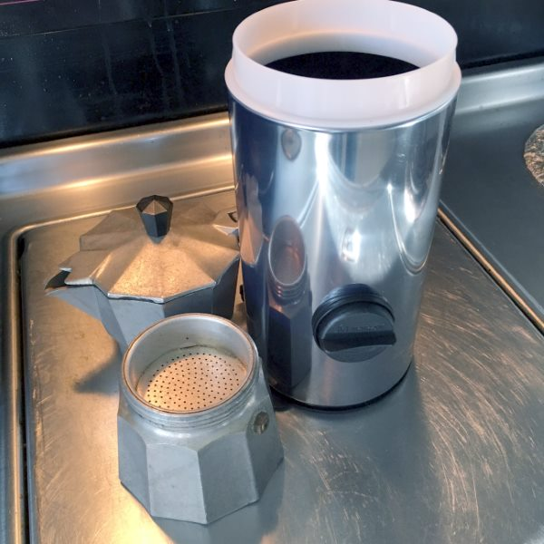
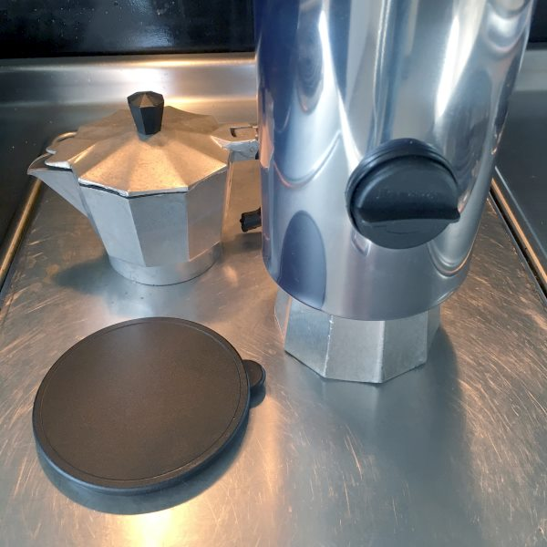
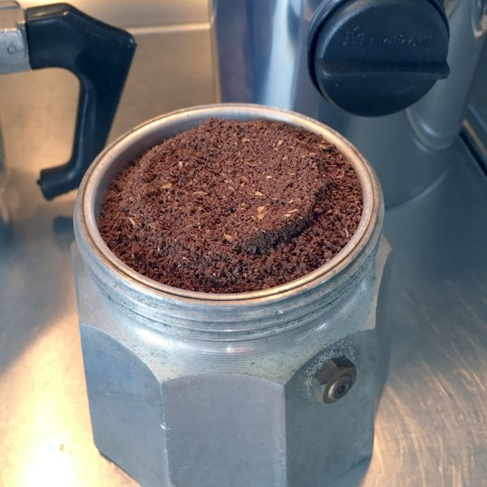
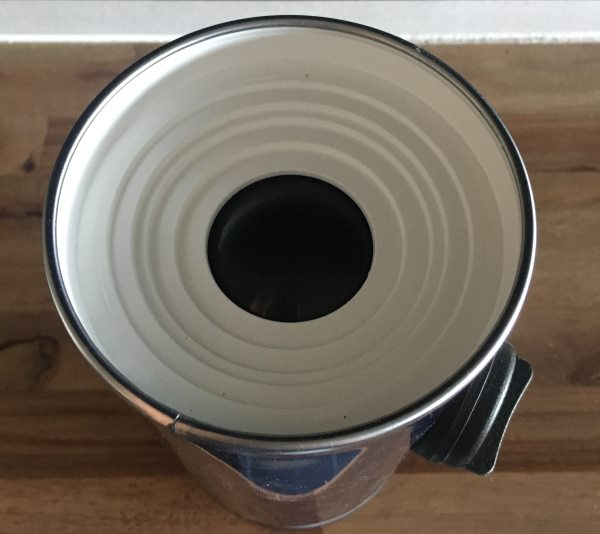

To be honest, I don’t often brew coffee with my Moka Pot. It seems like too much of a hassle. Getting the perfect amount of coffee in the filter without packing it too tightly or without making a mess on the counter with loose grounds gets old really fast, especially when you are half-awake at 6 a.m.

So, I rarely brew with or even think about my Bialetti Moka Pot. Then I received an email from an authorized distributor for the company Meliconi about a gadget they made to streamline the moka pot’s dosing process. I was unaware that anyone was working on ways to improve the process of making stovetop espresso, so I had them send me their Dosacaffe Espresso Dispenser to try out for myself.

### The Dosacaffe Espresso Dispenser

The Dosacaffe Espresso Dispenser is a simple device. Take off the top of the dispenser and fill it with ground coffee. Remove the bottom lid. Place the bottom portion of your Moka Pot underneath the dispenser and dock it into place. Turn the knob clockwise until it stops moving and then let it return. Repeat the turn. Your Moka Pot is now dosed.

The lid may not want to come off initially. I had to push it forcefully before it popped off.

*My Bialetti and the Dosacaffe Espresso Dispenser.*

*Docking the Bialetti under the Dosacaffe Espresso Dispenser.*

*My Bialetti Moka Pot is now dosed and lightly packed.*

Looking at the above photo, you will see a perfect dose of ground coffee in the Moka Pot filter with a very light pack, which is exactly what you want. You’ll also notice no loose grounds of coffee along the edge or anywhere on the counter.

There was no learning curve like there is with many other coffee gadgets. That photo above was my first attempt.

*This is an upside-down view of the Dosacaffe Espresso Dispenser.* 

### My Review of the Dosacaffe Espresso Dispenser

The Dosacaffe Espresso Dispenser works exactly as described. The ideal customer would be someone who makes Moka Pot on a regular basis. Having another coffee gadget might be a problem for some, but the dispenser also serves as a place to store ground coffee.

If you only make Moka Pot occasionally, purchasing the dispenser is unnecessary. Wiping the counter would be less work than cleaning and drying the dispenser. But for daily Moka Pot brewers, the Dosacaffe Espresso Dispenser is worth considering.

The Dosacaffe Espresso Dispenser holds 250 grams of ground coffee.

### Resources

[How to Brew Espresso in a Moka Pot](http://ineedcoffee.com/brewing-espresso-in-a-moka/) – INeedCoffee tutorial that uses sugar.

[Stovetop Espresso Brewing Tutorial](http://ineedcoffee.com/stovetop-espresso-brewing-tutorial/) – INeedCoffee tutorial.

[Cafe Cubano](http://ineedcoffee.com/cafe-cubano-cuban-coffee/) – Learn how to use the Bialetti Stovetop Espresso Maker to make this classic Cuban-style coffee drink.

[The Story of the Bialetti Moka Express](http://ineedcoffee.com/the-story-of-the-bialetti-moka-express/) – The interesting history of the stovetop espresso maker.

*Disclosure: INeedCoffee received a Dosacaffe Espresso Dispenser for this review.*