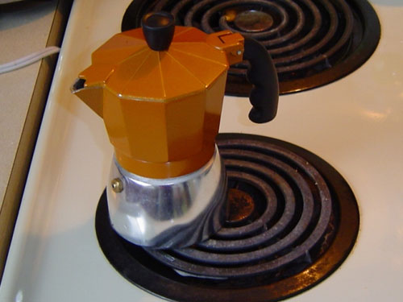
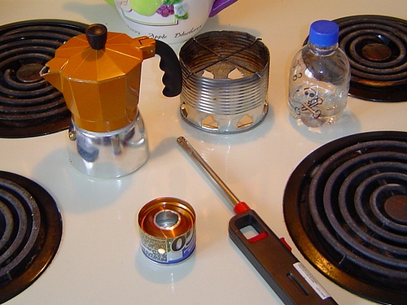
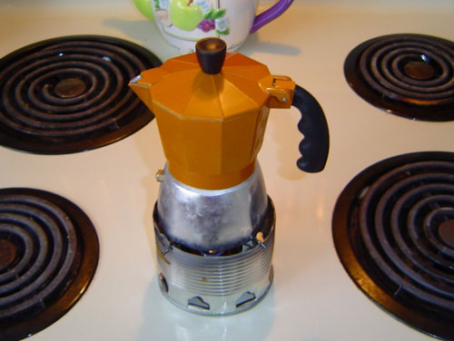
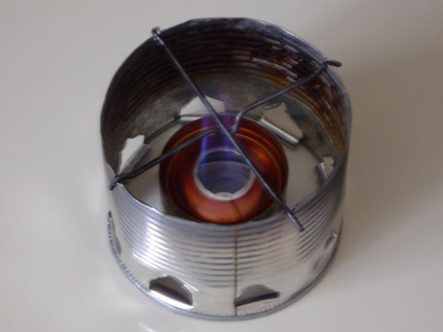
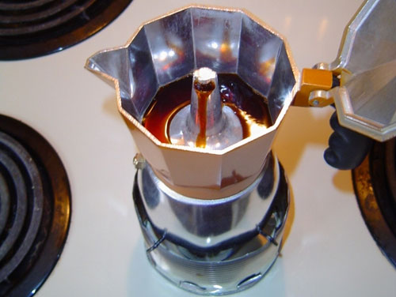

Being a person who appreciates a good cup of coffee, I have always been interested in doing everything possible to ensure that my cup is a good one. I have also been a person of sub-average means, so although a full-on espresso maker is something I would love to have, I can’t bring myself to buy one of those really cheap machines that will never really do a good job. As well, I love to spend time camping and canoeing, so having something low-tech fits the bill quite well.

It was here at INEEDCOFFEE that I learned how to use a [Moka pot](http://ineedcoffee.com/brewing-espresso-in-a-moka/), which is something I have really enjoyed. It also is something that would be easy to bring along when I’m out in the woods to help me make a good cup of coffee. But making coffee at home without a gas stove makes things a little more interesting. As you notice, the Moka pot is much smaller than the smallest electric stove element. Most of the heat is wasted, and the handle does get quite warm. Yes, I realize that turning the pot will place the handle off to the other side, but still, there is a lot of wasted energy.

  
*Moka Pot*

I needed another option. I also needed something for camping because most camping stoves are larger and put out a lot of heat. Searching the internet (something I have been mocked quite a bit for), I have found a solution that meets my needs for making coffee, a solution that can also be used while camping, and my third need for tinkering and making things myself.

I found a solution at *Zen Backpacking Stoves*, which describes several options for making alcohol stoves yourself out of recyclable and readily available materials. Plus, it’s not hard to make one. Here’s a picture of my current setup.

  
*Moka Pot Stove Setup*

The small stove has been modified slightly to make it specific for brewing. A stove made for boiling water will heat up the Moka pot too quickly, and the brew just won’t be what it should be. I tinkered with it a bit and found that four breather holes in the sides of the stove worked best to produce the 3-minute brew time recommended for a Moka pot. I also tinkered with the size of the main burner hole a little, starting with a hole sized with a penny, then nickel, then quarter. I found a nickel-sized hole to be the best.

The stove will prepare a 4-cup-sized Moka pot using about three teaspoons of fuel. Not bad at all. I use methyl-hydrate for the fuel, and I leave the exhaust hood fan running to help get rid of any fumes, even though alcohol stoves don’t produce much fumes, but it’s better to be safe when using it inside.

  
*Moka Pot on the burner*

  
*Stove Burner*

  
*Brewing Moka Coffee*

I made a stand out of an empty coffee can and some coat-hanger wire. Light the stove, place the stand over the top, and put the Moka pot on top. In the magical three minutes, I have a fresh pot of Moka pot espresso to enjoy! With practice, I have found just the right amount of fuel so that it extinguishes itself shortly after the coffee is ready. Let the stove cool, and just put it away. Always keep fuel away from children and follow reasonable practices.

### Resources

[Zen Backpacking Stoves](https://zenstoves.net/) – Provider of alcohol stoves.

[Brewing Espresso in a Moka](http://ineedcoffee.com/brewing-espresso-in-a-moka/) – Tutorial on making espresso using a Moka coffee pot.

[Stovetop Espresso Brewing Tutorial](http://ineedcoffee.com/stovetop-espresso-brewing-tutorial/) – Step-by-step instructions on using the Bialetti.