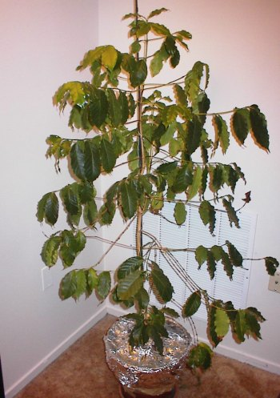
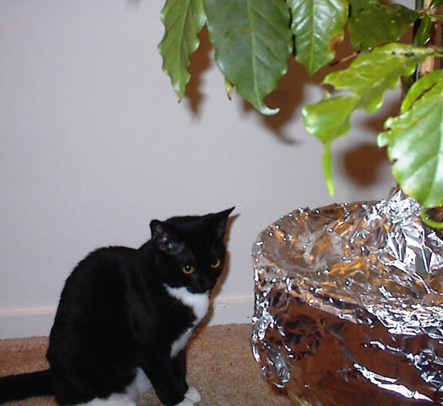
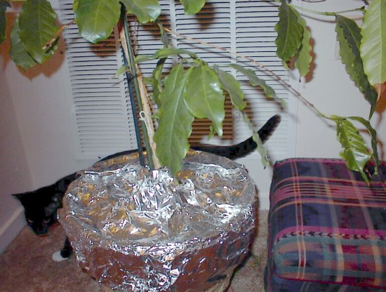
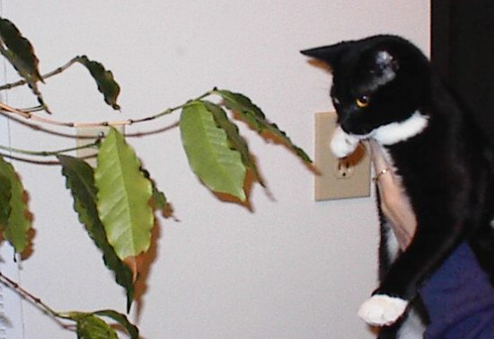

*This article was written in November 1999. The original photos were located and added to the article in November 2011.*

Next week many boxing fans will tune in to see Evander Holyfield fight Lennox Lewis. Not me. I’ll be watching a continuing battle in my own home. The two warriors are my 6-month-old kitten and my Hawaiian Kona plant. The plant is doing its best to stay alive outside of Hawaiian soil, and the kitten is doing her best to rip every leaf off.

As much as we try to keep our kitten, Kato, away from the Hawaiian Kona plant, she still manages to sneak over and rough it up now and then. Will the plant survive Kato’s wrath? Will Kato show mercy? Or will the plant survive regardless of whatever Kato dishes out? Which contender has more stamina and strength?

### In this corner: Kona Coffee Plant

By most accounts, the Kona plant should have been dead a long time ago. How does a delicate Kona coffee plant survive in Alexandria, Virginia? The DC Metro area is hardly an ideal region for a coffee plant. Not only has the plant survived, but it has also grown to a height of almost five feet tall. Granted, it won’t produce coffee, but it is a cool plant regardless.

*Kona Coffee plant*

### In this corner: Kato the Kitten

Kato is a feisty kitten full of energy with a devastating right jab. Her reach is extensive, and her vertical leap is impressive. She can easily grab the leaves of the Kona plant’s lower half and has on more than one occasion.

  
*Kato nears Kona*

### Tale of the Tape

-   **Speed:** Kato can “hit and run.” The plant can’t move. Edge Kato.
-   **Reach:** Kato has an impressive reach, but at 5 feet tall, the Kona plant towers over the kitten. Edge Kona.
-   **Endurance:** The plant has tolerated both the weather and the kitten. Kato gets bored quickly. Edge Kona.
-   **Attack Skills:** Kato has an excellent strike capable of tearing a leaf in a single swipe. Kona is unwilling to fight the cat. Edge Kato.
-   **Summary:** Both opponents have their strengths and weaknesses. Too close to call.

  
*Kato Surrounds Kona*

  
*Kato vs Kona*

### Who will win?

In our household, we hope Kato will throw in the towel and announce her retirement. We do our best to keep Kato from Kona but aren’t always successful. Maybe we can get Don King to convince Kato to move on to a new challenge, like attacking the cat in the mirror. Meanwhile, the Kona continues its **rope-a-dope**\* strategy. Is the Kona conserving energy, or will Kato deliver the knockout punch? Ding!

***Rope-A-Dope**: In 1974, Muhammed Ali fought heavily favored George Foreman in Zaire in a fight known as “The Rumble in the Jungle.” Foreman was considered the hardest puncher in heavyweight history, but Ali won. Ali backed up against the ropes and let Foreman punch him until he tired himself. Later, Ali came off the ropes to win the fight. Muhammed Ali called this his “rope-a-dope” technique.*

**UPDATE June 2000:** The Kato vs. Kona battle winner turned out to be the Kona plant. The Kona plant hung in through several beatings until, eventually, Kato got bored and started picking on the leather couch. Prior to moving from Alexandria to San Diego, the plant was donated to our neighborhood coffee shop. Today, that plant sits proudly in the front window of the Starbucks at 1464 N. Beauregard Street in Alexandria, VA. Kato also moved to San Diego. There are no plans for a rematch.
