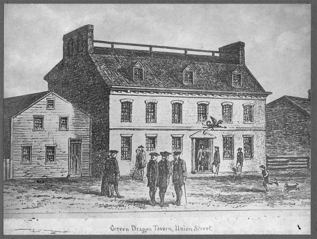
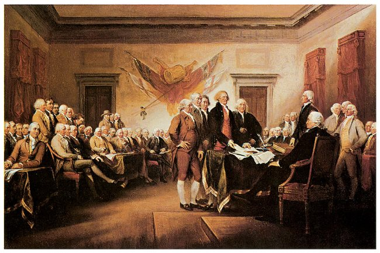

It is not stretching the truth to say that coffee played an important role in the founding of this country. From its introduction to European culture, coffee had been considered synonymous with intellectual discourse. Because of the connection between coffee and politics, it is perhaps the most important drink for American history.

### On American Soil

The great thinkers of the 18th Century would gather at colonial coffee houses/taverns, such as the **Green Dragon** in Boston, to discuss the important issues of the time. In 1765, a crowd gathered to burn an effigy of Andrew Oliver a Liberty Tree. Oliver was doing the unpopular work of King George III by selling stamps, a form of taxation.

The group eventually dispersed, but they gathered the next day at the Green Dragon to discuss the political events of the previous day. In so doing, they formed a group that they dubbed the Sons of Liberty. The Green Dragon Inn Tavern and Coffee House was their regular meeting place. (2)

*Green Dragon Tavern in Boston – credit BPL (Wikipedia)* 

### Coffee as Patriotism

When the British sought to punish the colonies by unfair taxation on tea, coffee became not only the preferred drink but the patriotic one as well. The East India Company couldn’t conceive of the colonists doing without tea, so they sent over a full cargo of tea in a marketing scheme that would pay the taxes to the King, but cut out the middlemen merchants. This scheme infuriated the colonists. A particularly energized group in Boston carried out the event which became known as the Boston Tea Party. They threw the tea overboard and vowed against drinking tea, in favor of coffee.

With the advent of the Revolutionary War, coffee houses soon became the preferred meeting place of the newly formed Continental Congress. The most famous coffee house of the time was the **Merchant’s Coffee House** in Philadelphia, also known as the **City Tavern**. It was there that the Declaration of Independence was first read aloud to the public.

One could argue that America began to define itself by its connection with coffee as opposed to tea. So stand up for something you believe in, drink coffee, and make our forefathers proud.

  
*Founding Fathers at the signing of the Declaration of Independence. Image by John Trumbull.*

### References

1 Refer to *History of Food* by Toussant-Soamat translated by Anthea Bell, page 585.

2 [Green Dragon Tavern](https://en.wikipedia.org/wiki/Green_Dragon_Tavern) – Wikipedia page

*Title image by [Gabbt Orcutt](https://unsplash.com/@monroefiles)*